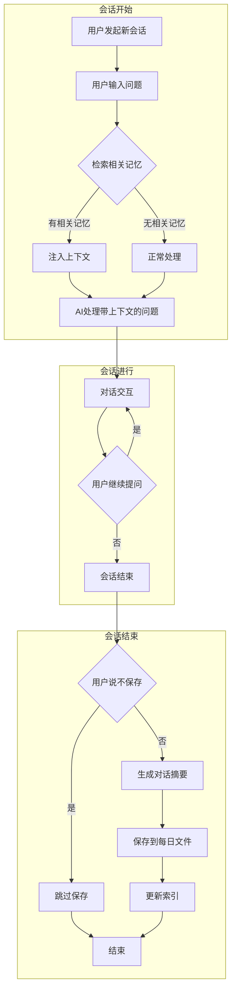
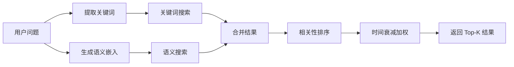
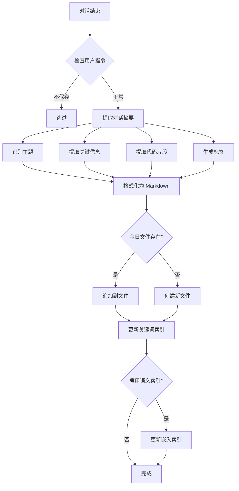

# Memory Skill 设计文档

## 1. 概述

**Skill 名称**: memory  
**描述**: 为 Cursor 提供长期记忆能力，自动记录每日对话内容，并在新会话开始时根据用户问题检索相关历史上下文，提升 AI 助手的连续性和个性化体验。

### 1.1 问题背景

Cursor 目前存在以下限制：
- 每次会话独立，无法记住历史对话
- 用户需要重复解释项目背景、偏好设置
- 无法积累学习用户的工作习惯和代码风格
- 跨会话的任务连续性差

### 1.2 解决方案

创建一个 Memory Skill，实现：
- 自动记录每日对话摘要
- 智能检索历史上下文
- 支持项目级和全局级记忆
- 用户可控的记忆管理

## 2. 核心功能

### 2.1 记忆记录（Memory Recording）

- **自动保存**: 每次对话结束时自动保存对话摘要
- **用户控制**: 用户可以说"这次不保存"来跳过记录
- **每日文件**: 按日期组织，每天一个 Markdown 文件
- **结构化存储**: 包含时间戳、主题、关键信息、代码片段等

### 2.2 记忆检索（Memory Retrieval）

- **自动触发**: 新会话开始时，根据用户问题自动检索
- **混合检索**: 关键词匹配 + 语义搜索结合
- **相关性排序**: 按相关度和时间权重排序
- **上下文注入**: 将相关记忆作为上下文提供给 AI

### 2.3 记忆管理（Memory Management）

- **查看记忆**: 用户可以查看历史记忆
- **删除记忆**: 用户可以删除特定记忆
- **搜索记忆**: 用户可以主动搜索历史记忆
- **导出记忆**: 支持导出记忆数据

## 3. 存储架构

### 3.1 目录结构

```
# 项目级记忆（优先）
.cursor/skills/memories/
├── daily/                    # 每日对话记录
│   ├── 2026-01-29.md
│   ├── 2026-01-28.md
│   └── ...
├── index/                    # 索引文件
│   ├── keywords.json         # 关键词索引
│   └── embeddings.json       # 语义嵌入索引（可选）
├── config.json               # 配置文件
└── summary.md                # 记忆摘要（可选）

# 全局级记忆（备选）
~/.cursor/skills/memories/
└── (同上结构)
```

### 3.2 每日记忆文件格式

```markdown
# 2026-01-29 对话记忆

## Session 1 - 10:30:45

### 主题
Memory Skill 设计讨论

### 关键信息
- 用户希望创建长期记忆功能
- 存储位置：.cursor/skills/memories/
- 检索方式：关键词 + 语义搜索
- 自动保存，用户可选择跳过

### 代码/配置
```json
{
  "storage": "project-first",
  "auto_save": true
}
```

### 标签
#skill #memory #design

---

## Session 2 - 14:20:00

### 主题
...
```

### 3.3 索引文件格式

**keywords.json**:
```json
{
  "version": "1.0",
  "updated_at": "2026-01-29T10:30:45Z",
  "entries": [
    {
      "date": "2026-01-29",
      "session": 1,
      "keywords": ["memory", "skill", "design", "cursor"],
      "topics": ["Memory Skill 设计讨论"],
      "line_range": [3, 25]
    }
  ]
}
```

**embeddings.json** (可选，用于语义搜索):
```json
{
  "version": "1.0",
  "model": "text-embedding-ada-002",
  "entries": [
    {
      "date": "2026-01-29",
      "session": 1,
      "text": "Memory Skill 设计讨论...",
      "embedding": [0.123, -0.456, ...]
    }
  ]
}
```

## 4. 工作流程

### 4.1 整体流程图



### 4.2 记忆检索流程



### 4.3 记忆保存流程



## 5. 检索方案详解

### 5.1 方案 A：纯关键词检索

**优点**:
- 实现简单，无需外部依赖
- 速度快，资源消耗低
- 精确匹配效果好

**缺点**:
- 无法理解语义相似性
- 同义词、近义词无法匹配
- 依赖关键词提取质量

**实现方式**:
```python
def keyword_search(query: str, index: dict) -> list:
    query_keywords = extract_keywords(query)
    results = []
    for entry in index["entries"]:
        score = len(set(query_keywords) & set(entry["keywords"]))
        if score > 0:
            results.append((entry, score))
    return sorted(results, key=lambda x: -x[1])
```

### 5.2 方案 B：纯语义检索

**优点**:
- 理解语义相似性
- 支持模糊匹配
- 不依赖精确关键词

**缺点**:
- 需要嵌入模型（API 调用或本地模型）
- 计算成本较高
- 首次索引耗时

**实现方式**:
```python
def semantic_search(query: str, embeddings: list) -> list:
    query_embedding = get_embedding(query)
    results = []
    for entry in embeddings:
        similarity = cosine_similarity(query_embedding, entry["embedding"])
        results.append((entry, similarity))
    return sorted(results, key=lambda x: -x[1])
```

### 5.3 方案 C：混合检索（推荐）

**优点**:
- 结合两种方案优势
- 精确匹配 + 语义理解
- 更全面的召回

**缺点**:
- 实现复杂度较高
- 需要调优权重参数

**实现方式**:
```python
def hybrid_search(query: str, keyword_index: dict, embeddings: list) -> list:
    # 关键词检索
    keyword_results = keyword_search(query, keyword_index)
    keyword_scores = {r[0]["id"]: r[1] for r in keyword_results}
    
    # 语义检索
    semantic_results = semantic_search(query, embeddings)
    semantic_scores = {r[0]["id"]: r[1] for r in semantic_results}
    
    # 合并分数 (可调权重)
    alpha = 0.4  # 关键词权重
    beta = 0.6   # 语义权重
    
    all_ids = set(keyword_scores.keys()) | set(semantic_scores.keys())
    final_scores = {}
    for id in all_ids:
        kw_score = keyword_scores.get(id, 0)
        sem_score = semantic_scores.get(id, 0)
        final_scores[id] = alpha * kw_score + beta * sem_score
    
    return sorted(final_scores.items(), key=lambda x: -x[1])
```

### 5.4 时间衰减策略

为了让近期记忆更相关，引入时间衰减：

```python
def apply_time_decay(score: float, days_ago: int, decay_rate: float = 0.95) -> float:
    """
    时间衰减公式: score * decay_rate^days_ago
    decay_rate = 0.95 表示每天衰减 5%
    """
    return score * (decay_rate ** days_ago)
```

## 6. 语义嵌入方案

> **重要说明**: 由于 Memory Skill 是给 Cursor 中的大模型使用的，我们可以充分利用大模型本身的语义理解能力，而不需要引入复杂的词嵌入模型。下面列出了从复杂到简单的多种方案。

### 6.1 方案 A：使用 OpenAI API（复杂，不推荐）

**优点**: 效果好，无需本地资源
**缺点**: 需要 API Key，有成本，对于 Skill 场景过于复杂

```python
import openai

def get_embedding_openai(text: str) -> list:
    response = openai.Embedding.create(
        input=text,
        model="text-embedding-ada-002"
    )
    return response["data"][0]["embedding"]
```

### 6.2 方案 B：使用本地模型（复杂，不推荐）

**优点**: 免费，隐私保护
**缺点**: 需要下载模型，占用资源，对于 Skill 场景过于复杂

```python
from sentence_transformers import SentenceTransformer

model = SentenceTransformer('all-MiniLM-L6-v2')

def get_embedding_local(text: str) -> list:
    return model.encode(text).tolist()
```

### 6.3 方案 C：延迟嵌入

**策略**: 先用关键词索引，后台异步生成嵌入

```python
def save_memory_with_delayed_embedding(content: str):
    # 立即保存关键词索引
    keywords = extract_keywords(content)
    save_keyword_index(keywords)
    
    # 异步生成嵌入（可选）
    if config.get("enable_semantic_search"):
        queue_embedding_task(content)
```

#### 6.3.1 延迟嵌入详解

**核心思想**: 分离即时性和完整性

1. **即时响应**：保存记忆时，立即生成关键词索引（毫秒级）
2. **后台完善**：异步生成语义嵌入（可能需要几秒到几十秒）

**对比分析**:

| 对比项 | 关键词索引 | 语义嵌入 |
|--------|-----------|----------|
| 生成速度 | 极快（本地计算） | 较慢（需要模型推理） |
| 资源消耗 | 低 | 高（API调用或GPU） |
| 检索能力 | 精确匹配 | 语义理解 |
| 依赖 | 无 | 需要嵌入模型 |

**工作流程**:

```
用户对话结束
    ↓
┌─────────────────────────────────────┐
│  同步操作（立即执行）                  │
│  1. 提取关键词                        │
│  2. 保存到 keywords.json              │
│  3. 返回"保存成功"                    │
└─────────────────────────────────────┘
    ↓
┌─────────────────────────────────────┐
│  异步操作（后台执行）                  │
│  1. 将内容加入嵌入队列                 │
│  2. 调用嵌入模型生成向量               │
│  3. 保存到 embeddings.json            │
└─────────────────────────────────────┘
```

**详细实现**:

```python
import asyncio
from queue import Queue
from threading import Thread

# 嵌入任务队列
embedding_queue = Queue()

def save_memory_with_delayed_embedding(content: str, session_id: str):
    """保存记忆，延迟生成嵌入"""
    
    # ========== 同步部分：立即执行 ==========
    # 1. 提取关键词（本地快速计算）
    keywords = extract_keywords(content)
    
    # 2. 保存关键词索引
    save_keyword_index({
        "session_id": session_id,
        "keywords": keywords,
        "timestamp": datetime.now().isoformat()
    })
    
    # 3. 立即返回，用户无感知延迟
    print("记忆已保存")
    
    # ========== 异步部分：后台执行 ==========
    # 4. 如果启用了语义搜索，将任务加入队列
    if config.get("enable_semantic_search"):
        embedding_queue.put({
            "session_id": session_id,
            "content": content
        })

# 后台嵌入处理器（单独线程运行）
def embedding_worker():
    """后台处理嵌入任务的工作线程"""
    while True:
        task = embedding_queue.get()
        if task is None:
            break
        
        try:
            # 生成嵌入（可能耗时）
            embedding = get_embedding(task["content"])
            
            # 保存嵌入索引
            save_embedding_index({
                "session_id": task["session_id"],
                "embedding": embedding
            })
        except Exception as e:
            log_error(f"嵌入生成失败: {e}")
        finally:
            embedding_queue.task_done()

# 启动后台工作线程
worker_thread = Thread(target=embedding_worker, daemon=True)
worker_thread.start()
```

**检索时的处理**:

```python
def search_memories(query: str) -> list:
    """搜索记忆，智能选择检索方式"""
    
    # 1. 总是执行关键词检索（快速、可靠）
    keyword_results = keyword_search(query)
    
    # 2. 检查嵌入索引是否可用
    embeddings_available = check_embeddings_ready()
    
    if embeddings_available:
        # 3a. 混合检索：关键词 + 语义
        semantic_results = semantic_search(query)
        return merge_results(keyword_results, semantic_results)
    else:
        # 3b. 仅关键词检索（嵌入还在生成中）
        return keyword_results
```

**优势总结**:

1. **用户体验好**：保存操作即时完成，无需等待
2. **渐进增强**：嵌入生成完成后，检索能力自动升级
3. **容错性强**：即使嵌入失败，关键词检索仍可用
4. **资源友好**：后台处理，不阻塞用户操作
5. **灵活配置**：可以完全禁用语义搜索，只用关键词

### 6.4 方案 D：利用大模型能力（推荐，适合 Skill 场景）

> **核心洞察**: 既然 Skill 是在 Cursor 中运行，大模型本身就有强大的语义理解能力，我们可以利用这一点来简化实现，完全不需要额外的 embedding 模型。

#### 6.4.1 子方案 D1：让大模型直接做语义匹配

**核心思想**: 不存储 embedding 向量，而是让大模型在检索时直接理解和匹配。

**Skill 指令示例**:

```markdown
# Memory Skill 检索指令

当用户提问时，请阅读以下历史记忆文件，找出与当前问题最相关的内容：

## 历史记忆
[读取 keywords.json 或 daily/*.md 文件内容]

## 用户当前问题
{user_query}

请找出最相关的 1-3 条记忆，并说明相关原因。
```

**优点**:
- 零额外依赖，无需 embedding 模型
- 大模型的语义理解能力远超简单的向量匹配
- 实现极其简单

**缺点**:
- 记忆量大时，需要读取大量文件到上下文
- 消耗 token

#### 6.4.2 子方案 D2：关键词 + 大模型二次筛选（强烈推荐）

**流程**:
1. **第一步（快速筛选）**: 用关键词索引快速找出候选记忆（Top 10-20）
2. **第二步（精准匹配）**: 让大模型从候选中选出最相关的（Top 3-5）

**keywords.json 结构**:

```json
{
  "entries": [
    {
      "date": "2026-01-29",
      "session": 1,
      "keywords": ["memory", "skill", "embedding", "cursor"],
      "summary": "讨论了 Memory Skill 的设计，包括延迟嵌入方案"
    }
  ]
}
```

**Skill 指令**:

```markdown
# 记忆检索流程

1. 读取 keywords.json
2. 用简单的关键词匹配找出候选记忆
3. 读取候选记忆的详细内容
4. 根据用户问题，选出最相关的记忆
```

**优点**:
- 关键词快速筛选，减少大模型需要处理的数据量
- 大模型做最终的语义理解和排序
- 平衡了效率和准确性

#### 6.4.3 子方案 D3：大模型生成"语义标签"代替 embedding

**思路**: 让大模型在保存时生成语义标签，而不是数值向量。

**存储结构**:

```json
{
  "date": "2026-01-29",
  "session": 1,
  "keywords": ["memory", "skill"],
  "semantic_tags": [
    "长期记忆功能设计",
    "Cursor 插件开发",
    "检索方案讨论",
    "关键词 vs 语义搜索"
  ],
  "summary": "讨论了 Memory Skill 的设计..."
}
```

检索时，大模型可以直接比较语义标签和用户问题的相关性。

**优点**:
- 语义标签比数值向量更易理解和调试
- 大模型可以直接基于标签进行匹配
- 无需向量计算

### 6.5 方案对比评估：sentence-transformers vs 大模型

#### 6.5.1 方案 A：sentence-transformers 本地语义嵌入

| 维度 | 评估 |
|------|------|
| **安装复杂度** | 需要安装 `sentence-transformers`、`torch` 等依赖，首次下载模型约 90MB |
| **运行时依赖** | 需要 Python 环境和模型文件 |
| **速度** | 生成嵌入：~50ms/条；向量检索：~1ms |
| **准确性** | 中等，依赖预训练模型质量 |
| **资源消耗** | 内存占用 ~500MB（加载模型） |
| **离线能力** | ✅ 完全离线可用 |
| **维护成本** | 需要管理模型版本、依赖更新 |

```python
# 使用示例
from sentence_transformers import SentenceTransformer
model = SentenceTransformer('all-MiniLM-L6-v2')  # 首次需下载
embedding = model.encode("用户问题")  # ~50ms
```

#### 6.5.2 方案 B：利用大模型（Cursor 内置）

| 维度 | 评估 |
|------|------|
| **安装复杂度** | 零依赖，Cursor 已内置大模型 |
| **运行时依赖** | 仅需 Cursor 运行环境 |
| **速度** | 依赖大模型响应，~1-3s（但可并行处理其他任务） |
| **准确性** | 高，大模型语义理解能力强 |
| **资源消耗** | 无额外资源，复用 Cursor 的大模型 |
| **离线能力** | ❌ 需要网络（Cursor 需联网） |
| **维护成本** | 零维护，随 Cursor 自动更新 |

```markdown
# Skill 指令示例
请从以下候选记忆中，找出与用户问题最相关的 3 条：
[候选记忆列表]
用户问题：{query}
```

#### 6.5.3 综合对比

| 对比维度 | sentence-transformers | 大模型方案 | 胜出 |
|----------|----------------------|-----------|------|
| 安装简易度 | ⭐⭐ | ⭐⭐⭐⭐⭐ | 大模型 |
| 依赖管理 | ⭐⭐ | ⭐⭐⭐⭐⭐ | 大模型 |
| 检索速度 | ⭐⭐⭐⭐⭐ | ⭐⭐⭐ | sentence-transformers |
| 语义理解 | ⭐⭐⭐ | ⭐⭐⭐⭐⭐ | 大模型 |
| 离线能力 | ⭐⭐⭐⭐⭐ | ⭐ | sentence-transformers |
| 维护成本 | ⭐⭐ | ⭐⭐⭐⭐⭐ | 大模型 |
| 适合 Skill | ⭐⭐ | ⭐⭐⭐⭐⭐ | 大模型 |

#### 6.5.4 结论与推荐

**对于 Memory Skill 场景，强烈推荐使用大模型方案**，原因：

1. **零依赖**：不需要安装任何额外包，Skill 保持轻量
2. **语义理解更强**：大模型的理解能力远超 sentence-transformers
3. **维护成本为零**：不需要管理模型版本和依赖
4. **与 Skill 理念一致**：Skill 就是让大模型来做事，应该充分利用大模型能力
5. **实现更简单**：只需要写好 Skill 指令，不需要写 Python 代码

**唯一考虑 sentence-transformers 的场景**：
- 需要完全离线使用
- 记忆量极大（>10000条），需要毫秒级检索

但对于大多数用户，记忆量不会太大，大模型方案完全够用。

### 6.6 最终推荐方案

对于 Memory Skill 场景，**强烈推荐方案 D2：关键词 + 大模型二次筛选**：

**保存时**:
- 提取关键词（简单字符串处理）
- 生成简短摘要
- 可选：让大模型生成语义标签

**检索时**:
- 关键词快速筛选候选
- 大模型从候选中精选最相关的

这样既利用了大模型的语义理解能力，又避免了读取过多文件的问题，同时完全不需要引入复杂的 embedding 模型依赖。

## 7. 你可能没有考虑的问题

### 7.1 隐私与安全

> **说明**: 由于记忆数据完全存储在本地，不会上传到任何服务器，因此隐私与安全问题的优先级较低。用户对自己本地的数据有完全的控制权。

~~**问题**: 记忆可能包含敏感信息（API Key、密码、个人数据）~~

~~**解决方案**:~~
~~- 自动过滤敏感信息（正则匹配常见模式）~~
~~- 用户可标记"敏感对话"不保存~~
~~- 支持加密存储~~
~~- 提供记忆清理工具~~

**当前策略**: 暂不实现敏感信息过滤，因为：
1. 数据存储在用户本地，不上传
2. 用户对本地数据有完全控制权
3. 简化实现复杂度

如果未来有需求（如团队共享记忆），可以考虑添加敏感信息过滤功能。

### 7.2 存储空间管理

**问题**: 长期使用会积累大量记忆文件

**解决方案**:
- 设置保留天数（如 90 天）
- 自动归档旧记忆
- 压缩存储
- 提供清理命令

```python
def cleanup_old_memories(retention_days: int = 90):
    cutoff_date = datetime.now() - timedelta(days=retention_days)
    for file in daily_files:
        if file.date < cutoff_date:
            archive_or_delete(file)
```

### 7.3 记忆冲突与更新

**问题**: 用户偏好可能随时间变化，旧记忆可能过时

**解决方案**:
- 时间衰减权重
- 用户可标记"过时"记忆
- 支持记忆更新/覆盖
- 定期提示用户审核

### 7.4 多项目记忆隔离

**问题**: 不同项目的记忆可能混淆

**解决方案**:
- 项目级记忆优先
- 全局记忆标记来源项目
- 检索时可指定范围

### 7.5 性能考虑

**问题**: 大量记忆可能导致检索变慢

**解决方案**:
- 分层索引（热数据 + 冷数据）
- 增量索引更新
- 缓存常用检索结果
- 限制检索范围（如最近 30 天）

### 7.6 记忆质量

**问题**: 自动摘要可能丢失重要信息或包含噪音

**解决方案**:
- 用户可编辑保存的记忆
- 提供"重要"标记功能
- 支持手动添加记忆
- 摘要质量评估

### 7.7 并发与一致性

**问题**: 多个 Cursor 窗口同时操作可能导致冲突

**解决方案**:
- 文件锁机制
- 追加写入而非覆盖
- 定期合并去重

## 8. 配置选项

```json
{
  "version": "1.0",
  "storage": {
    "location": "project-first",  // "project-only", "global-only", "project-first"
    "retention_days": 90,
    "max_file_size_mb": 10
  },
  "recording": {
    "auto_save": true,
    "save_code_snippets": true,
    "sanitize_sensitive": true,
    "min_conversation_length": 3  // 最少对话轮数才保存
  },
  "retrieval": {
    "method": "hybrid",  // "keyword", "semantic", "hybrid"
    "max_results": 5,
    "time_decay_rate": 0.95,
    "search_scope_days": 30
  },
  "semantic": {
    "enabled": true,
    "provider": "local",  // "openai", "local"
    "model": "all-MiniLM-L6-v2"
  }
}
```

## 9. 用户交互命令

| 命令 | 描述 |
|------|------|
| `记住这个` / `save this` | 手动保存当前对话 |
| `不要保存` / `don't save` | 跳过本次对话保存 |
| `搜索记忆: xxx` | 主动搜索历史记忆 |
| `查看今日记忆` | 查看今天的记忆 |
| `删除记忆: xxx` | 删除特定记忆 |
| `清理旧记忆` | 清理过期记忆 |
| `记忆设置` | 查看/修改配置 |

## 10. 触发条件

### 10.1 基础触发条件

当以下情况时触发 Memory Skill：

**自动触发（检索）**:
- 每次新会话开始时
- 用户问题包含历史相关词汇（"之前"、"上次"、"我们讨论过"）

**自动触发（保存）**:
- 对话结束时（用户长时间无响应或明确结束）
- 对话轮数超过阈值

**手动触发**:
- 用户说"记住这个"
- 用户说"搜索记忆"
- 用户说"查看记忆"

### 10.2 智能触发条件优化方案

> **核心思想**：充分利用大模型的理解能力进行意图识别，而不是依赖简单的关键词匹配。

#### 10.2.1 方案 A：意图识别触发（推荐）

让大模型在每次对话开始时，先分析用户意图，判断是否需要检索记忆。

**触发规则**：

| 意图类型 | 触发检索 | 示例 |
|----------|---------|------|
| 延续性意图 | ✅ | "继续昨天的工作"、"上次说到哪了" |
| 偏好相关 | ✅ | "帮我写个函数"（检索用户编码偏好） |
| 项目相关 | ✅ | "这个项目的 API 怎么调用"（检索项目上下文） |
| 独立问题 | ❌ | "Python 怎么读取文件"（通用问题，无需记忆） |
| 明确新话题 | ❌ | "换个话题"、"我想问个新问题" |

**Skill 指令**：

```markdown
## 智能触发判断

在回答用户问题之前，请先判断是否需要检索历史记忆。

**判断标准**：
1. 用户问题是否涉及"之前"、"上次"、"继续"等延续性词汇
2. 用户问题是否与当前项目相关（可能有历史上下文）
3. 用户问题是否涉及个人偏好（编码风格、工具选择等）
4. 用户问题是否是通用知识问题（无需记忆）

**输出判断结果**：
- 需要检索：执行 search_memory.py
- 不需要检索：直接回答
```

**优点**：
- 智能判断，减少不必要的检索
- 大模型理解能力强，准确率高
- 用户体验好，无需记住特定命令

**缺点**：
- 每次都需要大模型判断，有一定开销
- 判断可能偶尔不准确

#### 10.2.2 方案 B：上下文感知触发

根据对话上下文自动判断，不需要用户明确说出关键词。

**触发信号词**：

```python
# 延续性信号词
CONTINUATION_SIGNALS = [
    # 中文
    "继续", "接着", "上次", "之前", "昨天", "刚才", "那个",
    "我们讨论过", "你记得", "还记得", "提到过",
    # 英文
    "continue", "last time", "yesterday", "before", "remember",
    "we discussed", "you mentioned", "as I said"
]

# 偏好相关信号
PREFERENCE_SIGNALS = [
    "帮我写", "帮我实现", "生成一个", "创建一个",
    "我喜欢", "我习惯", "我通常", "按照我的风格"
]

# 项目上下文信号
PROJECT_SIGNALS = [
    "这个项目", "我们的", "当前", "这里的",
    "这个文件", "这个模块", "这个功能"
]
```

**智能判断逻辑**：

```python
def should_search_memory(user_query: str, project_context: dict) -> bool:
    """判断是否需要检索记忆"""
    query_lower = user_query.lower()
    
    # 1. 检查延续性信号
    for signal in CONTINUATION_SIGNALS:
        if signal in query_lower:
            return True
    
    # 2. 检查偏好相关信号（需要了解用户偏好）
    for signal in PREFERENCE_SIGNALS:
        if signal in query_lower:
            return True
    
    # 3. 检查项目上下文信号
    for signal in PROJECT_SIGNALS:
        if signal in query_lower:
            return True
    
    # 4. 如果是新会话的第一个问题，默认检索
    if project_context.get("is_new_session", True):
        return True
    
    return False
```

**优点**：
- 基于规则，判断速度快
- 可预测，行为一致
- 无需大模型额外判断

**缺点**：
- 规则有限，可能遗漏某些场景
- 需要维护信号词列表

#### 10.2.3 方案 C：主动学习用户习惯

记录用户的使用模式，自动调整触发策略。

**学习内容**：

```json
{
  "user_patterns": {
    "common_topics": ["API开发", "React组件", "数据库"],
    "preferred_style": "函数式编程",
    "active_hours": ["09:00-12:00", "14:00-18:00"],
    "frequent_commands": ["帮我写", "优化一下", "解释一下"]
  },
  "trigger_history": {
    "successful_triggers": 45,
    "unnecessary_triggers": 5,
    "missed_triggers": 2
  }
}
```

**自适应触发**：

```python
def adaptive_trigger(user_query: str, user_patterns: dict) -> bool:
    """基于用户习惯的自适应触发"""
    
    # 如果问题涉及用户常见话题，更可能需要记忆
    for topic in user_patterns["common_topics"]:
        if topic.lower() in user_query.lower():
            return True
    
    # 如果是用户常用命令，可能需要记忆偏好
    for cmd in user_patterns["frequent_commands"]:
        if cmd in user_query:
            return True
    
    return False
```

**优点**：
- 越用越准确
- 个性化体验
- 自动优化

**缺点**：
- 需要积累数据
- 实现复杂度高
- 冷启动问题

#### 10.2.4 方案 D：智能保存判断

不只是触发检索，保存时机也需要智能判断。

**保存判断标准**：

| 对话类型 | 是否保存 | 原因 |
|----------|---------|------|
| 重要决策 | ✅ | "我们决定使用 FastAPI" |
| 偏好表达 | ✅ | "我喜欢用 TypeScript" |
| 项目配置 | ✅ | "API 前缀是 /api/v2" |
| 待办计划 | ✅ | "下次需要完成用户认证" |
| 复杂方案 | ✅ | 经过讨论确定的技术方案 |
| 简单问答 | ❌ | "Python 怎么读文件" |
| 调试过程 | ❌ | 临时的错误排查 |
| 闲聊 | ❌ | 与项目无关的对话 |
| 重复内容 | ❌ | 已经保存过的类似内容 |

**Skill 指令**：

```markdown
## 智能保存判断

对话结束时，请判断是否值得保存为记忆。

**值得保存的内容**：
- 重要决策和选择
- 用户表达的偏好
- 项目配置和约定
- 待办事项和计划
- 复杂问题的解决方案

**不值得保存的内容**：
- 通用知识问答
- 临时的调试过程
- 与项目无关的闲聊
- 重复的内容

**输出判断结果**：
- 值得保存：提取关键信息，执行 save_memory.py
- 不值得保存：跳过保存
```

### 10.3 推荐方案

综合以上方案，推荐采用 **方案 A（意图识别触发） + 方案 D（智能保存判断）** 的组合：

1. **检索触发**：让大模型分析用户意图，智能判断是否需要检索
2. **保存触发**：让大模型判断对话内容是否值得保存

**核心优势**：充分利用大模型的理解能力，而不是依赖简单的关键词匹配，让 AI 真正"懂你"

## 11. 依赖

### 11.1 必需依赖

- **Python 3.8+**: 运行脚本
- **Cursor Skill 框架**: 集成到 Cursor

### 11.2 可选依赖

- **sentence-transformers**: 本地语义嵌入
- **openai**: OpenAI API 嵌入
- **faiss**: 高效向量搜索（大规模记忆）

## 12. 实现路线图

### Phase 1: MVP（最小可行产品）

- [ ] 基础目录结构
- [ ] 每日 Markdown 文件保存
- [ ] 关键词索引
- [ ] 简单关键词检索
- [ ] 基本配置文件

### Phase 2: 增强检索

- [ ] 语义嵌入支持
- [ ] 混合检索
- [ ] 时间衰减
- [ ] 检索结果排序优化

### Phase 3: 用户体验

- [ ] 敏感信息过滤
- [ ] 记忆管理命令
- [ ] 配置界面
- [ ] 记忆编辑功能

### Phase 4: 高级功能

- [ ] 多项目记忆管理
- [ ] 记忆导入/导出
- [ ] 记忆分析报告
- [ ] 智能记忆清理

## 13. 示例场景

### 场景 1: 自动上下文注入

```
[用户]: 继续昨天的 API 重构工作

[Memory Skill 检索]:
- 找到 2026-01-28 记忆: "讨论了 REST API 重构，决定使用 FastAPI 替换 Flask"
- 找到相关代码片段和决策原因

[AI 响应]:
基于昨天的讨论，我们决定使用 FastAPI 替换 Flask。上次我们完成了...
接下来需要...
```

### 场景 2: 偏好记忆

```
[历史记忆]: 用户偏好使用 TypeScript，喜欢函数式编程风格

[用户]: 帮我写一个数据处理函数

[AI 响应]: (自动使用 TypeScript + 函数式风格)
```

### 场景 3: 项目上下文

```
[历史记忆]: 项目使用 React + Redux，API 基于 /api/v2 前缀

[用户]: 添加一个新的用户列表页面

[AI 响应]: (自动遵循项目约定)
```

## 14. 风险与缓解

| 风险 | 影响 | 缓解措施 |
|------|------|----------|
| 隐私泄露 | 高 | 敏感信息过滤、加密存储 |
| 存储膨胀 | 中 | 自动清理、压缩归档 |
| 检索性能 | 中 | 索引优化、范围限制 |
| 记忆过时 | 低 | 时间衰减、用户审核 |
| 并发冲突 | 低 | 文件锁、追加写入 |

## 15. 总结

Memory Skill 通过以下方式解决 Cursor 无长期记忆的问题：

1. **自动记录**: 每次对话自动保存摘要，用户无需手动操作
2. **智能检索**: 混合检索方案，结合关键词精确匹配和语义理解
3. **用户可控**: 支持跳过保存、删除记忆、配置选项
4. **隐私保护**: 敏感信息过滤、本地存储优先
5. **性能优化**: 分层索引、时间衰减、范围限制

这个 Skill 将显著提升 Cursor 的使用体验，让 AI 助手真正"记住"用户的偏好、项目背景和历史决策。
