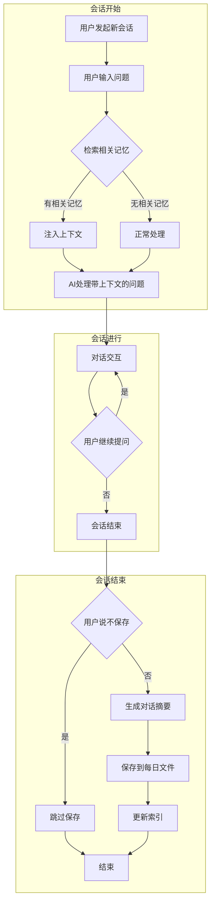
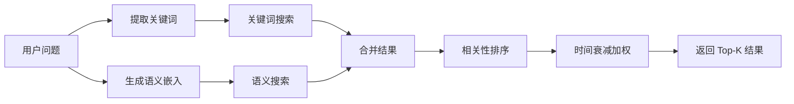
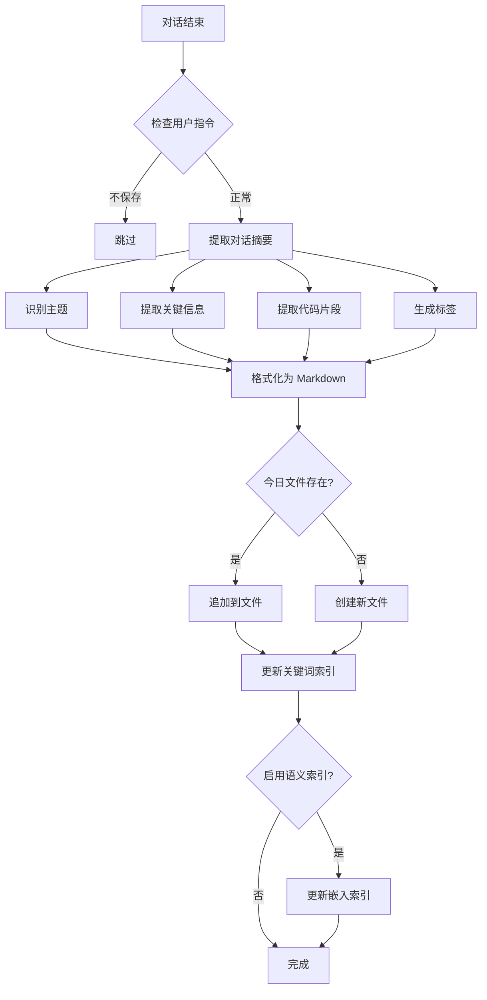

# Memory Skill 设计文档

## 1. 概述

**Skill 名称**: memory  
**描述**: 为 Cursor 提供长期记忆能力，自动记录每日对话内容，并在新会话开始时根据用户问题检索相关历史上下文，提升 AI 助手的连续性和个性化体验。

### 1.1 问题背景

Cursor 目前存在以下限制：
- 每次会话独立，无法记住历史对话
- 用户需要重复解释项目背景、偏好设置
- 无法积累学习用户的工作习惯和代码风格
- 跨会话的任务连续性差

### 1.2 解决方案

创建一个 Memory Skill，实现：
- 自动记录每日对话摘要
- 智能检索历史上下文
- 支持项目级和全局级记忆
- 用户可控的记忆管理

## 2. 核心功能

### 2.1 记忆记录（Memory Recording）

- **自动保存**: 每次对话结束时自动保存对话摘要
- **用户控制**: 用户可以说"这次不保存"来跳过记录
- **每日文件**: 按日期组织，每天一个 Markdown 文件
- **结构化存储**: 包含时间戳、主题、关键信息、代码片段等

### 2.2 记忆检索（Memory Retrieval）

- **自动触发**: 新会话开始时，根据用户问题自动检索
- **混合检索**: 关键词匹配 + 语义搜索结合
- **相关性排序**: 按相关度和时间权重排序
- **上下文注入**: 将相关记忆作为上下文提供给 AI

### 2.3 记忆管理（Memory Management）

- **查看记忆**: 用户可以查看历史记忆
- **删除记忆**: 用户可以删除特定记忆
- **搜索记忆**: 用户可以主动搜索历史记忆
- **导出记忆**: 支持导出记忆数据

## 3. 存储架构

### 3.1 目录结构

```
# 项目级记忆（优先）
.cursor/skills/memories/
├── daily/                    # 每日对话记录
│   ├── 2026-01-29.md
│   ├── 2026-01-28.md
│   └── ...
├── index/                    # 索引文件
│   ├── keywords.json         # 关键词索引
│   └── embeddings.json       # 语义嵌入索引（可选）
├── config.json               # 配置文件
└── summary.md                # 记忆摘要（可选）

# 全局级记忆（备选）
~/.cursor/skills/memories/
└── (同上结构)
```

### 3.2 每日记忆文件格式

```markdown
# 2026-01-29 对话记忆

## Session 1 - 10:30:45

### 主题
Memory Skill 设计讨论

### 关键信息
- 用户希望创建长期记忆功能
- 存储位置：.cursor/skills/memories/
- 检索方式：关键词 + 语义搜索
- 自动保存，用户可选择跳过

### 代码/配置
```json
{
  "storage": "project-first",
  "auto_save": true
}
```

### 标签
#skill #memory #design

---

## Session 2 - 14:20:00

### 主题
...
```

### 3.3 索引文件格式

**keywords.json**:
```json
{
  "version": "1.0",
  "updated_at": "2026-01-29T10:30:45Z",
  "entries": [
    {
      "date": "2026-01-29",
      "session": 1,
      "keywords": ["memory", "skill", "design", "cursor"],
      "topics": ["Memory Skill 设计讨论"],
      "line_range": [3, 25]
    }
  ]
}
```

**embeddings.json** (可选，用于语义搜索):
```json
{
  "version": "1.0",
  "model": "text-embedding-ada-002",
  "entries": [
    {
      "date": "2026-01-29",
      "session": 1,
      "text": "Memory Skill 设计讨论...",
      "embedding": [0.123, -0.456, ...]
    }
  ]
}
```

## 4. 工作流程

### 4.1 整体流程图



### 4.2 记忆检索流程



### 4.3 记忆保存流程



## 5. 检索方案详解

### 5.1 方案 A：纯关键词检索

**优点**:
- 实现简单，无需外部依赖
- 速度快，资源消耗低
- 精确匹配效果好

**缺点**:
- 无法理解语义相似性
- 同义词、近义词无法匹配
- 依赖关键词提取质量

**实现方式**:
```python
def keyword_search(query: str, index: dict) -> list:
    query_keywords = extract_keywords(query)
    results = []
    for entry in index["entries"]:
        score = len(set(query_keywords) & set(entry["keywords"]))
        if score > 0:
            results.append((entry, score))
    return sorted(results, key=lambda x: -x[1])
```

### 5.2 方案 B：纯语义检索

**优点**:
- 理解语义相似性
- 支持模糊匹配
- 不依赖精确关键词

**缺点**:
- 需要嵌入模型（API 调用或本地模型）
- 计算成本较高
- 首次索引耗时

**实现方式**:
```python
def semantic_search(query: str, embeddings: list) -> list:
    query_embedding = get_embedding(query)
    results = []
    for entry in embeddings:
        similarity = cosine_similarity(query_embedding, entry["embedding"])
        results.append((entry, similarity))
    return sorted(results, key=lambda x: -x[1])
```

### 5.3 方案 C：混合检索（推荐）

**优点**:
- 结合两种方案优势
- 精确匹配 + 语义理解
- 更全面的召回

**缺点**:
- 实现复杂度较高
- 需要调优权重参数

**实现方式**:
```python
def hybrid_search(query: str, keyword_index: dict, embeddings: list) -> list:
    # 关键词检索
    keyword_results = keyword_search(query, keyword_index)
    keyword_scores = {r[0]["id"]: r[1] for r in keyword_results}
    
    # 语义检索
    semantic_results = semantic_search(query, embeddings)
    semantic_scores = {r[0]["id"]: r[1] for r in semantic_results}
    
    # 合并分数 (可调权重)
    alpha = 0.4  # 关键词权重
    beta = 0.6   # 语义权重
    
    all_ids = set(keyword_scores.keys()) | set(semantic_scores.keys())
    final_scores = {}
    for id in all_ids:
        kw_score = keyword_scores.get(id, 0)
        sem_score = semantic_scores.get(id, 0)
        final_scores[id] = alpha * kw_score + beta * sem_score
    
    return sorted(final_scores.items(), key=lambda x: -x[1])
```

### 5.4 时间衰减策略

为了让近期记忆更相关，引入时间衰减：

```python
def apply_time_decay(score: float, days_ago: int, decay_rate: float = 0.95) -> float:
    """
    时间衰减公式: score * decay_rate^days_ago
    decay_rate = 0.95 表示每天衰减 5%
    """
    return score * (decay_rate ** days_ago)
```

## 6. 语义嵌入方案

### 6.1 方案 A：使用 OpenAI API

**优点**: 效果好，无需本地资源
**缺点**: 需要 API Key，有成本

```python
import openai

def get_embedding_openai(text: str) -> list:
    response = openai.Embedding.create(
        input=text,
        model="text-embedding-ada-002"
    )
    return response["data"][0]["embedding"]
```

### 6.2 方案 B：使用本地模型

**优点**: 免费，隐私保护
**缺点**: 需要下载模型，占用资源

```python
from sentence_transformers import SentenceTransformer

model = SentenceTransformer('all-MiniLM-L6-v2')

def get_embedding_local(text: str) -> list:
    return model.encode(text).tolist()
```

### 6.3 方案 C：延迟嵌入（推荐）

**策略**: 先用关键词索引，后台异步生成嵌入

```python
def save_memory_with_delayed_embedding(content: str):
    # 立即保存关键词索引
    keywords = extract_keywords(content)
    save_keyword_index(keywords)
    
    # 异步生成嵌入（可选）
    if config.get("enable_semantic_search"):
        queue_embedding_task(content)
```

## 7. 你可能没有考虑的问题

### 7.1 隐私与安全

**问题**: 记忆可能包含敏感信息（API Key、密码、个人数据）

**解决方案**:
- 自动过滤敏感信息（正则匹配常见模式）
- 用户可标记"敏感对话"不保存
- 支持加密存储
- 提供记忆清理工具

```python
SENSITIVE_PATTERNS = [
    r'(?i)(api[_-]?key|secret|password|token)\s*[:=]\s*["\']?[\w-]+',
    r'(?i)bearer\s+[\w-]+',
    r'\b[A-Za-z0-9._%+-]+@[A-Za-z0-9.-]+\.[A-Z|a-z]{2,}\b',  # email
]

def sanitize_content(content: str) -> str:
    for pattern in SENSITIVE_PATTERNS:
        content = re.sub(pattern, '[REDACTED]', content)
    return content
```

### 7.2 存储空间管理

**问题**: 长期使用会积累大量记忆文件

**解决方案**:
- 设置保留天数（如 90 天）
- 自动归档旧记忆
- 压缩存储
- 提供清理命令

```python
def cleanup_old_memories(retention_days: int = 90):
    cutoff_date = datetime.now() - timedelta(days=retention_days)
    for file in daily_files:
        if file.date < cutoff_date:
            archive_or_delete(file)
```

### 7.3 记忆冲突与更新

**问题**: 用户偏好可能随时间变化，旧记忆可能过时

**解决方案**:
- 时间衰减权重
- 用户可标记"过时"记忆
- 支持记忆更新/覆盖
- 定期提示用户审核

### 7.4 多项目记忆隔离

**问题**: 不同项目的记忆可能混淆

**解决方案**:
- 项目级记忆优先
- 全局记忆标记来源项目
- 检索时可指定范围

### 7.5 性能考虑

**问题**: 大量记忆可能导致检索变慢

**解决方案**:
- 分层索引（热数据 + 冷数据）
- 增量索引更新
- 缓存常用检索结果
- 限制检索范围（如最近 30 天）

### 7.6 记忆质量

**问题**: 自动摘要可能丢失重要信息或包含噪音

**解决方案**:
- 用户可编辑保存的记忆
- 提供"重要"标记功能
- 支持手动添加记忆
- 摘要质量评估

### 7.7 并发与一致性

**问题**: 多个 Cursor 窗口同时操作可能导致冲突

**解决方案**:
- 文件锁机制
- 追加写入而非覆盖
- 定期合并去重

## 8. 配置选项

```json
{
  "version": "1.0",
  "storage": {
    "location": "project-first",  // "project-only", "global-only", "project-first"
    "retention_days": 90,
    "max_file_size_mb": 10
  },
  "recording": {
    "auto_save": true,
    "save_code_snippets": true,
    "sanitize_sensitive": true,
    "min_conversation_length": 3  // 最少对话轮数才保存
  },
  "retrieval": {
    "method": "hybrid",  // "keyword", "semantic", "hybrid"
    "max_results": 5,
    "time_decay_rate": 0.95,
    "search_scope_days": 30
  },
  "semantic": {
    "enabled": true,
    "provider": "local",  // "openai", "local"
    "model": "all-MiniLM-L6-v2"
  }
}
```

## 9. 用户交互命令

| 命令 | 描述 |
|------|------|
| `记住这个` / `save this` | 手动保存当前对话 |
| `不要保存` / `don't save` | 跳过本次对话保存 |
| `搜索记忆: xxx` | 主动搜索历史记忆 |
| `查看今日记忆` | 查看今天的记忆 |
| `删除记忆: xxx` | 删除特定记忆 |
| `清理旧记忆` | 清理过期记忆 |
| `记忆设置` | 查看/修改配置 |

## 10. 触发条件

当以下情况时触发 Memory Skill：

**自动触发（检索）**:
- 每次新会话开始时
- 用户问题包含历史相关词汇（"之前"、"上次"、"我们讨论过"）

**自动触发（保存）**:
- 对话结束时（用户长时间无响应或明确结束）
- 对话轮数超过阈值

**手动触发**:
- 用户说"记住这个"
- 用户说"搜索记忆"
- 用户说"查看记忆"

## 11. 依赖

### 11.1 必需依赖

- **Python 3.8+**: 运行脚本
- **Cursor Skill 框架**: 集成到 Cursor

### 11.2 可选依赖

- **sentence-transformers**: 本地语义嵌入
- **openai**: OpenAI API 嵌入
- **faiss**: 高效向量搜索（大规模记忆）

## 12. 实现路线图

### Phase 1: MVP（最小可行产品）

- [ ] 基础目录结构
- [ ] 每日 Markdown 文件保存
- [ ] 关键词索引
- [ ] 简单关键词检索
- [ ] 基本配置文件

### Phase 2: 增强检索

- [ ] 语义嵌入支持
- [ ] 混合检索
- [ ] 时间衰减
- [ ] 检索结果排序优化

### Phase 3: 用户体验

- [ ] 敏感信息过滤
- [ ] 记忆管理命令
- [ ] 配置界面
- [ ] 记忆编辑功能

### Phase 4: 高级功能

- [ ] 多项目记忆管理
- [ ] 记忆导入/导出
- [ ] 记忆分析报告
- [ ] 智能记忆清理

## 13. 示例场景

### 场景 1: 自动上下文注入

```
[用户]: 继续昨天的 API 重构工作

[Memory Skill 检索]:
- 找到 2026-01-28 记忆: "讨论了 REST API 重构，决定使用 FastAPI 替换 Flask"
- 找到相关代码片段和决策原因

[AI 响应]:
基于昨天的讨论，我们决定使用 FastAPI 替换 Flask。上次我们完成了...
接下来需要...
```

### 场景 2: 偏好记忆

```
[历史记忆]: 用户偏好使用 TypeScript，喜欢函数式编程风格

[用户]: 帮我写一个数据处理函数

[AI 响应]: (自动使用 TypeScript + 函数式风格)
```

### 场景 3: 项目上下文

```
[历史记忆]: 项目使用 React + Redux，API 基于 /api/v2 前缀

[用户]: 添加一个新的用户列表页面

[AI 响应]: (自动遵循项目约定)
```

## 14. 风险与缓解

| 风险 | 影响 | 缓解措施 |
|------|------|----------|
| 隐私泄露 | 高 | 敏感信息过滤、加密存储 |
| 存储膨胀 | 中 | 自动清理、压缩归档 |
| 检索性能 | 中 | 索引优化、范围限制 |
| 记忆过时 | 低 | 时间衰减、用户审核 |
| 并发冲突 | 低 | 文件锁、追加写入 |

## 15. 总结

Memory Skill 通过以下方式解决 Cursor 无长期记忆的问题：

1. **自动记录**: 每次对话自动保存摘要，用户无需手动操作
2. **智能检索**: 混合检索方案，结合关键词精确匹配和语义理解
3. **用户可控**: 支持跳过保存、删除记忆、配置选项
4. **隐私保护**: 敏感信息过滤、本地存储优先
5. **性能优化**: 分层索引、时间衰减、范围限制

这个 Skill 将显著提升 Cursor 的使用体验，让 AI 助手真正"记住"用户的偏好、项目背景和历史决策。
