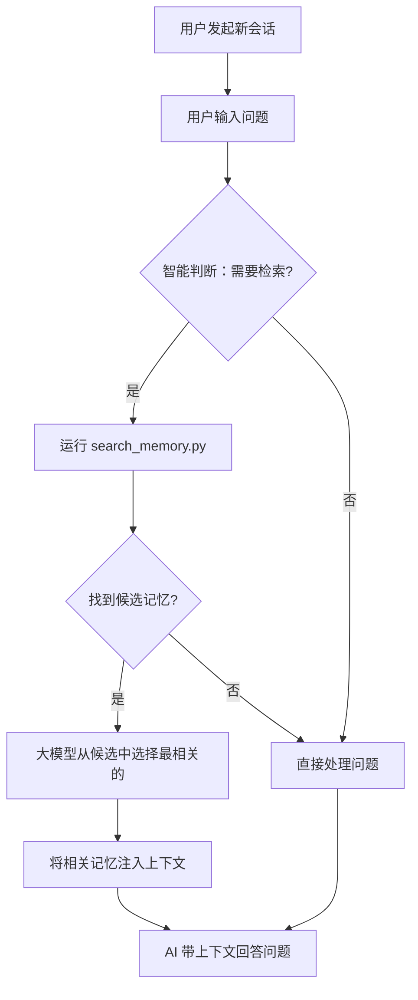
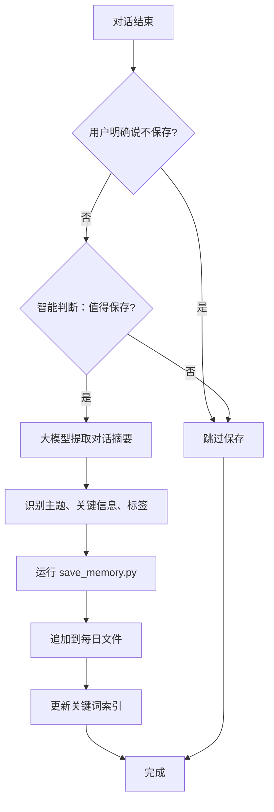

# Memory Skill 实施文档

> 基于设计文档推荐方案：**关键词 + 大模型二次筛选**

## 1. 概述

本文档描述 Memory Skill 的具体实施方案，采用设计文档中推荐的 **方案 D2：关键词 + 大模型二次筛选**。

### 1.1 核心原则

- **零外部依赖**：不使用 sentence-transformers 等外部库
- **利用大模型能力**：让 Cursor 内置的大模型进行语义理解
- **简单可靠**：关键词索引快速筛选，大模型精准匹配

### 1.2 技术选型

| 组件 | 选择 | 原因 |
|------|------|------|
| 存储格式 | Markdown + JSON | 人类可读，易于调试 |
| 索引方式 | 关键词索引 | 快速、无依赖 |
| 语义匹配 | 大模型 | 理解能力强，零维护 |
| 脚本语言 | Python | 简单、跨平台 |

## 2. 目录结构

### 2.1 代码与数据分离架构（推荐）

为了支持 Skill 安全更新，将代码和用户数据分开存放：

```
.cursor/skills/
├── memory/                      # Skill 代码（可安全更新）
│   ├── SKILL.md                 # Skill 入口文件
│   ├── scripts/
│   │   ├── save_memory.py       # 保存记忆脚本
│   │   ├── search_memory.py     # 搜索记忆脚本
│   │   └── utils.py             # 工具函数
│   └── default_config.json      # 默认配置模板
│
└── memory-data/                 # 用户数据（永不覆盖）
    ├── daily/                   # 每日对话记录
    │   ├── 2026-01-29.md
    │   ├── 2026-01-28.md
    │   └── ...
    ├── index/
    │   └── keywords.json        # 关键词索引
    └── config.json              # 用户自定义配置
```

### 2.2 Skill 更新与数据保护

#### 问题分析

当 Skill 更新时，不同类型文件的处理策略：

| 文件类型 | 位置 | 更新时处理 | 原因 |
|----------|------|-----------|------|
| SKILL.md | memory/ | ✅ 覆盖 | 功能定义，需要更新 |
| scripts/*.py | memory/ | ✅ 覆盖 | 代码逻辑，需要更新 |
| default_config.json | memory/ | ✅ 覆盖 | 默认配置模板 |
| daily/*.md | memory-data/ | ❌ 保留 | 用户记忆数据 |
| index/*.json | memory-data/ | ❌ 保留 | 用户索引数据 |
| config.json | memory-data/ | ⚠️ 合并 | 用户自定义配置 |

#### 更新机制

**方案：目录分离**

- `memory/` 目录：存放 Skill 代码，更新时可以安全替换
- `memory-data/` 目录：存放用户数据，更新时完全不触碰

**脚本路径获取逻辑**：

```python
# utils.py 中的路径获取
def get_skill_dir() -> Path:
    """获取 Skill 代码目录（可更新）"""
    return Path.cwd() / ".cursor" / "skills" / "memory"

def get_data_dir() -> Path:
    """获取用户数据目录（永不被更新覆盖）"""
    data_dir = Path.cwd() / ".cursor" / "skills" / "memory-data"
    data_dir.mkdir(parents=True, exist_ok=True)
    return data_dir
```

**配置合并逻辑**：

```python
def load_config() -> dict:
    """加载配置，用户配置优先，缺失项使用默认值"""
    skill_dir = get_skill_dir()
    data_dir = get_data_dir()
    
    # 加载默认配置
    default_config_path = skill_dir / "default_config.json"
    default_config = {}
    if default_config_path.exists():
        with open(default_config_path, 'r', encoding='utf-8') as f:
            default_config = json.load(f)
    
    # 加载用户配置
    user_config_path = data_dir / "config.json"
    user_config = {}
    if user_config_path.exists():
        with open(user_config_path, 'r', encoding='utf-8') as f:
            user_config = json.load(f)
    
    # 合并：用户配置覆盖默认配置
    merged_config = {**default_config, **user_config}
    return merged_config
```

#### 更新脚本示例

```bash
#!/bin/bash
# update_memory_skill.sh - 安全更新 Memory Skill

SKILL_DIR=".cursor/skills/memory"
DATA_DIR=".cursor/skills/memory-data"

echo "更新 Memory Skill..."

# 只更新代码目录，数据目录不触碰
rm -rf "$SKILL_DIR"
# ... 下载/复制新版本到 $SKILL_DIR ...

echo "Skill 代码已更新"
echo "用户数据保留在: $DATA_DIR"
```

### 2.3 首次初始化

首次使用时，自动创建数据目录结构：

```python
def initialize_data_dir():
    """首次使用时初始化数据目录"""
    data_dir = get_data_dir()
    
    # 创建子目录
    (data_dir / "daily").mkdir(parents=True, exist_ok=True)
    (data_dir / "index").mkdir(parents=True, exist_ok=True)
    
    # 如果用户配置不存在，从默认配置复制
    user_config = data_dir / "config.json"
    if not user_config.exists():
        default_config = get_skill_dir() / "default_config.json"
        if default_config.exists():
            shutil.copy(default_config, user_config)
    
    # 初始化空索引
    index_file = data_dir / "index" / "keywords.json"
    if not index_file.exists():
        with open(index_file, 'w', encoding='utf-8') as f:
            json.dump({
                "version": "1.0",
                "updated_at": None,
                "entries": []
            }, f, ensure_ascii=False, indent=2)
```

## 3. 核心文件实现

### 3.1 SKILL.md（Skill 入口）

```markdown
# Memory Skill

为 Cursor 提供长期记忆能力。

## 触发条件

- 每次新会话开始时，自动检索相关历史记忆
- 用户说"记住这个"、"保存记忆"时，保存当前对话
- 用户说"搜索记忆"、"查找历史"时，搜索历史记忆

## 检索流程

1. 读取 `index/keywords.json` 获取关键词索引
2. 根据用户问题提取关键词，匹配候选记忆
3. 读取候选记忆的详细内容
4. 从候选中选出最相关的 1-3 条记忆
5. 将相关记忆作为上下文注入

## 保存流程

1. 提取对话的关键信息：主题、关键词、代码片段
2. 格式化为 Markdown 追加到今日文件
3. 更新关键词索引

## 文件位置

- 每日记忆：`daily/YYYY-MM-DD.md`
- 关键词索引：`index/keywords.json`
- 配置文件：`config.json`
```

### 3.2 keywords.json（关键词索引）

```json
{
  "version": "1.0",
  "updated_at": "2026-01-29T10:30:45Z",
  "entries": [
    {
      "id": "2026-01-29-001",
      "date": "2026-01-29",
      "session": 1,
      "keywords": ["memory", "skill", "design", "cursor", "embedding"],
      "summary": "讨论了 Memory Skill 的设计，包括存储架构和检索方案",
      "tags": ["#skill", "#design"],
      "line_range": [3, 35]
    },
    {
      "id": "2026-01-29-002",
      "date": "2026-01-29",
      "session": 2,
      "keywords": ["api", "refactor", "fastapi"],
      "summary": "API 重构讨论，决定使用 FastAPI 替换 Flask",
      "tags": ["#api", "#refactor"],
      "line_range": [40, 80]
    }
  ]
}
```

### 3.3 每日记忆文件格式（daily/2026-01-29.md）

```markdown
# 2026-01-29 对话记忆

## Session 1 - 10:30:45

### 主题
Memory Skill 设计讨论

### 关键信息
- 用户希望创建长期记忆功能
- 存储位置：.cursor/skills/memories/
- 检索方式：关键词 + 大模型二次筛选
- 自动保存，用户可选择跳过

### 代码/配置
```json
{
  "storage": "project-first",
  "auto_save": true
}
```

### 标签
#skill #memory #design

---

## Session 2 - 14:20:00

### 主题
API 重构讨论

### 关键信息
- 决定使用 FastAPI 替换 Flask
- 保持 RESTful 风格
- 添加 OpenAPI 文档支持

### 标签
#api #refactor #fastapi

---
```

### 3.4 config.json（配置文件）

```json
{
  "version": "1.0",
  "storage": {
    "location": "project-first",
    "retention_days": 90
  },
  "recording": {
    "auto_save": true,
    "min_conversation_length": 3
  },
  "retrieval": {
    "max_candidates": 10,
    "max_results": 3,
    "search_scope_days": 30
  }
}
```

## 4. 脚本实现

### 4.1 utils.py（工具函数）

```python
#!/usr/bin/env python3
"""Memory Skill 工具函数"""

import json
import re
import shutil
from datetime import datetime
from pathlib import Path

# ============ 路径管理（代码与数据分离） ============

def get_skill_dir() -> Path:
    """获取 Skill 代码目录（可更新）"""
    return Path.cwd() / ".cursor" / "skills" / "memory"

def get_data_dir() -> Path:
    """获取用户数据目录（永不被更新覆盖）"""
    data_dir = Path.cwd() / ".cursor" / "skills" / "memory-data"
    data_dir.mkdir(parents=True, exist_ok=True)
    return data_dir

def initialize_data_dir():
    """首次使用时初始化数据目录"""
    data_dir = get_data_dir()
    
    # 创建子目录
    (data_dir / "daily").mkdir(parents=True, exist_ok=True)
    (data_dir / "index").mkdir(parents=True, exist_ok=True)
    
    # 如果用户配置不存在，从默认配置复制
    user_config = data_dir / "config.json"
    if not user_config.exists():
        default_config = get_skill_dir() / "default_config.json"
        if default_config.exists():
            shutil.copy(default_config, user_config)
    
    # 初始化空索引
    index_file = data_dir / "index" / "keywords.json"
    if not index_file.exists():
        with open(index_file, 'w', encoding='utf-8') as f:
            json.dump({
                "version": "1.0",
                "updated_at": None,
                "entries": []
            }, f, ensure_ascii=False, indent=2)

def extract_keywords(text: str) -> list:
    """从文本中提取关键词（简单实现）"""
    # 移除标点符号
    text = re.sub(r'[^\w\s]', ' ', text)
    
    # 分词
    words = text.lower().split()
    
    # 过滤停用词（简化版）
    stopwords = {'the', 'a', 'an', 'is', 'are', 'was', 'were', 'be', 'been',
                 'being', 'have', 'has', 'had', 'do', 'does', 'did', 'will',
                 'would', 'could', 'should', 'may', 'might', 'must', 'shall',
                 'can', 'need', 'dare', 'ought', 'used', 'to', 'of', 'in',
                 'for', 'on', 'with', 'at', 'by', 'from', 'as', 'into',
                 'through', 'during', 'before', 'after', 'above', 'below',
                 'between', 'under', 'again', 'further', 'then', 'once',
                 '的', '是', '在', '了', '和', '与', '或', '但', '如果',
                 '这个', '那个', '什么', '怎么', '为什么', '可以', '需要'}
    
    keywords = [w for w in words if w not in stopwords and len(w) > 1]
    
    # 去重并保持顺序
    seen = set()
    unique_keywords = []
    for kw in keywords:
        if kw not in seen:
            seen.add(kw)
            unique_keywords.append(kw)
    
    return unique_keywords[:20]  # 最多返回 20 个关键词

def load_index() -> dict:
    """加载关键词索引"""
    initialize_data_dir()  # 确保数据目录存在
    index_path = get_data_dir() / "index" / "keywords.json"
    if index_path.exists():
        with open(index_path, 'r', encoding='utf-8') as f:
            return json.load(f)
    return {"version": "1.0", "updated_at": None, "entries": []}

def save_index(index: dict):
    """保存关键词索引"""
    initialize_data_dir()  # 确保数据目录存在
    index_path = get_data_dir() / "index" / "keywords.json"
    index_path.parent.mkdir(parents=True, exist_ok=True)
    index["updated_at"] = datetime.now().isoformat()
    with open(index_path, 'w', encoding='utf-8') as f:
        json.dump(index, f, ensure_ascii=False, indent=2)

def load_config() -> dict:
    """加载配置，用户配置优先，缺失项使用默认值"""
    skill_dir = get_skill_dir()
    data_dir = get_data_dir()
    
    # 加载默认配置
    default_config_path = skill_dir / "default_config.json"
    default_config = {
        "version": "1.0",
        "storage": {"location": "project-first", "retention_days": 90},
        "recording": {"auto_save": True, "min_conversation_length": 3},
        "retrieval": {"max_candidates": 10, "max_results": 3, "search_scope_days": 30}
    }
    if default_config_path.exists():
        with open(default_config_path, 'r', encoding='utf-8') as f:
            default_config = json.load(f)
    
    # 加载用户配置
    user_config_path = data_dir / "config.json"
    user_config = {}
    if user_config_path.exists():
        with open(user_config_path, 'r', encoding='utf-8') as f:
            user_config = json.load(f)
    
    # 合并：用户配置覆盖默认配置
    merged_config = {**default_config, **user_config}
    return merged_config
```

### 4.2 save_memory.py（保存记忆）

```python
#!/usr/bin/env python3
"""保存对话记忆到每日文件"""

import sys
import json
from datetime import datetime
from pathlib import Path
from utils import get_data_dir, extract_keywords, load_index, save_index, initialize_data_dir

def save_memory(topic: str, key_info: list, code_snippets: list = None, tags: list = None):
    """
    保存一条记忆
    
    Args:
        topic: 对话主题
        key_info: 关键信息列表
        code_snippets: 代码片段列表（可选）
        tags: 标签列表（可选）
    """
    initialize_data_dir()  # 确保数据目录存在
    data_dir = get_data_dir()
    today = datetime.now().strftime("%Y-%m-%d")
    time_str = datetime.now().strftime("%H:%M:%S")
    
    # 确定 session 编号
    index = load_index()
    today_entries = [e for e in index["entries"] if e["date"] == today]
    session_num = len(today_entries) + 1
    
    # 生成记忆 ID
    memory_id = f"{today}-{session_num:03d}"
    
    # 构建 Markdown 内容
    md_content = f"\n## Session {session_num} - {time_str}\n\n"
    md_content += f"### 主题\n{topic}\n\n"
    md_content += "### 关键信息\n"
    for info in key_info:
        md_content += f"- {info}\n"
    
    if code_snippets:
        md_content += "\n### 代码/配置\n"
        for snippet in code_snippets:
            md_content += f"```\n{snippet}\n```\n"
    
    if tags:
        md_content += f"\n### 标签\n{' '.join(tags)}\n"
    
    md_content += "\n---\n"
    
    # 写入每日文件
    daily_dir = data_dir / "daily"
    daily_dir.mkdir(parents=True, exist_ok=True)
    daily_file = daily_dir / f"{today}.md"
    
    if not daily_file.exists():
        # 创建新文件，添加标题
        with open(daily_file, 'w', encoding='utf-8') as f:
            f.write(f"# {today} 对话记忆\n")
    
    # 追加内容
    with open(daily_file, 'a', encoding='utf-8') as f:
        f.write(md_content)
    
    # 计算行范围（简化处理）
    with open(daily_file, 'r', encoding='utf-8') as f:
        lines = f.readlines()
    end_line = len(lines)
    start_line = end_line - md_content.count('\n')
    
    # 更新索引
    all_text = f"{topic} {' '.join(key_info)}"
    keywords = extract_keywords(all_text)
    
    index["entries"].append({
        "id": memory_id,
        "date": today,
        "session": session_num,
        "keywords": keywords,
        "summary": topic,
        "tags": tags or [],
        "line_range": [start_line, end_line]
    })
    save_index(index)
    
    print(f"记忆已保存: {memory_id}")
    return memory_id

if __name__ == "__main__":
    # 示例用法
    if len(sys.argv) > 1:
        # 从命令行参数读取 JSON
        data = json.loads(sys.argv[1])
        save_memory(
            topic=data.get("topic", "未命名主题"),
            key_info=data.get("key_info", []),
            code_snippets=data.get("code_snippets"),
            tags=data.get("tags")
        )
    else:
        # 测试用例
        save_memory(
            topic="Memory Skill 设计讨论",
            key_info=[
                "用户希望创建长期记忆功能",
                "存储位置：.cursor/skills/memories/",
                "检索方式：关键词 + 大模型二次筛选"
            ],
            tags=["#skill", "#memory", "#design"]
        )
```

### 4.3 search_memory.py（搜索记忆）

```python
#!/usr/bin/env python3
"""搜索历史记忆"""

import sys
import json
from datetime import datetime, timedelta
from pathlib import Path
from utils import get_data_dir, extract_keywords, load_index, load_config, initialize_data_dir

def keyword_search(query: str, max_candidates: int = 10) -> list:
    """
    关键词搜索，返回候选记忆
    
    Args:
        query: 用户查询
        max_candidates: 最大候选数量
    
    Returns:
        候选记忆列表，按相关性排序
    """
    index = load_index()
    config = load_config()
    
    # 提取查询关键词
    query_keywords = set(extract_keywords(query))
    
    if not query_keywords:
        return []
    
    # 计算搜索范围
    search_days = config["retrieval"].get("search_scope_days", 30)
    cutoff_date = (datetime.now() - timedelta(days=search_days)).strftime("%Y-%m-%d")
    
    # 匹配并计分
    results = []
    for entry in index["entries"]:
        # 跳过超出范围的记忆
        if entry["date"] < cutoff_date:
            continue
        
        entry_keywords = set(entry["keywords"])
        
        # 计算关键词匹配分数
        matched = query_keywords & entry_keywords
        if matched:
            # 基础分数：匹配关键词数量
            score = len(matched)
            
            # 时间衰减（每天衰减 5%）
            days_ago = (datetime.now() - datetime.strptime(entry["date"], "%Y-%m-%d")).days
            decay_rate = 0.95
            score *= (decay_rate ** days_ago)
            
            results.append({
                "entry": entry,
                "score": score,
                "matched_keywords": list(matched)
            })
    
    # 按分数排序
    results.sort(key=lambda x: -x["score"])
    
    return results[:max_candidates]

def get_memory_content(entry: dict) -> str:
    """获取记忆的详细内容"""
    data_dir = get_data_dir()
    daily_file = data_dir / "daily" / f"{entry['date']}.md"
    
    if not daily_file.exists():
        return entry["summary"]
    
    with open(daily_file, 'r', encoding='utf-8') as f:
        lines = f.readlines()
    
    start, end = entry["line_range"]
    # 确保范围有效
    start = max(0, start - 1)
    end = min(len(lines), end)
    
    return "".join(lines[start:end])

def search_memories(query: str) -> dict:
    """
    搜索记忆的主函数
    
    返回候选记忆及其内容，供大模型进行二次筛选
    """
    config = load_config()
    max_candidates = config["retrieval"].get("max_candidates", 10)
    
    # 第一步：关键词快速筛选
    candidates = keyword_search(query, max_candidates)
    
    if not candidates:
        return {
            "query": query,
            "candidates_count": 0,
            "candidates": [],
            "message": "未找到相关记忆"
        }
    
    # 第二步：获取候选记忆的详细内容
    detailed_candidates = []
    for c in candidates:
        entry = c["entry"]
        content = get_memory_content(entry)
        detailed_candidates.append({
            "id": entry["id"],
            "date": entry["date"],
            "summary": entry["summary"],
            "score": round(c["score"], 3),
            "matched_keywords": c["matched_keywords"],
            "content": content
        })
    
    return {
        "query": query,
        "candidates_count": len(detailed_candidates),
        "candidates": detailed_candidates,
        "instruction": "请从以上候选记忆中，选出与用户问题最相关的 1-3 条"
    }

if __name__ == "__main__":
    if len(sys.argv) > 1:
        query = sys.argv[1]
    else:
        query = "Memory Skill 设计"
    
    result = search_memories(query)
    print(json.dumps(result, ensure_ascii=False, indent=2))
```

## 5. 智能触发条件

> **核心思想**：充分利用大模型的理解能力进行意图识别，而不是依赖简单的关键词匹配。
> 
> **完整方案**：详见设计文档 `2026-01-29_memory-skill-design.md` 第 10.2 节

### 5.1 推荐方案：意图识别触发 + 智能保存判断

采用设计文档推荐的组合方案：
- **检索触发**：让大模型分析用户意图，智能判断是否需要检索
- **保存触发**：让大模型判断对话内容是否值得保存

### 5.2 检索触发判断

**触发规则**：

| 意图类型 | 触发检索 | 示例 |
|----------|---------|------|
| 延续性意图 | ✅ | "继续昨天的工作"、"上次说到哪了" |
| 偏好相关 | ✅ | "帮我写个函数"（检索用户编码偏好） |
| 项目相关 | ✅ | "这个项目的 API 怎么调用" |
| 独立问题 | ❌ | "Python 怎么读取文件"（通用问题） |
| 明确新话题 | ❌ | "换个话题"、"我想问个新问题" |

**Skill 检索触发指令**：

```markdown
## 智能检索触发判断

在回答用户问题之前，请先判断是否需要检索历史记忆。

**用户问题**: {user_query}

**判断标准**：
1. 是否涉及"之前"、"上次"、"继续"等延续性词汇？
2. 是否与当前项目相关，可能有历史上下文？
3. 是否涉及个人偏好（编码风格、工具选择等）？
4. 是否是通用知识问题（无需记忆）？

**请输出判断结果**：
- 如果需要检索：说明原因，然后执行 search_memory.py "{提取的关键词}"
- 如果不需要检索：直接回答用户问题
```

### 5.3 保存触发判断

**保存价值判断标准**：

| 对话类型 | 是否保存 | 原因 |
|----------|---------|------|
| 重要决策 | ✅ | "我们决定使用 FastAPI" |
| 偏好表达 | ✅ | "我喜欢用 TypeScript" |
| 项目配置 | ✅ | "API 前缀是 /api/v2" |
| 简单问答 | ❌ | "Python 怎么读文件" |
| 调试过程 | ❌ | 临时的错误排查 |

**Skill 保存触发指令**：

```markdown
## 智能保存判断

对话即将结束，请判断本次对话是否值得保存为记忆。

**值得保存**：重要决策、用户偏好、项目配置、待办计划、复杂方案
**不值得保存**：通用问答、临时调试、闲聊、重复内容

**请输出判断结果**：
- 如果值得保存：提取关键信息，执行 save_memory.py
- 如果不值得保存：输出"本次对话无需保存"
```

## 6. 工作流程

### 6.1 检索流程（智能触发版）



### 6.2 保存流程（智能判断版）



## 7. Skill 指令模板

### 7.1 检索指令

```markdown
## 记忆检索

我需要检索与用户问题相关的历史记忆。

**用户问题**: {user_query}

**候选记忆**:
{search_memory.py 的输出}

请从以上候选记忆中：
1. 选出最相关的 1-3 条记忆
2. 说明选择原因
3. 将相关记忆作为上下文，帮助回答用户问题
```

### 7.2 保存指令

```markdown
## 保存记忆

请将本次对话保存为记忆。

**提取以下信息**:
1. 主题（一句话概括）
2. 关键信息（3-5 条要点）
3. 代码片段（如有）
4. 标签（#开头，2-5 个）

**输出 JSON 格式**:
```json
{
  "topic": "主题",
  "key_info": ["要点1", "要点2"],
  "code_snippets": ["代码片段"],
  "tags": ["#tag1", "#tag2"]
}
```

然后运行: python3 scripts/save_memory.py '{JSON}'
```

## 8. 使用示例

### 8.1 自动检索示例

```
[用户]: 继续昨天的 API 重构工作

[Memory Skill 检索]:
运行 search_memory.py "API 重构"
找到候选记忆:
- 2026-01-28: API 重构讨论，决定使用 FastAPI

[AI 响应]:
基于昨天的讨论，我们决定使用 FastAPI 替换 Flask。
上次我们完成了路由定义，接下来需要...
```

### 8.2 手动保存示例

```
[用户]: 记住这个

[Memory Skill]:
提取对话摘要:
- 主题: 数据库连接池配置
- 关键信息: 使用 SQLAlchemy，pool_size=10
- 标签: #database #config

运行 save_memory.py 保存记忆
输出: 记忆已保存: 2026-01-29-003
```

## 9. 后续优化方向

1. **语义标签增强**: 让大模型在保存时生成语义标签，提升检索准确性
2. **记忆合并**: 相似记忆自动合并，减少冗余
3. **重要性标记**: 用户可标记重要记忆，提升检索权重
4. **跨项目检索**: 支持从全局记忆中检索
5. **记忆可视化**: 提供记忆浏览和管理界面
