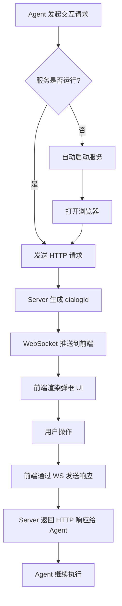
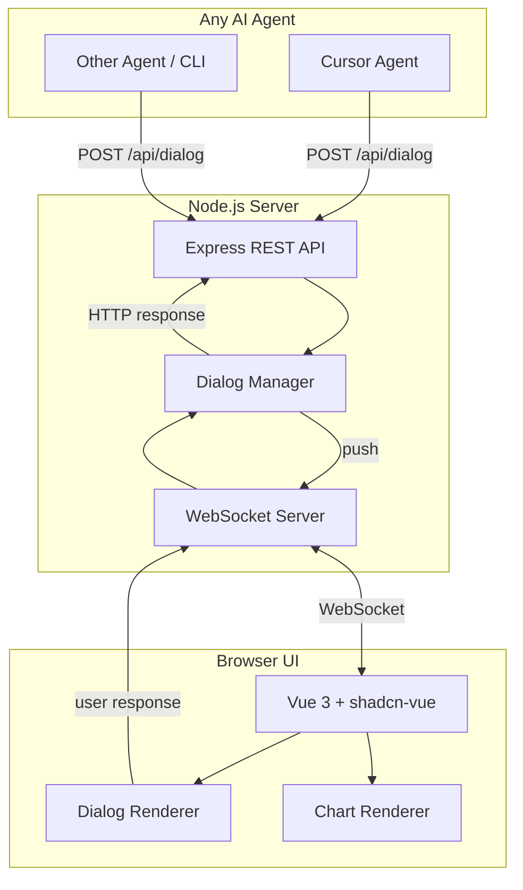
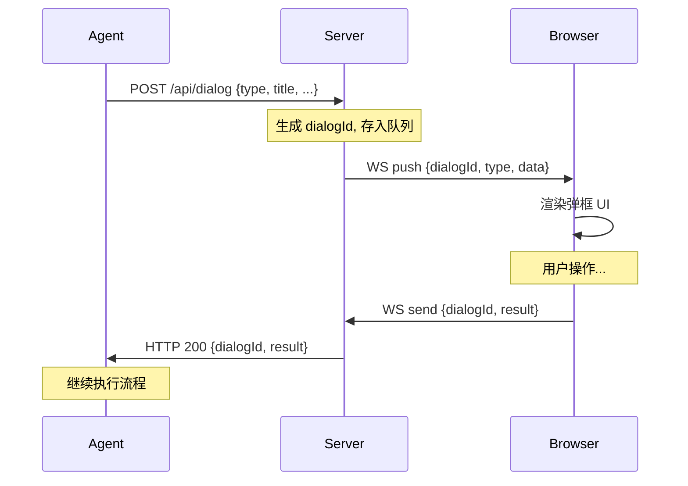

# Agent Interact — 设计文档

## 0. Phase 1 命名记录

### 候选方案

| 方案 | 名称 | 特点 |
|------|------|------|
| 1 | agent-dialog | 强调对话框/弹框交互，直观易懂 |
| 2 | agent-bridge | 强调 Agent 与 Human 之间的桥梁角色 |
| 3 | agent-interact | 强调交互能力，涵盖面广 |
| 4 | agent-popup | 强调弹框行为，偏前端术语 |
| 5 | agent-ui | 最简洁，但可能太宽泛 |

### 最终选择

**agent-interact**

理由：
- `interact` 涵盖了所有场景（确认选择、等待操作、图表展示）都是 Agent 与用户的"交互"
- 比 `dialog` 更通用，未来可扩展到非弹框类交互（如通知、进度条、表单等）
- `agent-` 前缀明确使用者是 AI Agent
- 命名风格与现有 Skill（`api-tracer`、`web-content-reader`）一致

## 1. 需求

### 1.1 背景

AI Agent（如 Cursor Agent）在执行任务时，经常需要与用户进行交互：确认选择、等待外部操作完成、展示数据图表等。目前这些交互只能通过文本对话完成，体验受限。需要一个可视化的交互桥梁，让 Agent 能够弹出 UI 界面与用户交互。

### 1.2 目标

- 提供本地 Web Server + 前端 UI，作为 Agent-Human 交互桥梁
- 支持三种核心交互类型：确认选择、等待操作、图表展示
- 任何 Agent 都可通过 HTTP API 调用，不绑定特定 IDE
- CLI 工具支持同步阻塞调用，Agent 发起请求后等待用户响应

### 1.3 使用场景

| 场景 | 触发方式 | 说明 |
|------|----------|------|
| 确认选择 | Agent 需要用户从多个选项中选择 | 如选择部署环境、确认操作方案 |
| 等待操作 | Agent 等待用户完成外部操作 | 如指纹验证、手动审批、物理设备操作 |
| 图表展示 | Agent 需要可视化展示数据 | 如性能分析图、API 响应时间、数据对比 |

## 2. 整体流程



## 3. 技术方案

### 3.1 方案 A：本地 Web Server（推荐）

**原理**：启动本地 HTTP + WebSocket 服务，Agent 通过 REST API 触发弹框，前端通过 WebSocket 实时通信。

**优点**：
- 实时双向通信，延迟极低
- 完整 Vue 工程，UI 体验最好
- 独立进程，不依赖任何 IDE
- 可同时服务多个 Agent

**缺点**：
- 需要启动后台服务进程
- 用户需要打开浏览器标签页

### 3.2 方案 B：文件轮询

**原理**：Agent 写入请求文件，前端监听文件变化弹框，用户操作后写入响应文件。

**优点**：
- 最轻量，无需后台服务
- 实现简单

**缺点**：
- 轮询有延迟（0.5-2s）
- 并发处理复杂
- 扩展性差

### 3.3 方案 C：Tauri 桌面窗口

**原理**：使用 Tauri 创建独立桌面窗口，Agent 通过 IPC 通信。

**优点**：
- 原生窗口体验，可置顶弹出
- 不需要浏览器

**缺点**：
- 需要 Rust 工具链
- 开发复杂度高
- 分发安装门槛高

### 3.4 方案对比

| 维度 | A: Web Server | B: 文件轮询 | C: Tauri |
|------|--------------|------------|----------|
| 实时性 | 极高（WebSocket） | 低（轮询延迟） | 高（IPC） |
| 开发复杂度 | 中等 | 低 | 高 |
| UI 体验 | 优秀 | 一般 | 最佳 |
| 独立性 | 高 | 中 | 高 |
| 扩展性 | 强 | 弱 | 强 |
| 安装门槛 | 低（npm） | 最低 | 高（编译） |

## 4. 推荐方案

选择**方案 A：本地 Web Server**。

### 4.1 架构



### 4.2 通信流程



关键设计：Agent 的 HTTP 请求是**阻塞的**（long-polling），直到用户在前端操作后才返回响应。

### 4.3 交互类型（已实现 + 规划）

#### 已实现（V1）

| 类型 | 场景 | 说明 |
|------|------|------|
| confirm | 确认选择 | Agent 需要用户从选项中选择 |
| wait | 等待操作 | Agent 等待用户完成外部操作 |
| chart | 图表展示 | Agent 可视化展示数据 |

#### 规划中（V2+，参考 Google Chat、OpenAI ChatKit、Microsoft AG-UI）

| 类型 | 场景 | 参考来源 | 说明 |
|------|------|----------|------|
| notification | 通知提醒 | 通用 UI | Agent 向用户推送通知（info/warning/error/success），无需等待响应 |
| form | 表单输入 | OpenAI ChatKit Form | Agent 需要用户填写结构化数据（文本、数字、下拉等） |
| approval | 审批门控 | Microsoft AG-UI | Agent 执行敏感操作前需要用户审批（approve/reject + 原因） |
| progress | 进度展示 | Long-running AI Tasks | Agent 展示长时间任务的实时进度（步骤列表 + 百分比） |
| file-upload | 文件上传 | 通用 UI | Agent 需要用户提供文件（图片、配置文件等） |
| markdown | 富文本展示 | Google Chat Cards | Agent 展示格式化内容（Markdown 渲染、代码高亮） |
| table | 数据表格 | OpenAI ChatKit ListView | Agent 展示结构化表格数据，支持排序和筛选 |
| multi-step | 多步向导 | 通用 Wizard | Agent 引导用户完成多步骤流程（如初始化配置） |

#### 场景示例

**notification — 通知提醒**
```json
{
  "type": "notification",
  "level": "warning",
  "title": "磁盘空间不足",
  "message": "当前磁盘使用率 92%，建议清理",
  "autoClose": 5
}
```

**form — 表单输入**
```json
{
  "type": "form",
  "title": "数据库连接配置",
  "fields": [
    { "id": "host", "label": "主机", "type": "text", "default": "localhost" },
    { "id": "port", "label": "端口", "type": "number", "default": 5432 },
    { "id": "db", "label": "数据库", "type": "select", "options": ["postgres", "mysql"] }
  ]
}
```

**approval — 审批门控**
```json
{
  "type": "approval",
  "title": "确认删除操作",
  "message": "即将删除 production 数据库中的 users 表，此操作不可逆",
  "severity": "critical",
  "details": { "action": "DROP TABLE users", "database": "production" }
}
```

**progress — 进度展示**
```json
{
  "type": "progress",
  "title": "部署进度",
  "steps": [
    { "id": "build", "label": "构建", "status": "completed" },
    { "id": "test", "label": "测试", "status": "running" },
    { "id": "deploy", "label": "部署", "status": "pending" }
  ],
  "percent": 45
}
```

### 4.4 已实现的三种弹框类型

#### confirm - 确认选择

```json
{
  "type": "confirm",
  "title": "请选择部署环境",
  "message": "检测到多个可用环境",
  "options": [
    { "id": "dev", "label": "开发环境", "description": "dev.example.com" },
    { "id": "staging", "label": "预发环境", "description": "staging.example.com" }
  ],
  "allowMultiple": false,
  "timeout": 60
}
```

#### wait - 等待操作

```json
{
  "type": "wait",
  "title": "等待指纹验证",
  "message": "请在设备上完成指纹验证后点击确认",
  "confirmText": "已完成验证",
  "cancelText": "取消",
  "timeout": 120
}
```

#### chart - 图表展示

```json
{
  "type": "chart",
  "title": "API 响应时间分析",
  "chartType": "line",
  "data": {
    "labels": ["Mon", "Tue", "Wed"],
    "datasets": [{ "label": "P99", "data": [120, 150, 90] }]
  },
  "actions": [
    { "id": "ok", "label": "了解" },
    { "id": "export", "label": "导出数据" }
  ]
}
```

### 4.5 REST API

| 方法 | 路径 | 说明 |
|------|------|------|
| POST | /api/dialog | 创建弹框（阻塞直到用户响应或超时） |
| GET | /api/status | 服务状态检查 |
| GET | /api/dialogs | 当前活跃弹框列表 |
| DELETE | /api/dialog/:id | 取消弹框 |

### 4.6 WebSocket 事件

| 方向 | 事件 | 说明 |
|------|------|------|
| Server → Client | dialog:open | 推送新弹框 |
| Server → Client | dialog:close | 关闭弹框 |
| Client → Server | dialog:response | 用户响应 |

### 4.7 CLI 命令设计

```bash
node skills/agent-interact/tool.js start          # 启动服务
node skills/agent-interact/tool.js stop           # 停止服务
node skills/agent-interact/tool.js status         # 检查服务状态
node skills/agent-interact/tool.js dialog '<JSON>' # 发送弹框（阻塞等待结果）
```

### 4.8 输出格式

成功：
```json
{
  "result": { "dialogId": "d-xxx", "action": "dev", "data": {} },
  "error": null
}
```

超时/取消：
```json
{
  "result": null,
  "error": "Dialog timed out after 60s"
}
```

### 4.9 技术栈

- **后端**：Node.js + Express + ws（WebSocket）
- **前端**：Vite + Vue 3 + TypeScript + shadcn-vue + Tailwind CSS v4
- **图表**：Chart.js + vue-chartjs
- **前端目录**：`skills/agent-interact/ui/`（独立 Vite 项目）

### 4.10 目录结构

```
skills/agent-interact/
├── SKILL.md
├── package.json
├── tool.js                    # CLI 入口
├── lib/
│   ├── config.js              # 端口、超时等配置
│   ├── server.js              # Express + WebSocket 服务
│   ├── dialog-manager.js      # 弹框生命周期管理
│   └── response.js            # 标准输出格式
└── ui/                        # Vite + Vue 3 前端项目
    ├── package.json
    ├── vite.config.ts
    ├── tsconfig.json
    └── src/
        ├── App.vue
        ├── main.ts
        ├── style.css
        ├── components/
        │   ├── DialogContainer.vue
        │   ├── ConfirmDialog.vue
        │   ├── WaitDialog.vue
        │   └── ChartDialog.vue
        └── lib/
            ├── ws-client.ts
            └── types.ts
```

## 5. 实现计划

### Phase 1：核心功能（MVP）

- 后端：Express + WebSocket 服务、DialogManager
- 前端：Vue 3 + shadcn-vue 基础框架
- 实现 confirm 弹框类型
- CLI tool.js 集成（start/stop/status/dialog）

### Phase 2：完整弹框类型

- 实现 wait 弹框类型
- 实现 chart 弹框类型（Chart.js 集成）

### Phase 3：增强功能

- 自动启动服务 + 打开浏览器
- 超时处理和错误恢复
- 弹框历史记录

## 6. 风险与注意事项

| 风险 | 影响 | 缓解措施 |
|------|------|----------|
| 端口冲突 | 服务无法启动 | 默认 7890，支持配置和自动发现可用端口 |
| 前端构建 | 首次使用需额外步骤 | npm install && npm run build，之后 serve 静态文件 |
| Agent 永久阻塞 | 流程卡死 | 所有弹框强制超时机制 |
| 安全性 | 外部访问 | 仅监听 localhost |
| 浏览器关闭 | 无法响应 | 超时自动返回错误 |

## 7. 技术文档

详见独立文件：`design/agent-interact/2026-02-23-01-技术文档.md`
