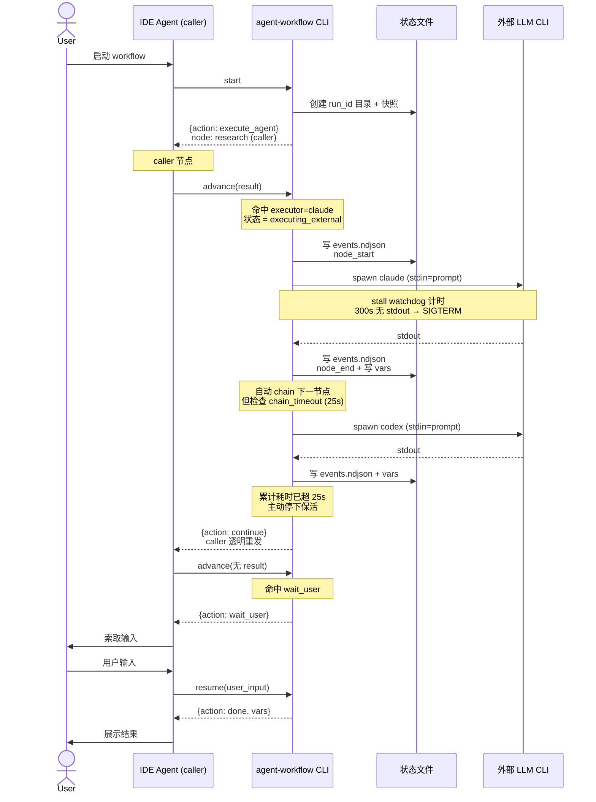
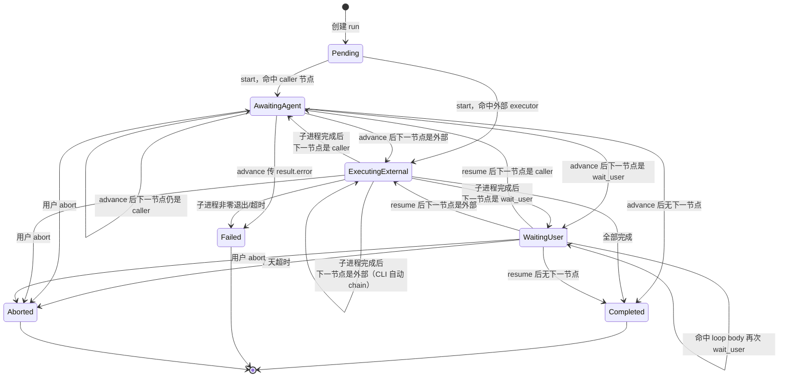

# Agent Workflow — 设计文档

> 日期：2026-05-27
> 作者：shetengteng
> 状态：草稿（Phase 3 - **v1.5 设计审核后大修订**）

## 变更记录

| 版本 | 日期 | 变更摘要 |
|------|------|----------|
| v1.0 | 2026-05-27 | 初稿：基础架构、3 类节点、状态机驱动 |
| v1.1 | 2026-05-27 | Executor 抽象，跨 LLM CLI 调用 |
| v1.2 | 2026-05-27 | 节点 `description` 可选字段 |
| v1.3 | 2026-05-27 | §4.10 执行记录与持久化专章 |
| v1.4 | 2026-05-27 | §1.5 定位、§4.11 校验、§4.12 创建、§4.13 错误处理 |
| **v1.5** | **2026-05-27** | **设计审核后大修订（24 项变更）**：删 edges / 统一错误协议 / 修 loop+wait_user / node UUID+alias / prompt 安全 / 状态拆分 / events.ndjson 入 v1 / strict_vars / project_root / secrets / 新增 §9 能力矩阵 |
| v1.5.1 | 2026-05-27 | 新增原子 `sleep` 节点（同步实现，0-300s）—— 可塞入 loop.body 做轮询 / 任意位置做 rate limit |
| v1.5.2 | 2026-05-27 | **长任务稳定性 + caller 接力** 4 项：①chain_timeout 25s + `action:"continue"` ② stall watchdog 300s + `EXECUTOR_STALLED` ③ `stats` 聚合命令（v1.5） ④ caller 接力 3 条约定（启动 list / 持久化 run_id / status 含 last_payload） |

---

## 0. Phase 1 命名记录

### 0.1 候选方案

| # | 命名 | 理由 |
|---|------|------|
| 1 | **agent-workflow** ✅ | 准确对应"由 agent 调用串成的 workflow"，与现有 `agent-interact` 同系列 |
| 2 | agent-pipeline | 强调流水线，但弱化"循环/阻塞"含义 |
| 3 | flow-engine | 强调引擎能力，但偏抽象 |
| 4 | skill-workflow | 范围窄于"agent 调用" |
| 5 | workflow-runner | 弱化 agent 概念 |

### 0.2 最终选择

- **命名**：`agent-workflow`
- **技术栈**：Python 3.10+
- **使用场景**：AI Agent 内部调用 + 用户手动触发
- **阻塞实现**：状态机持久化
- **配置格式**：YAML

---

## 1. 需求

### 1.1 背景

当前 AI Agent（Claude Code / Cursor / Codex / OpenCode / GitHub Copilot 等）在执行复杂任务时存在以下痛点：

1. **多步骤任务无结构化编排**：缺少可重复执行的流程
2. **跨 IDE 不通用**：各 IDE 私有抽象互不兼容
3. **缺少阻塞与循环原语**：subagent chain 无法表达"等用户确认"、"质量循环优化"
4. **agent 调用模式重复**：每个项目都重新写一遍 prompt 链
5. **跨 LLM 协作困难**：本地装了 claude/codex/opencode/gemini 多个 CLI，希望在一个 workflow 内组合调用

### 1.2 目标

| 目标 | 说明 |
|------|------|
| **G1：跨 IDE 通用** | CLI 形态，shell spawn 调用 |
| **G2：声明式配置** | YAML 描述节点、节点顺序、循环条件 |
| **G3：三类核心节点** | `agent_call` / `wait_user` / `loop` |
| **G4：状态机驱动** | 落盘状态文件，崩溃可恢复 |
| **G5：可观测** | `status` / `list` / `events.ndjson` |
| **G6：Agent 友好** | SKILL.md 明确调用协议 |
| **G7：跨 LLM 调用** | 节点 `executor` 字段；CLI 内部 spawn 子进程 |
| **G8：原子可组合节点** | `sleep` 节点（任意位置插入做 rate limit / 轮询间隔） |

### 1.3 使用场景

| 场景 | 触发方式 | 说明 |
|------|----------|------|
| 代码生成流水线 | Agent | 调研 → 设计 → 实现 → 测试 → 报告 |
| 代码审查工作流 | 用户/Agent | 检查格式 → 检查测试 → 用户确认 → 提交 |
| 数据分析报告 | Agent | 拉数据 → 分析 → 图表 → 循环优化 |
| 多轮迭代优化 | Agent | 生成 → 用户反馈 → 循环优化 |
| 跨项目复用 | 用户/Agent | workflow YAML 提交 git，团队复用 |
| 跨 LLM 协作 | Agent | 设计 Claude / 实现 Codex / 评审 caller |

### 1.4 非目标

- ❌ **不内嵌 LLM SDK**：通过 spawn 第三方 CLI 子进程
- ❌ **v1 不做 edges / DAG**：仅按 nodes 数组顺序串行；v2 评估
- ❌ **不做 Web UI**
- ❌ **不做权限/RBAC**
- ❌ **v1 不做 Windows**：仅 macOS / Linux；Windows 在 v1.5 评估

### 1.5 Skill 定位：全生命周期一体

本 skill 覆盖 workflow 的：

| 阶段 | 能力 | 命令/模块 |
|------|------|---------|
| 创建 | 从模板生成 YAML | `create` / `lib/builder/` / `examples/` |
| 校验 | 4 级校验体系 | `validate` / `lib/parser.py` |
| 执行 | 状态机 + 跨 LLM | `start` / `advance` / `resume` / `lib/engine.py` |
| 持久化 | Run 目录 + state.json + 快照 + events.ndjson + audit.log | `lib/store.py` |
| 管理 | 查询 / 中止 / 清理 | `status` / `list` / `abort` / `prune` |

### 1.6 使用边界（何时用本 skill）

| 用本 skill ✅ | 不用本 skill ❌ |
|------|------|
| ≥3 个节点的多步任务 | 单次问答 |
| 含用户阻塞（wait_user） | 纯 LLM 推理 |
| 含条件循环 | 简单 2-3 步 prompt chain |
| 跨 LLM 调用 | 单一 LLM 内部 |
| 需要可重复执行的 SOP | 临时任务 |
| 需要审计/进度可见 | 一次性脚本 |

---

## 2. 整体流程

### 2.1 高层时序



### 2.2 节点状态流转（v1.5 拆分）



**状态语义**：

| 状态 | 含义 | 允许操作 |
|------|------|--------|
| `awaiting_agent` | caller 节点等待 IDE agent 调 `advance` | `advance` / `abort` |
| `executing_external` | CLI 正在 spawn 外部 LLM 子进程 | `status`（只读）/ `abort` |
| `waiting_user` | 命中 `wait_user`，等待 `resume` | `resume` / `abort` |
| `completed` | 全部完成 | `status`（只读） |
| `failed` | 节点失败 | `status`（只读） |
| `aborted` | 主动中止/超时 | `status`（只读） |

---

## 3. 技术方案

### 3.1 方案 A：CLI 状态机驱动 + 多 Executor（推荐）

**原理**：CLI 是状态机 + Executor 调度器，**不内嵌 LLM SDK**，所有跨 LLM 通过 spawn 子进程实现。`caller` executor 返回给 IDE agent，其他 executor CLI 内部 chain。

**优点**：跨 IDE / 跨 LLM / 无 API key / 崩溃可恢复 / 测试友好

**缺点**：需要 SKILL.md 教学；spawn 开销 1-3 秒；不同 CLI 输出格式需适配

### 3.2 方案 B / 3.3 方案 C 均已否决

详见 v1.0 版本（B：CLI 内嵌 SDK，C：IDE 私有适配）。

### 3.4 方案对比

| 维度 | A：CLI + Executor ✅ | B：CLI 内嵌 SDK | C：IDE 适配 |
|------|---|---|---|
| 跨 IDE 通用 | ⭐⭐⭐⭐⭐ | ⭐⭐⭐⭐ | ⭐⭐ |
| 跨 LLM 调用 | ⭐⭐⭐⭐⭐ | ⭐⭐⭐ | ⭐ |
| 实现复杂度 | ⭐⭐⭐⭐ | ⭐⭐⭐⭐ | ⭐⭐⭐⭐⭐ |
| 维护成本 | ⭐⭐ | ⭐⭐⭐ | ⭐⭐⭐⭐⭐ |
| 用户成本 | 0 | 需 API key | 0 |
| 利用 IDE 上下文 | ✅ caller 完整 | ❌ | ✅ |
| 阻塞节点 | 持久化天然支持 | 进程内 | 各 IDE 不一 |
| 崩溃恢复 | ✅ | ❌ | 部分 |

---

## 4. 推荐方案

### 4.1 架构图

```
┌──────────────────────────────────────────────────────────┐
│  IDE Agent (caller)                                       │
│  1. 读 SKILL.md 理解调用协议                                │
│  2. shell spawn → tool.py                                │
│  3. 收 execute_agent → 推理 → advance                      │
│  4. 收 wait_user → 索取输入 → resume                       │
│  5. 收 done → 展示结果                                     │
│  错误处理：检查顶层 error，按 error.code / retryable 决策    │
└────────────────────────┬─────────────────────────────────┘
                         │ stdin/stdout JSON
                         ▼
┌──────────────────────────────────────────────────────────┐
│             agent-workflow CLI (Python 3.10+)             │
│  ┌──────────────────┬───────────────────┬────────────┐   │
│  │  parser.py       │  engine.py        │ store.py   │   │
│  │  YAML→AST + 校验  │  状态机 + chain    │ state + 锁  │   │
│  │  数据流分析       │  events 写入       │            │   │
│  └──────────────────┴───────────────────┴────────────┘   │
│  ┌──────────────────┬───────────────────┬────────────┐   │
│  │  nodes/          │  template.py      │ logger.py  │   │
│  │  agent_call.py   │  {{var}} + strict │ audit.log  │   │
│  │  wait_user.py    │  + secret 脱敏    │ events    │   │
│  │  loop.py         │                   │            │   │
│  │  sleep.py        │                   │            │   │
│  └──────────────────┴───────────────────┴────────────┘   │
│  ┌──────────────────┬──────────────────────────────┐    │
│  │ executors/        │  builder/                    │    │
│  │  base.py          │  scaffold.py                 │    │
│  │  caller.py        │  template_render.py          │    │
│  │  claude.py (stdin)│  errors.py                   │    │
│  │  codex.py (stdin) │                              │    │
│  │  mock.py (test)   │                              │    │
│  └──────────────────┴──────────────────────────────┘    │
└────────────────────────┬─────────────────────────────────┘
                         │ spawn 子进程（stdin 传 prompt）
                         ▼
┌──────────────────────────────────────────────────────────┐
│   外部 LLM CLI（claude / codex / ...）                    │
└──────────────────────────────────────────────────────────┘

┌──────────────────────────────────────────────────────────┐
│   状态目录（默认 ~/.agent-workflow/）                      │
│   ├── config.yaml             # executor 全局配置          │
│   └── runs/<run_id>/                                      │
│        ├── state.json         # 主状态                     │
│        ├── workflow.yaml      # 启动时快照                 │
│        ├── events.ndjson      # 进度事件流（v1 必做）       │
│        ├── audit.log          # 操作审计（v1 必做最小版）   │
│        └── outputs/<uuid>.txt # 大输出独立文件              │
└──────────────────────────────────────────────────────────┘
```

### 4.2 CLI 命令设计（v1 必做 9 个）

```bash
# 创建（v1 必做）
python3 skills/agent-workflow/tool.py create '{"action":"list"}'
python3 skills/agent-workflow/tool.py create '{"action":"from_template","template":"research-and-implement","out":"./flows/my.yaml"}'
python3 skills/agent-workflow/tool.py create '{"action":"scaffold","out":"./flows/blank.yaml","name":"my-flow"}'

# 校验（v1 必做）
python3 skills/agent-workflow/tool.py validate '{"workflow":"./flows/my.yaml"}'

# 启动（v1 必做）
python3 skills/agent-workflow/tool.py start '{"workflow":"./flows/my.yaml","vars":{"topic":"..."}}'
# 缺失 executor 强校验，可选 "allow_missing_executors": true 跳过

# 推进 / 恢复（v1 必做）
python3 skills/agent-workflow/tool.py advance '{"run_id":"wf-...","result":{"output":"..."}}'
python3 skills/agent-workflow/tool.py resume '{"run_id":"wf-...","user_input":{...}}'

# 查询（v1 必做）
python3 skills/agent-workflow/tool.py status '{"run_id":"wf-..."}'
python3 skills/agent-workflow/tool.py list '{"status":"running"}'
# list 默认仅当前项目，"--all" / "scope":"all" 查全局
# v1.5.2 新增 "format": "table" 输出人类可读 ASCII 表格
python3 skills/agent-workflow/tool.py list '{"format":"table"}'
python3 skills/agent-workflow/tool.py list '{"scope":"all","status":["running","waiting_user"],"format":"table"}'

# 中止（v1 必做，原 v1.5）
python3 skills/agent-workflow/tool.py abort '{"run_id":"wf-..."}'

# Executor 配置（v1 必做）
python3 skills/agent-workflow/tool.py executors

# v1.5：prune / config 写
python3 skills/agent-workflow/tool.py prune '{"older_than_days":30,"status":["completed","failed","aborted"]}'
python3 skills/agent-workflow/tool.py config '{"action":"set",...}'
```

### 4.3 Workflow YAML Schema 示例（v1.5 大改）

```yaml
name: cross-llm-pipeline
version: 1.0
description: 设计交给 Claude，实现交给 Codex，评审回到当前 agent

vars:
  topic: ""
  max_refine: 3

# v1.5：删除 edges，仅按 nodes 数组顺序执行
nodes:
  - alias: research                              # 用户可选语义化别名，CLI 自动生成 UUID 主键
    type: agent_call
    description: 调研主题，给出核心要点列表
    executor: caller                              # 默认 caller
    prompt: |
      调研主题：{{topic}}
      输出 5 个核心要点。
    output: research_result                       # v1.5 必填

  - alias: design
    type: agent_call
    description: 由 Claude 基于调研结果产出技术设计
    executor: claude
    prompt: |
      基于以下调研结果给出技术设计：
      {{research_result}}
    output: design_doc
    timeout: 600
    context_files:                                # v1.4 引入：spawn 时注入项目文件内容
      - "./README.md"

  - alias: refine_loop
    type: loop
    description: 用户反馈式循环优化（v1.5 修正：body 内允许 wait_user）
    condition: "{{review.approved}} == false"
    max_iterations: "{{max_refine}}"
    body:
      - alias: review                             # body 内 alias 仅 body 内唯一
        type: wait_user
        description: 用户审阅本轮设计
        message: 请审阅设计文档，是否通过？
        schema:                                   # JSON Schema 子集
          type: object
          required: [approved]
          properties:
            approved: { type: boolean }
            feedback: { type: string }

      - alias: refine
        type: agent_call
        description: 根据用户反馈优化设计
        executor: claude
        prompt: "根据反馈优化设计：{{review.feedback}}\n原设计：{{design_doc}}"
        output: design_doc

  - alias: implement
    type: agent_call
    description: 由 Codex 基于设计实现代码
    executor: codex
    prompt: "基于以下设计实现代码：{{design_doc}}"
    output: code

  - alias: final_review
    type: agent_call
    description: 回到当前 IDE agent，结合项目上下文做最终评审
    executor: caller
    prompt: "请评审代码，关注与项目风格的一致性：{{code}}"
    output: final_report
```

**变更要点**（v1.5）：
- ✅ 删除 `edges`，仅 nodes 数组顺序
- ✅ `id` → `alias`（可选，CLI 自动生成 UUID 主键）
- ✅ `loop.body` 在第一个节点放 `wait_user`，实现"每轮先问用户再优化"
- ✅ `agent_call.output` 必填
- ✅ `context_files` 字段（注入项目文件给外部 LLM CLI）
- ✅ `wait_user.schema` 用 JSON Schema 子集

### 4.4 节点类型规范

#### 4.4.0 所有节点的通用字段

| 字段 | 必填 | 默认 | 说明 |
|------|------|------|------|
| `alias` | ❌ | 空 | 用户可选语义化别名，命名规范 `[a-z][a-z0-9_]*`；**仅同层内唯一**（loop.body 内不与外层冲突） |
| `type` | ✅ | —— | `agent_call` / `wait_user` / `loop` / `sleep` |
| `description` | ❌ | 空 | 人类可读用途说明（用于错误信息、status、history、events） |

**CLI 自动生成**（不入 YAML）：

| 字段 | 说明 |
|------|------|
| `internal_id` | 8 字符 hex UUID 短 ID（如 `7f3a9c2e`），全局唯一，状态文件主键 |

**显示规则**：
- 错误信息、status、history、events 优先用 `alias`（如有），回退到 `internal_id`
- 形如：`Node 'research' (7f3a9c2e) failed: ...` 或 `Node '7f3a9c2e' failed: ...`

**唯一性约束**：

| 范围 | 唯一性 | 实现 |
|------|--------|------|
| `internal_id`（全局） | 强制唯一 | UUID 生成保证 |
| `alias`（同层） | 强制唯一 | parser L3 校验 |
| `alias`（跨层） | 不要求唯一 | loop.body 内可与外层重名（隔离） |
| `output`（vars 字段名） | 同层 + 跨层都不应重名 | parser warning（覆盖前值） |

#### 4.4.1 `agent_call`

```yaml
- alias: <可选别名>
  type: agent_call
  description: <可选用途说明>
  executor: caller | claude | codex | opencode | gemini | <自定义>    # 默认 caller
  prompt: <模板，支持 {{var}}>
  output: <写回 vars 的字段名，v1.5 必填>
  timeout: 600                  # 可选秒数（仅非 caller 生效）
  context_files:                # v1.4 引入：spawn 时注入文件内容到 prompt 前
    - "./path/to/file.md"
```

**行为差异**：

| executor | CLI 行为 | Run 状态 | 调用方 agent 角色 |
|----------|----------|---------|-----------------|
| `caller`（默认） | 返回 `{action: execute_agent, payload: {prompt, node_description, ...}}` | `awaiting_agent` | 自己推理 + advance 传 result |
| 非 caller | CLI spawn 子进程，**自动 chain 下一节点** | `executing_external` | 无感知 |

**特别说明**：

- v1.5：CLI 返回的 payload **不包含渲染后的 prompt 之外的敏感信息**；history 中也不存渲染后 prompt（仅 cmd 模板）
- `output` 必填：v1.5 起，无 output 字段的 YAML 在 L2 校验时报错。side-effect 节点请用 `save_output: false`（v1.5 起预留字段，v2 实现）

#### 4.4.2 `wait_user`

```yaml
- alias: review
  type: wait_user
  description: <可选用途>
  message: <展示给终端用户的提示语>
  schema:                       # JSON Schema 子集（v1.5 明确）
    type: object
    required: [approved]        # 默认所有字段都 required
    properties:
      approved: { type: boolean }
      feedback: { type: string, default: "" }
```

**Schema 限制**（v1 JSON Schema 子集）：

| 支持 | 不支持（v2 评估） |
|------|----------------|
| `type: object` 顶层 | 嵌套 object |
| `type: string/boolean/number` 字段 | `array` |
| `required` 列表 | `oneOf` / `anyOf` |
| 字段 `default` | `pattern` / `format` |

CLI 返回 `{action: "wait_user", payload: {message, schema, node_description, alias, internal_id}}`，永远返回给 caller（Run 状态 `waiting_user`）。

#### 4.4.3 `loop`（v1.5 修正）

```yaml
- alias: refine_loop
  type: loop
  description: <可选>
  condition: <表达式，true 则继续循环>
  max_iterations: <数字或 {{var}}>           # 必填，上限 100
  body:
    - <节点列表>                             # v1.5：允许嵌套 wait_user
```

**执行语义**（v1.5）：

```
执行算法：
1. iteration_count = 0
2. 评估 condition（用当前 vars 渲染表达式）
3. 若 condition == true 且 iteration_count < max_iterations:
   a. 执行 body 中所有节点（按数组顺序）
   b. 包括嵌套的 wait_user（这是 v1.5 关键修正）
   c. iteration_count++
   d. 回到第 2 步
4. 若 condition == false 或 iteration_count >= max_iterations:
   a. 退出 loop
   b. iteration_count >= max_iterations 且 condition 仍 true → 节点 failed (LOOP_EXCEEDED)
   c. 否则 → 节点 completed
```

**典型场景：用户反馈式循环**

```yaml
- alias: refine_loop
  type: loop
  condition: "{{review.approved}} == false"
  max_iterations: 3
  body:
    - alias: review              # 每轮先问用户（v1.5 允许）
      type: wait_user
      message: 是否通过？
      schema:
        type: object
        required: [approved]
        properties:
          approved: { type: boolean }
          feedback: { type: string }
    - alias: refine
      type: agent_call
      executor: claude
      prompt: "根据反馈：{{review.feedback}}\n优化：{{design_doc}}"
      output: design_doc
```

**为什么 v1.5 允许 wait_user 在 loop.body**：
- 用户反馈式循环是核心差异化场景
- 每轮 body 执行完会重新评估 condition（自然退出条件可达成）
- max_iterations 兜底防无限循环

#### 4.4.4 `sleep`（v1.5.1 新增 — 原子节点）

```yaml
- alias: rate_limit_wait
  type: sleep
  description: <可选>
  seconds: 5                    # 必填；可用 {{var}}；范围 0-300（即 0 秒到 5 分钟）
```

**设计理念**：sleep 是原子可组合节点，**任何位置都能插入**：

| 用法 | 写法 |
|------|------|
| 防 LLM API rate limit | 两个 agent_call 之间插一个 sleep |
| 轮询外部状态 | loop.body 末尾插 sleep，间隔 N 秒重试 |
| 给用户准备时间 | wait_user 前插 sleep（不建议，用 message 提示更好） |
| 调试观察 events | 任意节点之间插，方便看 events.ndjson 流 |

**执行语义**：

```
1. CLI 命中 sleep 节点
2. 渲染 seconds（支持 {{var}}）
3. 写 events.ndjson: sleep_start
4. time.sleep(seconds)   # 同步等待（Python 标准库）
5. 写 events.ndjson: sleep_end
6. 自动 chain 下一节点
```

**v1 同步实现的取舍**：

| 决策 | 理由 |
|------|------|
| 不引入新 status | 同步等待，调用 advance/resume 的那次 CLI 会被阻塞 N 秒后才返回；caller agent 用一次 RPC 涵盖 |
| seconds 上限 300 | 超过 5 分钟应该用 wait_user 或外部 cron，避免长时间阻塞 caller |
| sleep 期间不能 abort | v1 局限；v1.5 引入异步 sleep（持久化 `sleeping` 状态）后修复 |
| 不写 vars | sleep 没有 output；同 loop |
| `seconds: 0` 合法 | 等价于无操作；用于占位 |

**典型场景 — 轮询**：

```yaml
- alias: poll_loop
  type: loop
  condition: "{{job_status}} != 'done'"
  max_iterations: 60
  body:
    - alias: check_job
      type: agent_call
      executor: caller
      prompt: "查询任务状态：{{job_id}}"
      output: job_status
    - alias: wait_5s
      type: sleep
      seconds: 5            # 每轮 check 后等 5 秒
```

**典型场景 — Rate limit**：

```yaml
nodes:
  - alias: design
    type: agent_call
    executor: claude
    prompt: "..."
    output: design_doc

  - alias: cool_down            # 防 claude API rate limit
    type: sleep
    seconds: 3

  - alias: implement
    type: agent_call
    executor: codex
    prompt: "..."
    output: code
```

**与 wait_user 的区别**：

| 节点 | 阻塞主体 | 阻塞时长 | 持久化 |
|------|---------|---------|------|
| `wait_user` | 等用户输入 | 不确定（最长 7 天） | 是（state 落盘，可跨进程） |
| `sleep` | 等时间流逝 | 确定（≤300s） | 否（v1 同步阻塞 CLI 进程） |

### 4.5 Executor 配置规范

#### 4.5.1 内置 Executor（v1 必做 3 个）

| 名称 | 内置 | 默认命令 | 输入方式 | 默认输出 |
|------|------|----------|----------|---------|
| `caller` | ✅ v1 | —— | —— | 返回 caller |
| `claude` | ✅ v1 | `claude` | **stdin**（v1.5 安全默认） | text trim |
| `codex` | ✅ v1 | `codex exec` | **stdin** | text trim |
| `opencode` | ❌ v1.5 | `opencode run` | stdin | text trim |
| `gemini` | ❌ v1.5 | `gemini` | stdin | text trim |
| `custom` | ✅ v1（via config） | 用户定义 | stdin/arg/tmpfile | text/json |

#### 4.5.2 全局配置 `~/.agent-workflow/config.yaml`

```yaml
executors:
  claude:
    cmd: claude
    args: []                          # v1.5 默认不带 prompt 参数
    input_mode: stdin                 # v1.5 默认 stdin（避免 prompt 出现在进程列表）
    timeout: 600
    output_parser: text               # text | json

  codex:
    cmd: codex
    args: ["exec"]
    input_mode: stdin
    timeout: 600
    output_parser: text

  my-llm:                             # 自定义
    cmd: /usr/local/bin/my-cli
    args: ["--input-stdin"]
    input_mode: stdin
    output_parser: json
    timeout: 300

defaults:
  executor: caller
  state_dir: ~/.agent-workflow/runs
  strict_vars: true                   # v1.5 默认未定义变量报错
  wait_user_timeout_days: 7
  history_max_entries: 100
  result_truncate_bytes: 10240        # 10KB 截断，超出写 outputs/<uuid>.txt
  chain_timeout_ms: 25000             # v1.5.2 长链保活阈值（25s）；超出返回 action="continue"
  stall_timeout_ms: 300000            # v1.5.2 外部 executor watchdog（5 分钟无 stdout → SIGTERM）
```

#### 4.5.3 Executor 适配器接口

```javascript
class BaseExecutor {
  // 同步阻塞执行，返回 { output, error }
  async execute({ rendered_prompt, node, vars, timeout, context_files }) { ... }

  // 子类覆写：构造 spawn 参数
  buildCommand() {
    return {
      cmd: 'claude',
      args: [],
      stdin: rendered_prompt,         // v1.5 默认 stdin
    };
  }

  // 子类覆写：解析 stdout
  parseOutput(stdout) { return stdout.trim(); }
}
```

### 4.6 输出格式（v1.5 统一协议）

#### 4.6.1 成功响应

```json
{
  "result": {
    "run_id": "wf-2026-05-27-abc123",
    "status": "awaiting_agent" | "executing_external" | "waiting_user" | "completed" | "failed" | "aborted",
    "action": "execute_agent" | "wait_user" | "done",
    "node": {
      "internal_id": "7f3a9c2e",
      "alias": "research",
      "description": "调研主题，给出核心要点列表",
      "type": "agent_call",
      "executor": "caller"
    },
    "payload": {
      "prompt": "...",
      "node_description": "...",
      "schema": null
    },
    "vars": { ... },
    "history_tail": [ ... ]
  },
  "error": null
}
```

**action 取值**（v1.5.2 共 4 个）：
- `execute_agent`：caller 节点等待 advance
- `wait_user`：阻塞节点等待 resume
- `done`：流程结束
- **`continue`**（v1.5.2 新增，长链保活）：CLI 内部 chain 累计耗时超 `chain_timeout`（默认 25s），主动停下让 caller 立即再调一次 `advance`（不带 result）继续。caller 透明处理，用户无感

**已删除**：`action: "error"`（v1.4 残留）

#### 4.6.3 `continue` 响应示例（v1.5.2）

```json
{
  "result": {
    "run_id": "wf-...",
    "status": "executing_external",
    "action": "continue",
    "reason": "chain_timeout_25s",
    "progress": {
      "completed_in_chain": [
        {"alias": "design", "duration_ms": 18000, "executor": "claude"},
        {"alias": "cool_down", "duration_ms": 5000}
      ],
      "next_node": {"alias": "implement", "executor": "codex"}
    }
  },
  "error": null
}
```

调用方处理：

```python
if response.result.action == "continue":
    # 长链保活，立即重发 advance（不带 result）
    response = cli('advance', {'run_id': run_id})
    # 继续主循环
```

events.ndjson 会同步写：
```
{"ts":"...","type":"chain_paused","reason":"chain_timeout_25s","completed":[...]}
{"ts":"...","type":"chain_resumed"}
```

#### 4.6.4 `status` 响应包含 `last_payload`（v1.5.2 新增 — caller 接力关键）

```json
{
  "result": {
    "run_id": "wf-...",
    "status": "waiting_user",
    "current_node": {"internal_id":"...","alias":"review","description":"用户审阅设计"},
    "last_payload": {                          // v1.5.2 必填，便于 caller 重建上下文
      "message": "请审阅设计文档，是否通过？",
      "schema": {...},
      "node_description": "用户审阅设计"
    },
    "vars": {...},
    "history_tail": [...],
    "events_tail": [...]                       // 最近 N 条 events.ndjson
  },
  "error": null
}
```

**用途**：caller 关闭重启后，调 `status` 即可拿回上次该展示给用户的 message / schema，无需重新执行 wait_user 节点。

#### 4.6.5 `list --format=table`（v1.5.2 新增）

**入参**：

```json
{
  "scope": "project" | "all",                     // 默认 project
  "status": ["running","waiting_user",...],       // 可选，多选
  "format": "json" | "table",                     // 默认 json
  "limit": 50                                     // 可选
}
```

**format=json**（默认，机器可读）：

```json
{
  "result": {
    "items": [
      {
        "run_id": "wf-2026-05-27-a3f9c1",
        "workflow_name": "cross-llm-pipeline",
        "status": "waiting_user",
        "current_node": {"alias":"review","internal_id":"8b2e1f4d"},
        "started_at": "2026-05-27T13:30:00Z",
        "updated_at": "2026-05-27T13:35:12Z",
        "elapsed_ms": 312000,
        "project_root": "/path/to/proj",
        "caller": "cursor"
      }
    ],
    "summary": {
      "total": 3,
      "by_status": {"running":1,"waiting_user":1,"completed":1}
    }
  },
  "error": null
}
```

**format=table**（人类可读，新增 `table` 字符串字段）：

```json
{
  "result": {
    "items": [...],
    "summary": {...},
    "table": "+-----------+-----...-+\n| run_id    | workflow...|\n+...+"
  },
  "error": null
}
```

`table` 字符串内容示例：

```
+----------------+--------------------+----------------+----------+----------+---------+
| run_id         | workflow           | status         | node     | started  | elapsed |
+----------------+--------------------+----------------+----------+----------+---------+
| wf-..a3f9c1    | cross-llm-pipeline | waiting_user   | review   | 13:30:00 |  5m 12s |
| wf-..b8d2e3    | code-review        | completed      | -        | 13:25:00 |  8m 03s |
| wf-..c1f5a7    | iterative-refine   | failed         | refine   | 13:20:00 |  2m 45s |
+----------------+--------------------+----------------+----------+----------+---------+
3 runs total | running: 0 | waiting_user: 1 | completed: 1 | failed: 1 | aborted: 0
```

**渲染规则**：

| 列 | 内容 | 长度 |
|----|------|------|
| run_id | 短形式 `wf-..<last6>` | 14 |
| workflow | workflow_name 截断 + `...` | 20 |
| status | 当前状态 | 14 |
| node | current_node.alias（截断 8 字符） | 10 |
| started | started_at 提取 HH:MM:SS | 10 |
| elapsed | 已耗时人类可读（`1h 23m 45s` / `5m 12s` / `45s`） | 9 |

**排序**：默认按 `updated_at` 倒序。可加 `sort_by` v1.5。

**实现**：纯字符串拼接（不依赖 cli-table3 等库），跨平台。代码 ≤ 80 行。

**caller 使用建议**：
- caller 调度场景：用 `format: "json"` 处理 items
- caller 想展示给用户看：直接拿 `table` 字符串透传到用户消息

#### 4.6.2 错误响应（v1.5 统一）

```json
{
  "result": null,
  "error": {
    "code": "NODE_TIMEOUT",
    "message": "node 'design' (7f3a9c2e) timed out after 600s",
    "node": {
      "internal_id": "7f3a9c2e",
      "alias": "design",
      "description": "由 Claude 基于调研结果产出技术设计"
    },
    "executor": "claude",
    "details": {
      "exit_code": 124,
      "stderr_tail": "...",
      "cmd_template": "claude {{args}}"
    },
    "retryable": false,
    "suggestion": "Increase timeout, or split prompt into smaller chunks"
  }
}
```

**调用方 agent 的分支逻辑**（统一为一套）：

```
if (response.error != null):
    if (response.error.retryable):
        # 可重试错误（如 wait_user 输入不符 schema）
        提示用户 / 调整输入 → 重新 resume
    else:
        # 不可重试，展示 error.suggestion 给用户
else:
    根据 response.result.action 分支：
    - execute_agent → 自己推理 → advance
    - wait_user → 索取输入 → resume
    - done → 展示结果
```

### 4.7 目录结构

```
skills/agent-workflow/
├── SKILL.md                     # 调用协议 + Quick Start + 错误码表
├── pyproject.toml               # PEP 621 包元数据 + 依赖
├── requirements.txt             # 精简依赖列表（pip 直装）
├── tool.py                      # CLI 入口
├── lib/
│   ├── __init__.py
│   ├── config.py
│   ├── parser.py                # YAML→AST + 4 级校验 + 数据流分析
│   ├── store.py                 # state + 文件锁 + outputs/
│   ├── engine.py                # 状态机 + chain
│   ├── template.py              # {{var}} + strict_vars + secret 脱敏
│   ├── logger.py                # audit.log + events.ndjson
│   ├── errors.py                # 错误码常量 + 错误对象工厂
│   ├── nodes/
│   │   ├── __init__.py
│   │   ├── agent_call.py
│   │   ├── wait_user.py
│   │   ├── loop.py
│   │   └── sleep.py
│   ├── executors/
│   │   ├── __init__.py
│   │   ├── base.py              # subprocess + stall watchdog
│   │   ├── caller.py
│   │   ├── claude.py            # stdin 默认
│   │   ├── codex.py             # stdin 默认
│   │   ├── custom.py
│   │   ├── mock.py              # v1 测试用
│   │   └── registry.py
│   └── builder/                 # workflow 创建
│       ├── __init__.py
│       ├── scaffold.py
│       └── template_render.py
├── examples/                    # v1 提供 4 个模板
│   ├── research-and-implement.yaml
│   ├── cross-llm-pipeline.yaml
│   ├── code-review.yaml
│   └── iterative-refine.yaml
├── schemas/
│   ├── workflow.schema.json
│   └── config.schema.json
└── tests/
    ├── __init__.py
    ├── run_tests.py             # 统一入口（基于 unittest）
    ├── testdata/
    │   ├── runtime/             # 沙箱
    │   └── flows/               # 测试用 workflow
    └── unit/
        ├── __init__.py
        ├── test_parser.py
        ├── test_template.py
        ├── test_store.py
        ├── test_engine.py
        ├── test_nodes.py
        ├── test_executors.py
        ├── test_builder.py
        ├── test_validator.py
        └── test_errors.py

design/agent-workflow/
├── 2026-05-27-01-设计文档.md     # 本文件
├── 2026-05-27-02-流程介绍.html
├── 2026-05-27-03-设计审核.md     # 用户反馈
├── 2026-05-27-04-v1验收清单.md
└── 2026-05-27-05-实施TODO.md
```

### 4.8 状态文件 Schema（v1.5 关键修订）

`~/.agent-workflow/runs/<run_id>/state.json`：

```json
{
  "run_id": "wf-2026-05-27-abc123",
  "workflow_name": "cross-llm-pipeline",
  "workflow_path": "/abs/path/to/source.yaml",
  "workflow_snapshot": "./workflow.yaml",
  "project_root": "/Users/me/Documents/proj",        // v1.5 新增
  "caller": "opencode",
  "status": "waiting_user",                          // v1.5 拆分后状态
  "current_node": {
    "internal_id": "8b2e1f4d",
    "alias": "review",
    "description": "用户审阅本轮设计",
    "type": "wait_user"
  },
  "vars": {
    "topic": "Claude Code workflow",
    "research_result": "...",
    "design_doc": "...",
    "_secrets": {                                    // v1.5 新增：secret vars 脱敏存放
      "api_key": "***REDACTED***"
    }
  },
  "loop_counters": {
    "7f3a9c2e_refine_loop": 1
  },
  "history": [
    {
      "internal_id": "7f3a9c2e",
      "alias": "research",
      "description": "调研主题，给出核心要点列表",
      "type": "agent_call",
      "executor": "caller",
      "status": "completed",
      "started_at": "2026-05-27T13:30:00Z",
      "ended_at": "2026-05-27T13:30:12Z",
      "duration_ms": 12000,
      "result_truncated": false,
      "output_chars": 524                            // result 写入 vars，不入 history
    },
    {
      "internal_id": "9c4e2f1a",
      "alias": "design",
      "description": "由 Claude 基于调研结果产出技术设计",
      "type": "agent_call",
      "executor": "claude",
      "status": "completed",
      "cmd_template": "claude (stdin)",              // v1.5：不存渲染后 prompt
      "duration_ms": 28456,
      "output_chars": 2048,
      "result_truncated": true,
      "result_file": "outputs/9c4e2f1a.txt"          // v1.5：大输出独立文件
    }
  ],
  "created_at": "2026-05-27T13:29:50Z",
  "updated_at": "2026-05-27T13:30:42Z"
}
```

**关键变更**（v1.5）：
- ✅ 新增 `project_root`
- ✅ `status` 用 v1.5 拆分后的 6 状态之一
- ✅ `current_node` 是对象（含 internal_id + alias + description）
- ✅ `history[].cmd_template`：仅记 cmd 模板，**不记渲染后 prompt**
- ✅ `vars._secrets`：secret vars 脱敏存放
- ✅ `result_file`：超过 `result_truncate_bytes` 写独立文件
- ✅ `loop_counters` 用 `<internal_id>_<alias>` 命名

### 4.9 Agent 调用约定（v1.5.2 增订 — 写入 SKILL.md）

```
强制约定（调用方 agent 必须遵守）：

0. caller 接力（v1.5.2 新增）：
   - **caller 启动时**：跑 list '{"scope":"project","status":["waiting_user","awaiting_agent"]}'
     如有未完成 run → 主动告知用户："你有 N 个未完成 workflow，是否继续？"
   - **start 返回 run_id 后**：立即持久化（写文件 / IDE memory），避免会话丢失后追溯困难
   - **接力恢复未完成 run**：先调 status '{"run_id":"..."}' → 用 last_payload 重建提问上下文 → 调 resume

1. 启动：调 `start`，记 run_id（立即持久化）
2. 错误检测（v1.5 统一）：
   - 收到响应后先看 response.error
   - if (error != null):
       if (error.retryable):
         展示 error.message + error.suggestion 给用户
         索取新输入 → resume
       else:
         不可重试错误：展示 error.message + suggestion，本轮结束
   - else: 按 result.action 分支处理
3. action 处理（v1.5.2 共 4 个）：
   - "execute_agent":
       展示 "正在执行：{node.description}" 给用户（如有 description）
       用 payload.prompt 推理（agent 自己 think → respond）
       调 advance(run_id, result)
   - "wait_user":
       展示 payload.message 给用户
       按 payload.schema 校验用户输入
       调 resume(run_id, user_input)
   - "continue"（v1.5.2 长链保活）:
       不展示给用户（透明处理）
       立即再调 advance(run_id)（不传 result）继续主循环
       注意：连续触发 continue 也是合法的（极长 workflow）
   - "done":
       从 result.vars 提取最终结果展示给用户
4. 中断：用户终止时调 abort(run_id)
5. 跨 LLM 透明性：你不会收到 executor != caller 的节点；status 可看 executor 进度
6. 跨 caller 接力：v1 不做 caller 身份锁，任何进程都可 resume 同一 run

禁止行为：
- 跳过 node（必须按 CLI 返回执行）
- 修改 state.json / events.ndjson / audit.log（CLI 独占写）
- 平行执行多 advance（同一 run_id 串行；CLI 文件锁返回 RUN_BUSY）
- 收到 continue 时去推理或问用户（必须立刻重发 advance）
```

### 4.10 执行记录与持久化

**核心**：每启动一次 = 一个 Run = 独立目录。

```
~/.agent-workflow/
├── config.yaml
└── runs/
    ├── wf-2026-05-27-a3f9c1/
    │   ├── state.json
    │   ├── workflow.yaml       # 启动时快照（只读）
    │   ├── events.ndjson       # 进度事件流（v1 必做）
    │   ├── audit.log           # 操作审计（v1 必做最小版）
    │   └── outputs/            # 大输出独立文件
    │       ├── 7f3a9c2e.txt
    │       └── 9c4e2f1a.txt
    ├── wf-2026-05-27-b8d2e3/
    │   └── ...
    └── ...
```

**list 默认作用域**（v1.5）：
- `list` → 默认仅显示当前项目（`state.project_root == cwd-project-root`）的 Run
- `list '{"scope":"all"}'` → 跨项目列表
- `list '{"scope":"all","status":"running"}'` → 全局过滤

**保留策略**（不变）：

| 策略 | 默认 |
|------|------|
| Run 完成保留 | 永久 |
| wait_user 超时 | 7 天自动 abort |
| history 长度 | 最近 100 条 |
| result 截断 | 10KB（超出写 outputs/） |

### 4.11 Workflow 校验机制（v1.5 修订）

#### 4.11.1 四级校验

| 级别 | 检查项 | 失败示例 |
|------|--------|---------|
| **L1** YAML 语法 | PyYAML 能否解析 | `YAML parse error at line X col Y` |
| **L2** Schema 结构 | JSON Schema：类型/必填/枚举（v1.5 含 output 必填、alias 模式） | `node[2].output is required (v1.5)` |
| **L3** 引用一致性 | 数据流分析（v1.5）+ alias 同层唯一 + loop.body 嵌套规则 | `template '{{undefined_var}}' at node 'design': variable not in scope at this point` |
| **L4** 环境就绪 | executor 在 PATH（v1.5 默认强校验） | `executor 'codex' not found in PATH` |

#### 4.11.2 校验时机（v1.5 调整）

| 命令 | 强制级别 | 失败行为 |
|------|---------|---------|
| `start` | **L1+L2+L3+L4** | L1~L4 任一失败 → 拒绝启动；可传 `allow_missing_executors: true` 跳过 L4 |
| `validate` | L1+L2+L3+L4 | 全部跑完返回报告 |
| `advance` | L1+L2 | 失败 → 节点 failed |

> v1.4 → v1.5 变化：**L4 默认拒绝启动**，避免半途失败。需要忍受缺失时显式 `allow_missing_executors: true`。

#### 4.11.3 变量引用数据流分析（v1.5 新增）

**算法**：

```
1. 初始可用集合 = top-level vars 的 keys + start 入参 vars 的 keys
2. 按 nodes 数组顺序遍历，对每个 node:
   a. 渲染 prompt / condition / message 时，每个 {{xxx}} 必须在当前可用集合中
   b. 若 strict_vars=true 且不在集合 → L3 错误
   c. 若节点是 agent_call: output 添加到可用集合
   d. 若节点是 wait_user: alias（或 internal_id 短形式）添加到可用集合
   e. 若节点是 loop:
      - body 内可用集合 = loop 前可用集合（loop 不引入新作用域）
      - body 内节点的 output 加入可用集合（loop 后仍可见）
3. 引用"未来节点"的输出 → L3 错误（前置依赖未满足）
```

**模板表达式安全**（不变）：白名单 `==` `!=` `<` `>` `&&` `||`，无 `eval`。

#### 4.11.4 `validate` 返回示例

成功：

```json
{
  "result": {
    "valid": true,
    "errors": [],
    "warnings": [
      { "code": "L4_EXECUTOR_NOT_FOUND", "message": "executor 'codex' not found in PATH" },
      { "code": "MISSING_DESCRIPTION", "message": "node '7f3a9c2e' has no description" }
    ],
    "summary": {
      "node_count": 7,
      "agent_call": 5,
      "wait_user": 1,
      "loop": 1,
      "executors_used": ["caller", "claude", "codex"],
      "vars_consumed": ["topic", "research_result", "design_doc", "review.approved", "review.feedback", "code"]
    }
  },
  "error": null
}
```

失败：

```json
{
  "result": {
    "valid": false,
    "errors": [
      {
        "level": "L3",
        "code": "VAR_NOT_IN_SCOPE",
        "message": "template '{{design_doc}}' at node 'review': 'design_doc' not produced by any earlier node",
        "location": "nodes[2].schema",
        "line": 28,
        "suggestion": "did you mean 'research_result'? or move 'review' after node 'design'"
      }
    ],
    "warnings": []
  },
  "error": null
}
```

### 4.12 Workflow 创建方式（v1.4 不变）

三种路径：复用模板 / AI 生成 / 手工编写。`create` 命令支持 `list` / `from_template` / `scaffold` 三个 action。

v1 内置 4 模板：`research-and-implement` / `cross-llm-pipeline` / `code-review` / `iterative-refine`。

**AI 生成最佳实践**（写入 SKILL.md）：

```
1. 调 create '{"action":"list"}' 看模板
2. 匹配模板就 from_template + 改 prompt；不匹配就手写
3. 必填字段：alias（可选但建议）/ type / prompt（agent_call）/ output（agent_call）
4. 立刻 validate；errors 非空就修，最多 3 轮
5. valid 后 start
```

### 4.13 节点结果与错误处理（v1.5 统一协议）

#### 4.13.1 成功路径

| 节点类型 | 成功判定 | vars 写入 |
|---------|---------|----------|
| `agent_call` (caller) | advance 时 `result.error == null` 且 `result.output` 非空 | `vars[node.output] = result.output` |
| `agent_call` (外部 CLI) | spawn `exit_code == 0` 且 stdout 非空 | `vars[node.output] = parseOutput(stdout)` |
| `wait_user` | resume 时 user_input 通过 schema | `vars[node.alias] = user_input` |
| `loop` | iteration < max 且 condition true | —— |

#### 4.13.2 失败路径（v1.5 统一为顶层 error）

| # | 失败原因 | 错误码 | run status | retryable |
|---|---------|--------|-----------|-----------|
| F1 | caller advance 传 `result.error` | `CALLER_ERROR` | failed | false |
| F2 | 非 caller exit_code != 0 | `EXECUTOR_NONZERO_EXIT` | failed | false |
| F3 | 非 caller 超时 | `NODE_TIMEOUT` | failed | false |
| F4 | 非 caller stdout 为空/解析失败 | `EMPTY_OUTPUT` | failed | false |
| **F5** | wait_user input 不符 schema | `SCHEMA_VIOLATION` | **不变（waiting_user）** | **true** |
| F6 | loop iteration_count 超 max 仍 true | `LOOP_EXCEEDED` | failed | false |
| F7 | start 时 L1~L4 失败 | `WORKFLOW_INVALID` | (未创建) | false |
| F8 | advance 时 L1~L2 失败（快照解析） | `SNAPSHOT_CORRUPTED` | failed | false |
| F9 | 模板渲染 strict_vars 失败 | `VAR_NOT_IN_SCOPE` | failed | false |
| F10 | start 时 executor 缺失（L4） | `EXECUTOR_NOT_FOUND` | (未创建) | false |
| **F11** | **外部 executor `stall_timeout` 内无 stdout 输出**（v1.5.2） | **`EXECUTOR_STALLED`** | **failed** | **false** |

#### 4.13.3 错误码命名空间

```
WORKFLOW_*         # workflow 级别（INVALID, SNAPSHOT_CORRUPTED）
NODE_*             # 节点级别（TIMEOUT, EMPTY_OUTPUT, OUTPUT_REQUIRED）
EXECUTOR_*         # executor 级别（NOT_FOUND, NONZERO_EXIT）
LOOP_*             # loop 级别（EXCEEDED）
SCHEMA_*           # schema 校验（VIOLATION）
VAR_*              # 变量（NOT_IN_SCOPE）
CALLER_*           # caller agent（ERROR）
RUN_*              # run 状态（BUSY, NOT_FOUND, ALREADY_TERMINAL）
```

### 4.14 Secrets 管理（v1.5 新增）

#### 4.14.1 标记 secret 变量

```yaml
vars:
  api_key:
    secret: true       # 标记为敏感
    value: ""

# 启动时通过 start 入参传入实际值
# 渲染后值不会出现在：events.ndjson / audit.log / status / history
```

#### 4.14.2 行为规则

| 位置 | 处理 |
|------|------|
| `state.json` | 存在 `vars._secrets`，明文（仅本机可读，权限 0600） |
| `state.json.history` | 不含 secret 值 |
| `events.ndjson` | secret 渲染处显示 `***REDACTED***` |
| `audit.log` | 同上 |
| `outputs/*.txt` | 不写 secret 值（前置过滤） |
| 错误信息（`stderr_tail`） | secret 模式串自动脱敏 |
| 子进程 stdin（spawn） | 真实值（渲染后） |
| 子进程 args | 真实值（但默认 args 不带 prompt，规避） |

#### 4.14.3 配置文件 secret 加载

```bash
# 启动时从环境变量加载
python3 tool.py start '{
  "workflow": "...",
  "vars": {"api_key": "$ENV:OPENAI_KEY"}
}'
# CLI 自动展开 $ENV:xxx，标记为 secret
```

### 4.15 跨平台与依赖声明（v1.5 新增）

**v1 支持范围**：
- ✅ macOS 13+
- ✅ Linux（x64/arm64，Ubuntu/Debian/Alpine 系）
- ❌ Windows（v1.5 评估）
- ❌ WSL（v1 不测，可能可用）

**Python 版本**：≥ 3.10（用 match-case、PEP 604 联合类型、PEP 585 内置泛型）

**关键依赖（pip 安装）**：

| 包 | 版本约束 | 用途 |
|----|------|------|
| `PyYAML` | `>=6.0` | YAML 解析 |
| `jsonschema` | `>=4.20` | JSON Schema 校验（draft-2020-12） |
| `filelock` | `>=3.13` | 跨平台文件锁（state.json 并发保护） |

**Python 标准库**（无需安装）：
- `uuid`（UUID 生成）
- `subprocess`（spawn 外部 LLM CLI）
- `pathlib` / `json` / `argparse` / `signal` / `time` / `unittest`

**可选依赖**：
- `agent-interact` skill（用户已装时，wait_user 自动弹窗）

**为什么不依赖更重的框架**（Click / Typer / Pydantic）：
- 减少安装成本（一行 `pip install -r requirements.txt`，3 个包即可）
- 标准库 `argparse` 足够覆盖 8 个命令 + JSON 参数协议
- JSON Schema 校验已是核心契约，不需要再加一层 Pydantic 模型

### 4.16 进度事件流 events.ndjson（v1.5 v1 必做）

每个 Run 一个 `events.ndjson`，append-only。每行一个 JSON 事件：

```json
{"ts":"2026-05-27T13:30:00Z","type":"run_start","run_id":"wf-..."}
{"ts":"2026-05-27T13:30:01Z","type":"node_start","internal_id":"7f3a9c2e","alias":"research","executor":"caller"}
{"ts":"2026-05-27T13:30:12Z","type":"node_end","internal_id":"7f3a9c2e","status":"completed","duration_ms":11000}
{"ts":"2026-05-27T13:30:13Z","type":"node_start","internal_id":"9c4e2f1a","alias":"design","executor":"claude"}
{"ts":"2026-05-27T13:30:13Z","type":"spawn","internal_id":"9c4e2f1a","cmd":"claude (stdin)"}
{"ts":"2026-05-27T13:30:41Z","type":"node_end","internal_id":"9c4e2f1a","status":"completed","duration_ms":28000}
{"ts":"2026-05-27T13:30:42Z","type":"run_end","status":"waiting_user"}
```

**事件类型**：`run_start` / `node_start` / `spawn` / `sleep_start` / `sleep_end` / `node_end` / `error` / `pause` / `resume` / `run_end` / `abort`

**用途**：
- 另一进程实时查看进度（`tail -f events.ndjson`）
- `status` 命令读取最近 N 个事件展示给 caller agent
- v1.5 引入"轮询模式"调用方主动查询

---

## 5. 实现计划（v1.5 重排，对齐 §9 能力矩阵）

### Phase 1：v1 必做闭环（按审核建议最小化）

**第一批（最小闭环）**：
- [ ] `lib/errors.py`：错误码常量 + 错误对象工厂（统一协议）
- [ ] `lib/template.py`：`{{var}}` 插值 + 白名单表达式 + `strict_vars` + secret 脱敏
- [ ] `lib/parser.py`：L1+L2+L3+L4 四级校验，含数据流分析
- [ ] `schemas/workflow.schema.json`：v1.5 schema（含 output 必填、alias 模式、无 edges）
- [ ] `lib/store.py`：state.json + project_root + outputs/ + filelock + events.ndjson
- [ ] `lib/logger.py`：events.ndjson + audit.log（最小版）
- [ ] `lib/executors/caller.py`：返回 `execute_agent`
- [ ] `lib/executors/mock.py`：测试 mock
- [ ] `lib/executors/base.py` + `registry.py`：subprocess 工具（stdin 默认）+ 注册表
- [ ] `lib/nodes/agent_call.py`：含 executor 分派
- [ ] `lib/nodes/wait_user.py`：含 schema 校验
- [ ] `lib/nodes/loop.py`：允许 body 嵌套 wait_user / sleep，每轮重新评估
- [ ] `lib/nodes/sleep.py`：同步 `time.sleep()`；seconds 0-300；events 写 sleep_start/sleep_end
- [ ] `lib/engine.py`：状态机（含 6 状态）+ chain + **chain_timeout（默认 25s）返回 `action:"continue"`**
- [ ] `lib/executors/base.py`：subprocess 时实现 **stall watchdog（默认 300s）**：定时检查 stdout buffer，N 秒无新输出 → SIGTERM → `EXECUTOR_STALLED`
- [ ] `lib/builder/scaffold.py` + `template_render.py`：create 命令
- [ ] `examples/research-and-implement.yaml` + 3 个其他模板
- [ ] `tool.py`：命令分发（start/advance/resume/status/list/abort/validate/create/executors）
- [ ] 单测覆盖：parser / template / store / engine / 节点 / executors（mock）/ builder / validator / errors

**第二批（v1 落地真实 executor）**：
- [ ] `lib/executors/claude.py`：subprocess `claude`（stdin）
- [ ] `lib/executors/codex.py`：subprocess `codex exec`（stdin）
- [ ] secrets 管理（vars `secret: true` 脱敏）
- [ ] context_files 注入

### Phase 2：v1.5 增强

- [ ] `condition` 节点（if-else 分支）
- [ ] `sleep` 节点异步版（持久化 `sleeping` 状态，期间可 abort）
- [ ] `stats` 命令（聚合 history+events 输出节点耗时报表）
- [ ] `prune` 命令
- [ ] 节点 `timeout` / `retry`
- [ ] `opencode` / `gemini` executor
- [ ] `output_parser` json / markdown_block
- [ ] `agent-interact` 自动集成（wait_user 弹窗）
- [ ] `output_schema` / `assertion` 字段
- [ ] `save_output: false`（side-effect 节点）
- [ ] dry-run 模式
- [ ] `recover --from_node` 命令

### Phase 3：v2

- [ ] `parallel` 节点
- [ ] `sub_workflow` 节点
- [ ] `edges` 字段（复杂分支）
- [ ] Webhook resume
- [ ] Windows 支持
- [ ] 可视化（基于 agent-interact）

---

## 6. 风险与注意事项

| 风险 | 影响 | 缓解措施 |
|------|------|----------|
| agent 不按约定调用 | workflow 卡死 | SKILL.md "强制使用"；统一错误协议含 `retryable` |
| state 并发冲突 | state.json 写脏 | `filelock`；同 run_id 串行 |
| YAML 解析错误 | start 崩 | JSON Schema 强校验；validate dry-run |
| 模板表达式注入 | condition 执行任意代码 | 白名单运算符 |
| loop 死循环 | 资源耗尽 | max_iterations ≤ 100 |
| wait_user 长阻塞 | 状态文件常驻 | 7 天超时 abort |
| history 膨胀 | 占空间 | 100 条 + result 10KB 截断 |
| LLM CLI 不存在 | spawn 失败 | L4 校验默认拒绝启动 |
| LLM CLI 输出格式不一 | 解析错 | output_parser 适配器 |
| LLM CLI 超时 | 节点卡死 | spawn timeout + SIGTERM |
| LLM CLI 版本/参数变化 | 适配失效 | config.yaml 暴露 cmd/args |
| **sleep 阻塞 caller 过久**（v1.5.1） | caller agent 等响应被卡住 | seconds 上限 300；超过应用 wait_user；v1.5 异步 sleep |
| **sleep 期间无法 abort**（v1.5.1） | 用户想取消需等同步阻塞完 | v1 限制；v1.5 异步实现修复 |
| **长链 caller 超时**（v1.5.2 — 重要） | IDE shell 30s/120s 超时；CLI 自动 chain 多个外部节点累计耗时大 | **chain_timeout=25s 主动停下返回 `action: "continue"`**；caller 自动重发 |
| **外部 executor 卡死**（v1.5.2） | 子进程 hang 无超时回收 | **stall watchdog 300s 无 stdout → SIGTERM + `EXECUTOR_STALLED`** |
| **caller 关闭后失忆**（v1.5.2） | 看不到未完成 run | caller 启动跑 list；start 后立即持久化 run_id；status 含 last_payload 重建上下文 |
| **跨 caller 接力身份混乱** | 不同 IDE 接力同一 run | v1 不做身份锁；audit.log 记录所有 caller 切换；故意行为 |
| **prompt 通过参数泄漏**（P0-5） | 敏感信息进进程列表 | **默认 stdin 传 prompt**；state 不记渲染后 prompt |
| **history 含敏感信息** | 落盘泄漏 | history 仅 cmd_template；secret 自动脱敏 |
| **AI 生成 YAML 错** | start 失败 | 4 级校验 + AI 自我修正循环 |
| **AI 生成 alias 冲突** | parser 报错 | UUID 主键自动唯一 |
| **变量引用未定义** | prompt 渲染异常 | strict_vars + 数据流分析 |
| **节点失败用户难恢复** | 重复操作 | 错误对象 retryable + suggestion；v1.5 recover |
| **跨项目 run 混淆** | list 噪声大 | state.project_root + list 默认仅当前项目 |

---

## 7. 待讨论问题（v1.5 精简，多数已决）

| Q | 推荐 | 状态 |
|---|------|------|
| Q1 模板插值语法 | 自研轻量 `{{var}}` + 白名单表达式 | 已决 |
| Q2 状态文件位置 | `~/.agent-workflow/`，环境变量可覆盖 | 已决 |
| Q3 condition 节点 | v1.5 引入 | 已决 |
| Q4 wait_user UI | 节点级 `ui` 字段，默认 terminal | 已决 |
| Q5 失败重试 | v1.5 引入节点级 retry | 已决 |
| Q6 workflow 文件存放 | 内置 examples/ + 用户 flows/ | 已决 |
| Q7 sub_workflow | v2 | 已决 |
| Q8 CLI 入口 | `python3 skills/.../tool.py` | 已决 |
| Q9 executor 默认值 | `caller` | 已决 |
| Q10 v1 内置 LLM CLI | caller + claude + codex | 已决 |
| Q11 跨 LLM prompt 上下文 | v1 引入 `context_files` 字段 | 已决（v1.5 升级） |
| Q12 中间进度可见性 | **v1 落地 events.ndjson** | 已决（v1.5 升级） |
| Q13 L4 校验失败 start 行为 | **默认拒绝启动，--force 显式覆盖** | 已决（v1.5 升级） |
| Q14 v1 内置模板 | 4 个 | 已决 |
| Q15 节点 retry 引入时机 | v1.5 | 已决 |
| Q16 失败 Run 从某节点继续 | v1.5 评估 | 待评估 |
| **Q17（v1.5 新增）** | **node 主键方案** | **已决：UUID + 可选 alias，alias 仅同层唯一** |
| **Q18（v1.5 新增）** | **secrets 处理** | **已决：vars `secret: true`，state._secrets 隔离** |
| **Q19（v1.5 新增）** | **stdin vs args 传 prompt** | **已决：默认 stdin** |
| **Q20（v1.5 新增）** | **strict_vars 默认值** | **已决：true** |
| **Q21（v1.5.1 新增）** | **sleep 节点同步 vs 异步** | **已决：v1 同步实现（CLI 内 `time.sleep()`，无新 status）；v1.5 异步版** |
| **Q22（v1.5.2 新增）** | **chain_timeout 阈值** | **已决：默认 25s（留 5s 余量给 Cursor 30s shell）；config 可配** |
| **Q23（v1.5.2 新增）** | **stall_timeout 阈值** | **已决：默认 300s（5 分钟）；致敬 Claude Code Agent SDK `CLAUDE_ASYNC_AGENT_STALL_TIMEOUT_MS`** |
| **Q24（v1.5.2 新增）** | **caller 接力是否做身份锁** | **已决：v1 不锁；audit.log 记录切换历史；v2 评估** |

---

## 8. 下一步

1. ✅ Phase 4 协议定稿（本次 v1.5）
2. 步骤 B（即将进行）：
   - 产出 SKILL.md 调用协议骨架
   - 产出 v1 验收清单
3. Phase 5 实现第一批（最小闭环）
4. Phase 5 实现第二批（真实 executor）
5. Phase 6 单测
6. Phase 7 测试报告
7. Phase 8 技术文档
8. Phase 9~10 README + docs 同步

---

## 9. v1 能力矩阵（v1.5 新增）

按审核 P1-10 建议，对每个能力明确版本归属。

### 9.1 命令

| 命令 | v1 必做 | v1 可选 | v1.5 | v2 |
|------|:---:|:---:|:---:|:---:|
| `create list` | ✅ | | | |
| `create from_template` | ✅ | | | |
| `create scaffold` | ✅ | | | |
| `validate` | ✅ | | | |
| `start` | ✅ | | | |
| `advance` | ✅ | | | |
| `resume` | ✅ | | | |
| `status`（含 last_payload） | ✅ | | | |
| `list`（当前项目） | ✅ | | | |
| `list --all` | | ✅ | | |
| **`list --format=table`**（v1.5.2） | ✅ | | | |
| `abort` | ✅ | | | |
| `executors`（列出） | ✅ | | | |
| `config show` | ✅ | | | |
| `config set` | | | ✅ | |
| `prune` | | | ✅ | |
| `dry-run` | | | ✅ | |
| `recover --from_node` | | | ✅ | |
| `stats`（聚合耗时报表） | | | ✅ | |

### 9.2 节点类型

| 类型 | v1 必做 | v1.5 | v2 |
|------|:---:|:---:|:---:|
| `agent_call` | ✅ | | |
| `wait_user` | ✅ | | |
| `loop` | ✅ | | |
| `sleep`（同步） | ✅ | | |
| `sleep`（异步，可 abort） | | ✅ | |
| `condition` (if-else) | | ✅ | |
| `parallel` | | | ✅ |
| `sub_workflow` | | | ✅ |

### 9.3 节点字段

| 字段 | v1 必做 | v1.5 | v2 |
|------|:---:|:---:|:---:|
| `alias`（可选） | ✅ | | |
| `description` | ✅ | | |
| `type` | ✅ | | |
| `executor` | ✅ | | |
| `prompt` | ✅ | | |
| `output`（必填） | ✅ | | |
| `timeout` | ✅ | | |
| `context_files` | ✅ | | |
| `condition`（loop） | ✅ | | |
| `max_iterations`（loop） | ✅ | | |
| `body`（loop） | ✅ | | |
| `message`（wait_user） | ✅ | | |
| `schema`（wait_user） | ✅ | | |
| `seconds`（sleep） | ✅ | | |
| `retry` | | ✅ | |
| `output_schema` | | ✅ | |
| `assertion` | | ✅ | |
| `save_output: false` | | ✅ | |
| `ui: terminal/agent-interact` | | ✅ | |

### 9.4 Executor

| Executor | v1 必做 | v1.5 | v2 |
|----------|:---:|:---:|:---:|
| `caller` | ✅ | | |
| `claude` | ✅ | | |
| `codex` | ✅ | | |
| `custom`（via config） | ✅ | | |
| `mock`（测试） | ✅ | | |
| `opencode` | | ✅ | |
| `gemini` | | ✅ | |

### 9.5 持久化文件

| 文件 | v1 必做 | v1.5 | v2 |
|------|:---:|:---:|:---:|
| `state.json` | ✅ | | |
| `workflow.yaml` 快照 | ✅ | | |
| `events.ndjson` | ✅ | | |
| `audit.log` 最小版 | ✅ | | |
| `outputs/<uuid>.txt` | ✅ | | |
| `audit.log` 完整版 | | ✅ | |

### 9.6 校验

| 能力 | v1 必做 | v1.5 | v2 |
|------|:---:|:---:|:---:|
| L1 YAML 语法 | ✅ | | |
| L2 JSON Schema | ✅ | | |
| L3 引用一致性 | ✅ | | |
| L3 数据流分析 | ✅ | | |
| L4 executor 检查 | ✅ | | |
| L4 强制拒绝启动 | ✅ | | |
| `output_schema` 运行时校验 | | ✅ | |
| `assertion` 运行时校验 | | ✅ | |

### 9.7 安全 / 平台

| 能力 | v1 必做 | v1.5 | v2 |
|------|:---:|:---:|:---:|
| stdin 默认传 prompt | ✅ | | |
| state 不记渲染后 prompt | ✅ | | |
| `vars._secrets` 脱敏 | ✅ | | |
| `$ENV:` 自动展开 | ✅ | | |
| macOS 支持 | ✅ | | |
| Linux 支持 | ✅ | | |
| Windows 支持 | | | ✅ |
| **`chain_timeout` + `action:"continue"`**（v1.5.2） | ✅ | | |
| **stall watchdog + `EXECUTOR_STALLED`**（v1.5.2） | ✅ | | |
| **status 含 `last_payload`**（v1.5.2 — caller 接力关键） | ✅ | | |
| **caller 启动 list 检查未完成 run**（SKILL.md 约定） | ✅ | | |

### 9.8 验收口径

**v1 必做能力** 集合即"完整 v1 验收线"——所有上表标 ✅ 必做的项目都必须实现并通过测试。

**v1.5 增强** 在 v1 稳定运行后启动；**v2** 待 v1.5 实际反馈后再规划。

**Phase 5 第一批最小闭环**（按审核建议）：
- 命令：`validate / start / advance / resume / status / create / executors`
- 节点：`agent_call / wait_user / loop`（含 wait_user 在 loop.body）
- Executor：`caller + mock`（暂不接真实 claude/codex）
- 持久化：state.json / workflow.yaml / events.ndjson / outputs/
- 校验：L1+L2+L3+L4
- 错误协议：统一顶层 error 对象

第一批跑通后再做：`abort / list / config show`、真实 `claude/codex` executor、`audit.log`、secrets、context_files。
