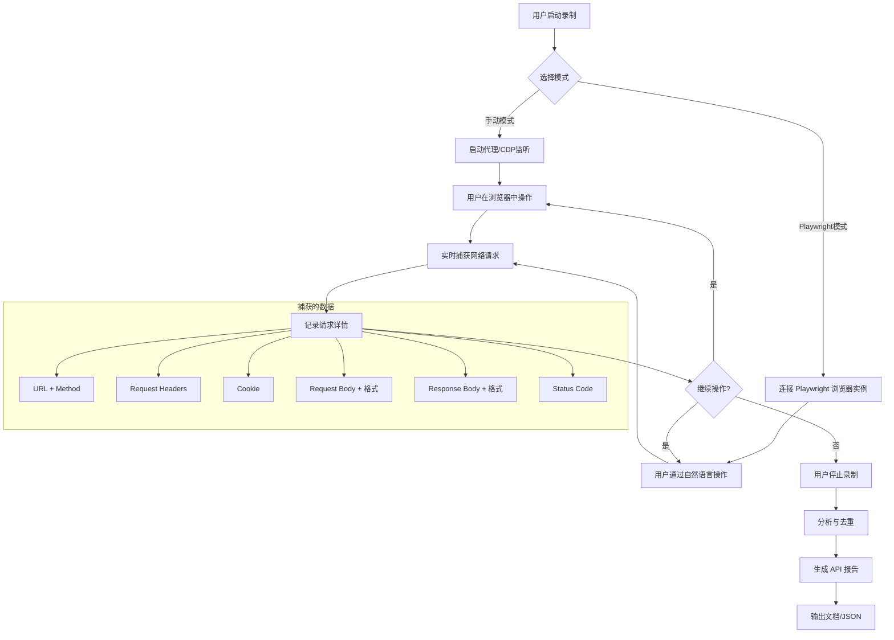
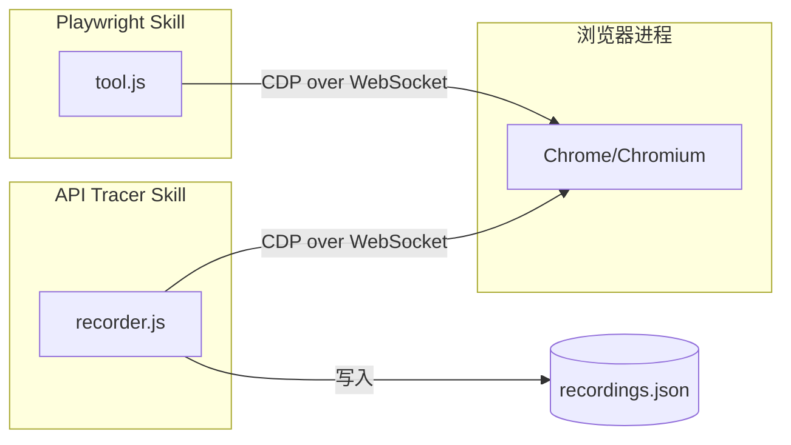
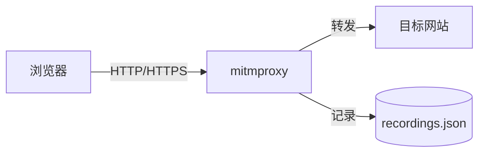
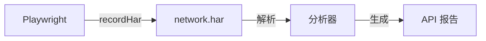
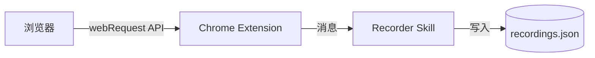
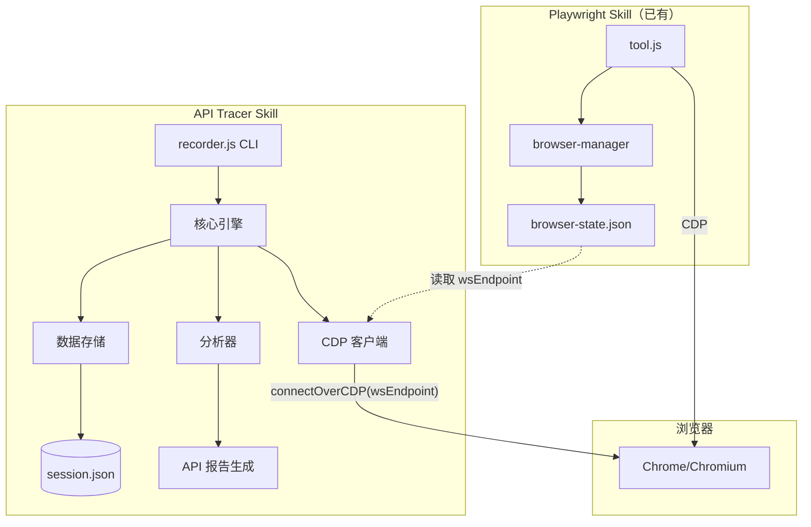
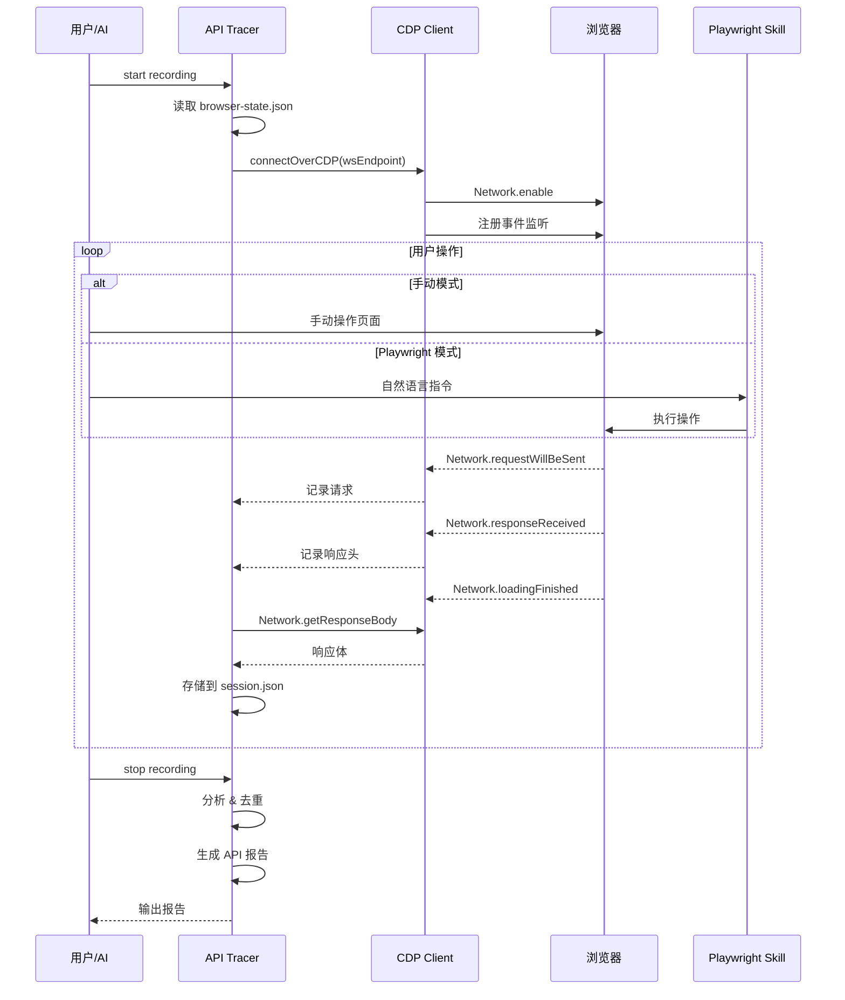

# API Tracer — 可行性分析

## 需求

用户访问一个网站（手动操作或通过 Playwright 自然语言驱动），Skill 记录所有网络请求的完整信息（URL、headers、cookie、入参、出参格式），生成分析报告。报告用于后期自动化访问该网站。

### 两种使用场景

1. **手动模式**：用户在浏览器中手动操作页面，Skill 在后台记录所有 API 请求
2. **Playwright 模式**：用户通过自然语言指令（Playwright skill）操作页面，Skill 同时记录

### 输出目标

- 每个 API 端点的完整信息：URL 模式、HTTP 方法、请求头、Cookie、请求体格式、响应体格式
- 自动识别 API 模式（RESTful、GraphQL 等）
- 生成可直接用于自动化脚本的 API 文档

## 整体流程



## 技术方案对比

### 方案 A：基于 CDP（Chrome DevTools Protocol）

**原理**：通过 CDP 的 `Network` 域监听所有网络事件，与浏览器进程解耦。



**技术栈**：Node.js + playwright-core（复用 Playwright skill 的依赖）

**实现方式**：
- 通过 `playwright-core` 的 `connectOverCDP` 连接到 Playwright skill 启动的浏览器
- 使用 CDP `Network.requestWillBeSent`、`Network.responseReceived`、`Network.loadingFinished` 事件
- 通过 `Network.getResponseBody` 获取响应体

**优点**：
- 与 Playwright skill 共享同一浏览器实例，零额外浏览器开销
- CDP 提供最完整的网络信息（包括 timing、initiator、cache 等）
- 手动模式和 Playwright 模式统一处理
- 不影响 Playwright skill 的正常操作

**缺点**：
- 需要浏览器已启动（依赖 Playwright skill 或手动启动）
- CDP 协议较底层，需要处理事件关联

**可行性**：高。Playwright skill 的 `browser-state.json` 中保存了 `wsEndpoint`，新 skill 可以直接连接。

### 方案 B：基于 mitmproxy（中间人代理）

**原理**：启动 HTTP/HTTPS 代理，浏览器流量经过代理，代理记录所有请求。



**技术栈**：Python + mitmproxy

**实现方式**：
- 启动 mitmproxy 作为本地代理
- 配置浏览器使用代理（Playwright 支持 `proxy` 选项）
- mitmproxy addon 脚本记录所有请求/响应

**优点**：
- 与浏览器完全解耦，支持任何浏览器
- mitmproxy 生态成熟，内置 HAR 导出
- 天然支持 HTTPS 解密

**缺点**：
- 需要安装 mitmproxy（`pip install mitmproxy`，约 100MB）
- 需要安装 CA 证书才能解密 HTTPS
- 代理配置增加复杂度
- 与 Playwright skill 的集成需要修改浏览器启动参数

**可行性**：中。HTTPS 证书安装是主要障碍。

### 方案 C：基于 Playwright 内置 HAR 录制

**原理**：利用 Playwright 的 `recordHar` 功能自动录制 HAR 文件。



**技术栈**：Node.js（复用 Playwright skill）

**实现方式**：
- 修改 Playwright skill 的 `browser-manager.js`，在创建 context 时启用 `recordHar`
- 录制完成后解析 HAR 文件生成报告

**优点**：
- Playwright 原生支持，实现最简单
- HAR 是标准格式，可被 Chrome DevTools 等工具打开

**缺点**：
- **必须在创建 context 时开启**，无法中途启动录制
- 需要修改 Playwright skill 的核心代码
- 不支持手动模式（只能在 Playwright 控制的浏览器中使用）
- HAR 文件可能很大

**可行性**：低-中。不支持手动模式是硬伤。

### 方案 D：基于浏览器扩展（Chrome Extension）

**原理**：安装浏览器扩展，通过 `chrome.webRequest` API 或 `chrome.devtools.network` API 捕获请求。



**技术栈**：JavaScript（Chrome Extension）+ Node.js

**优点**：
- 手动模式天然支持
- 用户体验好（浏览器内操作）

**缺点**：
- 需要开发和安装浏览器扩展
- `webRequest` API 无法获取 response body（需要 `devtools` API）
- 扩展与 Skill 之间需要通信机制
- Playwright 控制的浏览器加载扩展需要额外配置

**可行性**：低。开发和维护成本高，与 Skill 体系集成复杂。

## 方案对比总结

| 维度 | A: CDP | B: mitmproxy | C: HAR 录制 | D: 浏览器扩展 |
|------|--------|-------------|------------|-------------|
| 手动模式支持 | 是（连接已有浏览器） | 是 | 否 | 是 |
| Playwright 模式支持 | 是（共享实例） | 需改启动参数 | 是（需改核心代码） | 需改启动参数 |
| 请求头/Cookie | 完整 | 完整 | 完整 | 部分 |
| 请求体 | 完整 | 完整 | 完整 | 有限 |
| 响应体 | 完整 | 完整 | 完整 | 需 devtools API |
| 额外依赖 | 无（复用 playwright-core） | mitmproxy ~100MB | 无 | Chrome Extension |
| HTTPS 支持 | 原生（CDP 在 TLS 之后） | 需安装 CA 证书 | 原生 | 原生 |
| 实现复杂度 | 中 | 中-高 | 低 | 高 |
| 与 Playwright skill 集成 | 无缝（共享 wsEndpoint） | 需改浏览器配置 | 需改核心代码 | 需改浏览器配置 |

## 推荐方案：A（CDP）

### 理由

1. **零额外依赖**：复用 Playwright skill 的 `playwright-core`
2. **两种模式统一**：CDP 连接不区分浏览器是手动操作还是 Playwright 控制
3. **与 Playwright skill 无缝集成**：读取 `browser-state.json` 获取 `wsEndpoint` 即可连接
4. **完整的网络数据**：CDP Network 域提供最完整的请求/响应信息
5. **不修改 Playwright skill**：新 skill 独立运行，通过 CDP 旁路监听

### 架构设计



### 录制流程



### 输出报告格式示例

```json
{
  "session": {
    "id": "rec-20260221-001",
    "target": "https://app.example.com",
    "startTime": "2026-02-21T10:00:00Z",
    "endTime": "2026-02-21T10:15:00Z",
    "totalRequests": 47,
    "apiEndpoints": 12
  },
  "endpoints": [
    {
      "url": "https://api.example.com/v1/users",
      "method": "GET",
      "pattern": "/v1/users",
      "requestHeaders": {
        "Authorization": "Bearer <token>",
        "Content-Type": "application/json"
      },
      "cookies": ["session_id", "csrf_token"],
      "requestBody": null,
      "responseFormat": {
        "type": "json",
        "schema": {
          "code": "number",
          "data": {
            "list": [{"id": "number", "name": "string", "email": "string"}],
            "total": "number"
          }
        }
      },
      "statusCodes": [200],
      "callCount": 3,
      "avgResponseTime": 150
    },
    {
      "url": "https://api.example.com/v1/users",
      "method": "POST",
      "pattern": "/v1/users",
      "requestHeaders": {
        "Authorization": "Bearer <token>",
        "Content-Type": "application/json"
      },
      "cookies": ["session_id", "csrf_token"],
      "requestBody": {
        "type": "json",
        "schema": {"name": "string", "email": "string", "role": "string"}
      },
      "responseFormat": {
        "type": "json",
        "schema": {"code": "number", "data": {"id": "number"}}
      },
      "statusCodes": [200, 201],
      "callCount": 1,
      "avgResponseTime": 200
    }
  ],
  "authentication": {
    "type": "bearer_token",
    "headerName": "Authorization",
    "tokenPattern": "Bearer <token>"
  },
  "cookies": [
    {"name": "session_id", "domain": ".example.com", "path": "/"},
    {"name": "csrf_token", "domain": ".example.com", "path": "/"}
  ]
}
```

### CLI 命令设计

```bash
# 启动录制（连接 Playwright 浏览器）
node skills/api-tracer/tool.js start '{"name": "example-session"}'

# 启动录制（指定 wsEndpoint，用于手动模式）
node skills/api-tracer/tool.js start '{"name": "example-session", "wsEndpoint": "ws://..."}'

# 查看实时捕获状态
node skills/api-tracer/tool.js status '{}'

# 查看已捕获的请求列表
node skills/api-tracer/tool.js list '{"filter": "api/"}'

# 查看单个请求详情
node skills/api-tracer/tool.js detail '{"index": 5}'

# 停止录制
node skills/api-tracer/tool.js stop '{}'

# 生成分析报告
node skills/api-tracer/tool.js report '{"format": "json"}'
node skills/api-tracer/tool.js report '{"format": "markdown"}'

# 列出历史录制会话
node skills/api-tracer/tool.js sessions '{}'

# 导出为可执行脚本
node skills/api-tracer/tool.js export '{"session": "example-session", "format": "curl"}'
node skills/api-tracer/tool.js export '{"session": "example-session", "format": "playwright"}'
```

### 技术栈

| 组件 | 技术 | 说明 |
|------|------|------|
| 运行时 | Node.js | 与 Playwright skill 一致 |
| CDP 客户端 | playwright-core | 复用 Playwright skill 的依赖 |
| 数据存储 | JSON 文件 | 每个录制会话一个 JSON 文件 |
| 报告生成 | 内置 | JSON/Markdown 格式 |

### 目录结构

```
skills/api-tracer/
├── SKILL.md           # Skill 说明文档
├── tool.js            # CLI 入口
├── package.json       # 依赖（playwright-core）
├── design/            # 设计文档
├── lib/
│   ├── recorder.js    # 核心录制引擎（CDP 监听）
│   ├── analyzer.js    # 请求分析（去重、schema 推断）
│   ├── reporter.js    # 报告生成
│   └── store.js       # 数据存储
└── tools/
    ├── start.js       # 启动录制
    ├── stop.js        # 停止录制
    ├── status.js      # 查看状态
    ├── list.js        # 列出请求
    ├── detail.js      # 请求详情
    ├── report.js      # 生成报告
    └── export.js      # 导出脚本
```

## 实现计划

### Phase 1：核心录制（MVP）

- CDP 连接和 Network 事件监听
- 请求/响应完整数据捕获
- start/stop/list/detail 命令
- 数据持久化到 JSON

### Phase 2：分析与报告

- API 端点自动识别和去重
- 请求/响应 schema 推断
- JSON 和 Markdown 格式报告生成
- 认证方式自动识别

### Phase 3：导出与自动化

- 导出为 curl 命令
- 导出为 Playwright 脚本
- 导出为 Swagger/OpenAPI 格式（可选）

## 风险与注意事项

1. **WebSocket 连接稳定性**：CDP 连接可能因浏览器关闭而断开，需要重连机制
2. **大响应体**：图片、视频等二进制响应需要过滤或截断
3. **敏感信息**：录制的数据可能包含 token、密码等，报告中需要脱敏选项
4. **并发请求关联**：同一页面可能有多个并发请求，需要正确关联 request 和 response
