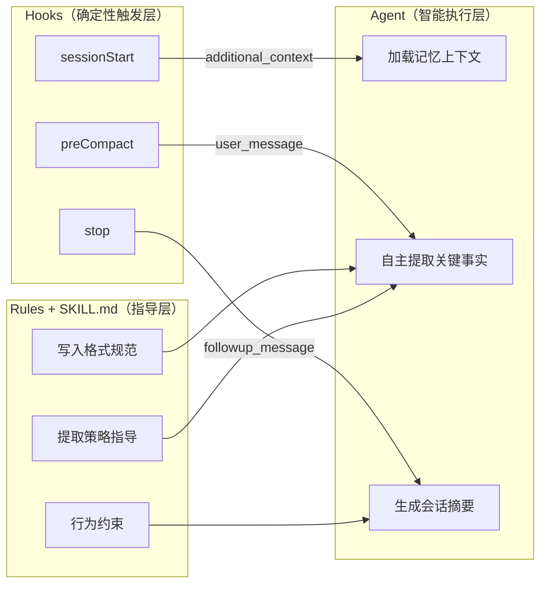
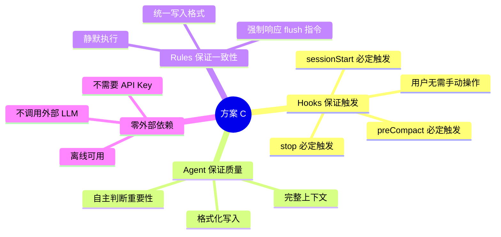
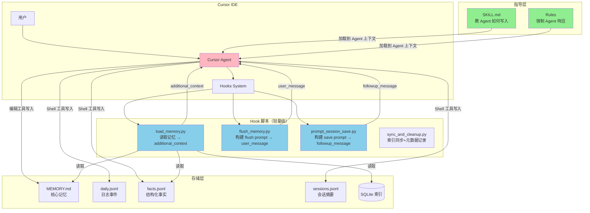

# 方案 C：总览与设计理念

> **版本**: v1.0
> **创建日期**: 2026-02-18
> **状态**: 设计中
> **前置文档**: [14-Clawdbot实现对比.md](../调研/14-Clawdbot实现对比.md)
> **原始文档**: [16-方案C-Hooks+Agent协作记忆方案.md](../调研/16-方案C-Hooks+Agent协作记忆方案.md)

---

## 系列文档索引

| 编号 | 文档 | 内容 |
|------|------|------|
| **01** | **本文档** | 总览、设计理念、整体架构 |
| 02 | [方案对比分析](./2026-02-18-02-方案对比分析.md) | 与原方案（纯 Hooks + 外部 LLM）的核心差异 |
| 03 | [记忆生命周期](./2026-02-18-03-记忆生命周期.md) | 一次完整会话的记忆流程 |
| 04 | [Hook 详细设计](./2026-02-18-04-Hook详细设计.md) | sessionStart / preCompact / stop / 搜索 |
| 05 | [SKILL 与 Rules 设计](./2026-02-18-05-SKILL与Rules设计.md) | SKILL.md 和 Rules 的完整内容 |
| 06 | [数据存储格式](./2026-02-18-06-数据存储格式.md) | 目录结构、JSONL / MEMORY.md 格式、字段说明 |
| 07 | [JSONL 与 SQLite 关系](./2026-02-18-07-JSONL与SQLite关系.md) | 两层存储设计、数据流动全景、时间线视角 |
| 08 | [SQLite 索引设计](./2026-02-18-08-SQLite索引设计.md) | 表结构、搜索方式、数据同步流程 |
| 09 | [用户参与与配置指南](./2026-02-18-09-用户参与与配置指南.md) | 安装步骤、hooks.json 配置、用户参与层次 |
| 10 | [风险与验证计划](./2026-02-18-10-风险与验证计划.md) | 关键假设验证、测试方案、应对策略 |
| 11 | [本地嵌入模型选型](./2026-02-18-11-本地嵌入模型选型.md) | 候选模型对比、推荐方案、性能预估 |
| 12 | [开发实现指南](./2026-02-18-12-开发实现指南.md) | 代码结构、技术栈、模块职责、实现阶段 |
| 13 | [常见问题 FAQ](./2026-02-18-13-常见问题FAQ.md) | 信息丢失、搜索时机、语义搜索原理 |

---

## 1. 设计理念

### 1.1 核心思想

**Hooks 负责"何时做"，Agent 负责"做什么"。**

这是方案 C 与原方案最本质的区别。原方案中，Hook 脚本既负责触发时机又负责执行逻辑（调用外部 LLM 提取事实）。方案 C 将这两个职责彻底分离：

- **Hooks（确定性触发层）**：仅负责在正确的时机触发，构建简单的 prompt 字符串
- **Agent（智能执行层）**：在完整的对话上下文中，自主判断、提取和写入

### 1.2 为什么这样设计

| 问题 | 原方案（纯 Hooks + 外部 LLM） | 方案 C（Hooks + Agent 协作） |
|------|-------------------------------|----------------------------|
| 谁提取关键事实？ | Hook 脚本调用外部 LLM（Gemini Flash） | Agent 自己提取（它就是 LLM） |
| 上下文质量 | 低（只有 transcript 文本片段） | 高（Agent 拥有完整对话上下文） |
| 外部 LLM 依赖 | 需要（API 费用 + 延迟） | 不需要 |
| 触发确定性 | 高（Hook 自动触发） | 高（Hook 自动触发 + Agent 执行） |

> 详细的对比分析见 [02-方案对比分析](./2026-02-18-02-方案对比分析.md)

### 1.3 设计原则

四大原则的设计考量：

1. **Hooks 保证触发**：依赖 Cursor IDE 的 Hook 机制（sessionStart / preCompact / stop），这些事件由系统自动触发，不依赖用户操作，也不依赖 Agent 的"主动性"。这保证了记忆系统的可靠运行。

2. **Agent 保证质量**：Agent（即 Cursor 中运行的 LLM）拥有完整的对话上下文，能准确判断哪些信息值得记住、如何分类、置信度多高。这比外部 LLM 只看 transcript 片段要准确得多。

3. **Rules 保证一致性**：通过 `.cursor/rules/` 中的规则文件，强制约束 Agent 必须响应 `[Memory Flush]` 和 `[Session Save]` 消息，确保不会被 Agent 忽略。

4. **零外部依赖**：不需要 API Key、不需要网络连接、不产生额外费用。所有智能处理都由 Agent 自身完成。

---

## 2. 整体架构

### 2.1 系统架构图

### 2.2 职责分工

| 组件 | 职责 | 运行方式 | 是否需要 LLM |
|------|------|----------|-------------|
| **sessionStart Hook** | 读取记忆、注入上下文 | Python 脚本（自动触发） | 否（纯文件读取） |
| **preCompact Hook** | 构建 flush prompt | Python 脚本（自动触发） | 否（纯字符串拼接） |
| **stop Hook** | 构建 save prompt | Python 脚本（自动触发） | 否（纯字符串拼接） |
| **Agent** | 提取事实、生成摘要、写入文件 | Cursor Agent（LLM 推理） | 是（Agent 自身） |
| **SKILL.md** | 教 Agent 写入格式和策略 | 提示词（自动加载） | — |
| **Rules** | 强制 Agent 响应 flush 指令 | 提示词（自动加载） | — |

### 2.3 数据流概览

系统中有三条主要数据流：

| 数据流 | 触发方式 | 流向 | 说明 |
|--------|----------|------|------|
| **记忆加载** | sessionStart Hook | 存储 → Hook → Agent | 读取历史记忆注入上下文 |
| **事实提取** | preCompact Hook | Hook → Agent → 存储 | Agent 在压缩前自主提取并写入 |
| **摘要保存** | stop Hook | Hook → Agent → 存储 | Agent 在任务完成后生成并写入 |

> 完整的数据流和生命周期请见 [03-记忆生命周期](./2026-02-18-03-记忆生命周期.md)

---

## 相关文档

- [02-方案对比分析](./2026-02-18-02-方案对比分析.md) — 与原方案的详细对比
- [03-记忆生命周期](./2026-02-18-03-记忆生命周期.md) — 完整会话流程
- [04-Hook 详细设计](./2026-02-18-04-Hook详细设计.md) — 各 Hook 的实现逻辑
- [14-Clawdbot实现对比.md](../调研/14-Clawdbot实现对比.md) — 方案 C 的来源分析
