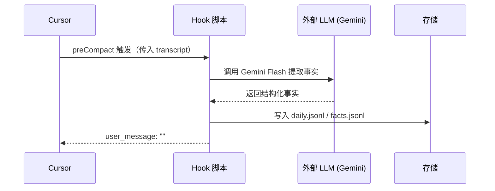
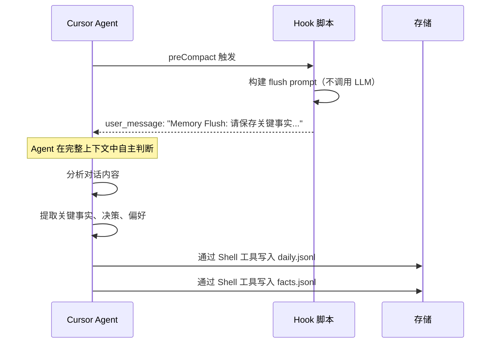

# 方案 C：方案对比分析

> **版本**: v1.0
> **创建日期**: 2026-02-18
> **系列**: 方案 C 设计文档 ([返回总览](./2026-02-18-01-总览与设计理念.md))
> **前置文档**: [14-Clawdbot实现对比.md](../调研/14-Clawdbot实现对比.md)

---

## 1. 与原方案的核心差异

方案 C 的核心变更在于**将事实提取和摘要生成的职责从 Hook 脚本（外部 LLM）转移到 Agent 自身**。以下从多个维度详细对比两种方案。

---

## 2. 数据流对比

### 2.1 原方案（纯 Hooks + 外部 LLM）



**原方案特点**：
- Hook 脚本是"重量级"的：包含 LLM 调用、JSON 解析、错误处理
- 依赖外部 LLM（Gemini Flash）API，需要 API Key 和网络连接
- 外部 LLM 只能看到 `transcript` 文本片段，上下文质量有限
- Hook 超时设置需要较长（30 秒），因为要等待 LLM 响应

### 2.2 方案 C（Hooks + Agent 协作）



**方案 C 特点**：
- Hook 脚本是"轻量级"的：仅构建 prompt 字符串，不调用任何外部服务
- Agent 自身就是 LLM，在完整对话上下文中提取事实，质量更高
- 无外部依赖，无 API 成本，离线可用
- Hook 超时设置可以很短（5 秒），因为只做字符串拼接

---

## 3. 关键差异总结

### 3.1 总体对比

| 维度 | 原方案 | 方案 C |
|------|--------|--------|
| **事实提取者** | 外部 LLM（Gemini Flash） | Agent 自身 |
| **Hook 脚本复杂度** | 高（含 LLM 调用、JSON 解析） | 低（仅构建 prompt 字符串） |
| **外部依赖** | google-generativeai SDK | 无 |
| **API 成本** | 有（每次 preCompact 调用 LLM） | 无 |
| **上下文质量** | 低（仅 transcript 片段） | 高（Agent 完整上下文） |
| **写入控制** | Hook 脚本直接写入 | Agent 通过工具写入 |

### 3.2 Hook 脚本复杂度对比

**原方案的 preCompact Hook**（约 150 行）：

```
读取 stdin → 解析 JSON → 读取 transcript 文件 → 
构建 LLM prompt → 调用 Gemini Flash API → 等待响应 →
解析 LLM 返回的 JSON → 验证格式 → 写入 daily.jsonl → 
写入 facts.jsonl → 输出 stdout JSON
```

**方案 C 的 preCompact Hook**（约 30 行）：

```
读取 stdin → 解析 JSON → 构建 flush prompt 字符串 → 输出 stdout JSON
```

### 3.3 上下文质量对比

| 维度 | 原方案（transcript 片段） | 方案 C（Agent 完整上下文） |
|------|--------------------------|---------------------------|
| 可见的对话内容 | 部分（取决于 transcript 大小） | 全部（当前窗口内的所有对话） |
| 代码上下文 | 无（transcript 不含文件内容） | 有（Agent 可能已读取相关文件） |
| 用户意图理解 | 弱（只有文字记录） | 强（参与了整个对话过程） |
| 去重能力 | 弱（无法对比已有记忆） | 强（Agent 已加载历史记忆） |

### 3.4 错误处理对比

| 场景 | 原方案处理 | 方案 C 处理 |
|------|-----------|------------|
| LLM API 不可用 | 记忆丢失（无法提取） | 不存在（不依赖外部 LLM） |
| LLM 返回格式错误 | 需要复杂的解析和重试逻辑 | 不存在（Agent 直接写入） |
| Hook 脚本超时 | 记忆丢失（30s 内 LLM 未响应） | 极少发生（5s 超时仅用于字符串拼接） |
| Agent 未执行写入 | — | 可能发生，通过 Rules 强制约束 |
| 写入文件失败 | Hook 脚本处理错误 | Agent 可感知并重试 |

### 3.5 成本对比

| 成本项 | 原方案 | 方案 C |
|--------|--------|--------|
| **API 调用费用** | Gemini Flash: ~$0.075/百万 token | $0（无额外 API 调用） |
| **每次 preCompact 成本** | ~$0.001-0.005（取决于上下文大小） | $0 |
| **每月预估（活跃使用）** | ~$1-5 | $0 |
| **Agent token 消耗增加** | — | 约 200-500 token/次（处理 flush 指令） |
| **总效果** | 额外 API 成本 | 包含在现有 Cursor 订阅中 |

> 方案 C 的 Agent token 消耗增加（处理 flush 指令和写入命令）已包含在 Cursor 的订阅 token 配额中，不产生额外费用。

---

## 4. 方案 C 的潜在风险

虽然方案 C 在多个维度优于原方案，但也引入了新的风险：

| 风险 | 描述 | 缓解措施 |
|------|------|----------|
| **Agent 不响应** | Agent 可能忽略 `[Memory Flush]` 消息 | 通过 Rules 强制约束 |
| **写入质量不一致** | 不同 Agent 模型可能写出不同格式 | SKILL.md 提供明确模板 |
| **user_message 机制未验证** | preCompact 的 `user_message` 返回值是否真正注入 Agent | 需要实际测试验证 |
| **followup_message 未验证** | stop 的 `followup_message` 是否能让 Agent 继续执行 | 需要实际测试验证 |

> 详细的风险分析和验证计划见 [10-风险与验证计划](./2026-02-18-10-风险与验证计划.md)

---

## 相关文档

- [01-总览与设计理念](./2026-02-18-01-总览与设计理念.md) — 方案概述
- [03-记忆生命周期](./2026-02-18-03-记忆生命周期.md) — 完整会话流程
- [04-Hook 详细设计](./2026-02-18-04-Hook详细设计.md) — 各 Hook 的实现逻辑
- [14-Clawdbot实现对比.md](../调研/14-Clawdbot实现对比.md) — 原始方案对比分析
