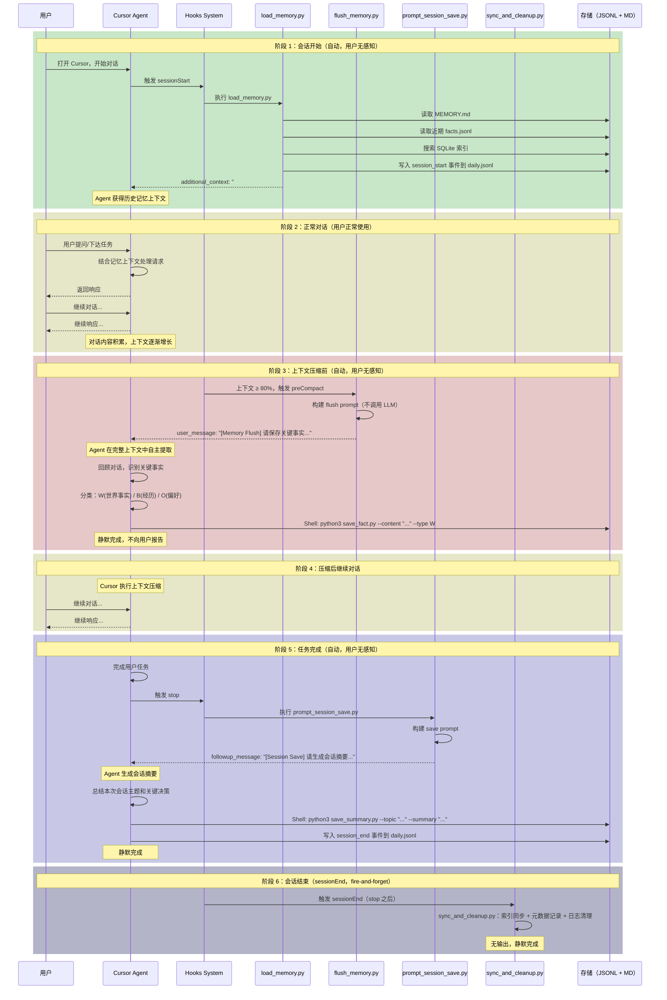

# 方案 C：记忆生命周期

> **版本**: v1.0
> **创建日期**: 2026-02-18
> **系列**: 方案 C 设计文档 ([返回总览](./2026-02-18-01-总览与设计理念.md))

---

## 1. 一次完整会话的记忆流程

以下时序图展示了一次完整的 Cursor 会话中，记忆系统在各阶段的行为。整个流程分为 6 个阶段，对用户完全透明。



---

## 2. 各阶段详细说明

### 阶段 1：会话开始

| 项目 | 说明 |
|------|------|
| **触发条件** | 用户打开 Cursor 或开始新对话 |
| **Hook** | `sessionStart` |
| **返回方式** | `additional_context` |
| **执行者** | Hook 脚本（纯文件读取，无 LLM） |
| **用户感知** | 无 |

**加载内容**：
1. `MEMORY.md` 全量加载（核心记忆）
2. 最近 7 天、最多 15 条 `facts.jsonl` 事实
3. 最近一次会话摘要（`sessions.jsonl`）

**衰减加载策略**：

为了平衡信息完整性和上下文空间占用，facts 的加载采用"近多远少"的衰减策略：

| 时间范围 | 加载量 | 说明 |
|----------|--------|------|
| 今天 + 昨天（2 天内） | 全量加载 | 最近的事实最有可能被用到 |
| 前 3-5 天 | 部分加载（每天最多 3 条） | 保持一定的连续性，防止记忆断裂 |
| 5-7 天前 | 仅加载高置信度（confidence ≥ 0.9） | 只保留重要事实 |
| 总量上限 | 最多 15 条 | 控制上下文占用 |

```
今天     昨天     3天前    4天前    5天前    6天前    7天前
 ████     ████     ██       ██       █        █        █
 全量     全量     部分     部分     重要     重要     重要
```

相邻时间段的事实在内容上可能存在天然重叠（如昨天和前天讨论同一个方案），这种重叠有助于 Agent 理解事实的时间演变，不需要去重。

**关于 sessionStart 的搜索时机**：

sessionStart 阶段**不**使用用户输入作为搜索关键词（因为此时用户还没有输入）。它的加载策略是：
- 读取 MEMORY.md 全量内容（确定性加载，不需要搜索）
- 读取最近的 facts 和 sessions（按时间排序 + 衰减策略，不需要语义搜索）

当用户在对话中需要搜索历史记忆时（如"之前讨论的 Redis 方案是什么？"），由 **Agent 在对话过程中主动调用 `search_memory.py`**，此时使用用户的问题作为搜索关键词，通过 SQLite FTS5 + 向量搜索找到相关记忆。

```
sessionStart 阶段：加载"最近"的记忆（衰减策略，不按关键词）
    ↓
用户开始对话
    ↓
对话中需要历史信息时：Agent 主动调用 search_memory.py（按关键词/语义搜索）
```

**效果**：Agent 在第一轮对话时就"记得"最近的讨论、决策和用户偏好，且记忆从近到远渐进衰减，不会出现突然的记忆断裂。当需要更深层的历史信息时，Agent 会主动搜索。

### 阶段 2：正常对话

| 项目 | 说明 |
|------|------|
| **触发条件** | 用户正常对话 |
| **Hook** | 无 |
| **执行者** | Agent |
| **用户感知** | 正常（Agent 似乎"记得"更多） |

这个阶段与没有记忆系统时的对话完全一致，唯一的区别是 Agent 上下文中多了阶段 1 注入的历史记忆。Agent 在此阶段可以主动调用 `search_memory.py` 搜索更多历史记忆。

### 阶段 3：上下文压缩前

| 项目 | 说明 |
|------|------|
| **触发条件** | 上下文使用率 ≥ 80%，系统准备压缩 |
| **Hook** | `preCompact` |
| **返回方式** | `user_message` |
| **执行者** | Agent（在完整上下文中自主提取） |
| **用户感知** | 无 |

**关键特性**：
- `user_message` 在压缩**之前**注入，此时 Agent 仍拥有完整的对话上下文
- Agent 自主判断哪些信息值得记住，不依赖外部 LLM
- 写入完成后静默继续，用户不会看到任何提示

### 阶段 4：压缩后继续

上下文压缩后，Agent 的上下文窗口被清理。但关键事实已在阶段 3 保存到 JSONL 文件中。用户可以继续正常对话。

### 阶段 5：任务完成

| 项目 | 说明 |
|------|------|
| **触发条件** | Agent 完成任务（status = "completed"） |
| **Hook** | `stop` |
| **返回方式** | `followup_message` |
| **执行者** | Agent（生成会话摘要） |
| **用户感知** | 无 |
| **执行次数** | 仅 1 次（`loop_limit: 1`） |

**摘要内容**：
- 主题：用一句话描述本次会话
- 摘要：100-200 字的总结
- 关键决策：列表形式
- 待办事项：如有未完成的工作

### 阶段 6：会话结束（sessionEnd）

| 项目 | 说明 |
|------|------|
| **触发条件** | stop 之后，会话彻底关闭 |
| **Hook** | `sessionEnd` |
| **脚本** | `sync_and_cleanup.py` |
| **返回方式** | 无（fire-and-forget） |
| **执行者** | Hook 脚本（纯本地操作，无 LLM） |
| **用户感知** | 无 |

**执行任务**：
1. 同步 SQLite 索引：将新写入的 JSONL 增量同步到 index.sqlite
2. 记录会话元数据：将 reason、duration_ms 等写入 daily/YYYY-MM-DD.jsonl
3. 清理过期日志：删除超过保留天数的日志文件

**关键特性**：sessionEnd 在 stop 之后触发，此时 Agent 已完成 summary/facts 写入，是最安全的索引同步时机。无输出，静默完成。

---

## 3. 流程简化视图

```mermaid
flowchart LR
    subgraph "会话开始"
        A1[sessionStart Hook] -->|additional_context| A2[Agent 获得记忆]
    end

    subgraph "对话中"
        B1[用户正常对话] --> B2[Agent 正常响应]
    end

    subgraph "压缩前"
        C1[preCompact Hook] -->|user_message| C2[Agent 自主提取事实]
        C2 --> C3[save_fact.py]
    end

    subgraph "任务完成"
        D1[stop Hook] -->|followup_message| D2[Agent 生成摘要]
        D2 --> D3[save_summary.py]
    end

    subgraph "会话结束"
        E1[sessionEnd Hook] --> E2[sync_and_cleanup.py]
        E2 --> E3[索引同步+元数据+日志清理]
    end

    A2 --> B1
    B2 --> C1
    C3 --> D1
    D3 --> E1

    style A1 fill:#87CEEB
    style C1 fill:#87CEEB
    style D1 fill:#87CEEB
    style E1 fill:#87CEEB
    style C2 fill:#FFB6C1
    style D2 fill:#FFB6C1
```



---

## 4. 如果没有触发上下文压缩会怎样？

在短会话中，上下文可能始终不会达到 80% 的阈值，因此 `preCompact` Hook 不会触发。此时记忆保存依赖以下机制：

### 4.1 stop Hook 兜底保存

即使 `preCompact` 未触发，`stop` Hook 在任务完成时**一定会触发**。Agent 在此时生成会话摘要并写入 `sessions.jsonl`，摘要中包含了本次会话的关键信息。

```
短会话（无压缩）：
  sessionStart → 加载记忆
  对话（上下文未满）
  stop → Agent 写入 sessions.jsonl（摘要包含关键决策）
```

### 4.2 双重保障机制

| 场景 | preCompact 触发？ | stop 触发？ | 信息是否保存？ |
|------|-------------------|-------------|---------------|
| 长会话（上下文满） | 是 | 是 | 是（事实 + 摘要） |
| 短会话（上下文未满） | 否 | 是 | 是（仅摘要，但包含关键信息） |
| 异常中断（crash） | 可能否 | 否 | **否**（信息丢失） |

### 4.3 增强方案：stop Hook 同时保存事实

为了解决短会话中细粒度事实丢失的问题，stop Hook 的 `[Session Save]` 指令可以同时要求 Agent 提取关键事实：

```
[Session Save] 指令中增加：
  1. 生成会话摘要 → sessions.jsonl
  2. 提取关键事实 → daily/YYYY-MM-DD.jsonl（如果 preCompact 未触发）
```

这样无论会话长短，关键事实都不会丢失。

---

## 5. 跨会话的记忆延续

单次会话的记忆流程是一个闭环，但记忆系统的价值在于**跨会话延续**。以下展示两次会话之间的数据流动：

```
会话 A：
  sessionStart → 加载历史记忆（如有）
  对话...
  preCompact → Agent 调用 save_fact.py 写入 daily/2026-02-17.jsonl
  对话继续...
  stop → Agent 调用 save_summary.py 写入 sessions.jsonl
  sessionEnd → sync_and_cleanup.py 同步索引 + 元数据 + 日志清理

===== 会话间隔 =====

会话 B：
  sessionStart → 同步新数据到 SQLite → 加载会话 A 的记忆
  对话...（Agent 已知会话 A 的内容）
  preCompact → Agent 写入 daily/2026-02-18.jsonl + facts.jsonl
  stop → Agent 写入 sessions.jsonl
```

**关键点**：会话 A 中 Agent 写入 JSONL 的数据，在会话 B 的 `sessionStart` 阶段被同步到 SQLite 索引，然后通过搜索加载到 Agent 上下文中。这就是跨会话记忆延续的机制。

> 详细的数据同步流程见 [07-JSONL与SQLite关系](./2026-02-18-07-JSONL与SQLite关系.md)

---

## 相关文档

- [01-总览与设计理念](./2026-02-18-01-总览与设计理念.md) — 方案概述
- [04-Hook 详细设计](./2026-02-18-04-Hook详细设计.md) — 各 Hook 的实现逻辑
- [07-JSONL与SQLite关系](./2026-02-18-07-JSONL与SQLite关系.md) — 数据同步和流动
