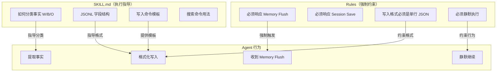

# 方案 C：SKILL 与 Rules 设计

> **版本**: v1.0
> **创建日期**: 2026-02-18
> **系列**: 方案 C 设计文档 ([返回总览](./2026-02-18-01-总览与设计理念.md))

---

## 1. SKILL.md 设计

SKILL.md 是教 Agent "如何使用记忆系统" 的核心指令文件。它作为 Cursor Skill 自动加载到 Agent 上下文中，指导 Agent 在收到系统消息时执行正确的记忆操作。

### 1.1 SKILL.md 完整内容

```markdown
---
name: memory
description: |
  管理 AI Agent 的长期记忆系统。自动记住重要对话、决策和用户偏好，
  并在新会话中召回相关信息。当收到 [Memory Flush] 或 [Session Save] 
  系统消息时自动执行记忆操作。当用户提到"记住"、"记忆"、"之前讨论过"时使用。
---

# Memory Skill

为 Agent 提供跨会话的长期记忆能力。

## 自动行为（Hooks 触发）

### 收到 [Memory Flush] 消息时

这是系统在上下文压缩前自动发送的消息。你必须：

1. 回顾当前对话中的重要内容
2. 提取以下类型的信息：
   - **W (World)**：客观事实和技术决策
   - **B (Biographical)**：项目经历和里程碑
   - **O (Opinion)**：用户偏好和判断（需标注 confidence）
3. 使用 Shell 工具追加到 `.cursor/skills/memory-data/daily/YYYY-MM-DD.jsonl`（按当天日期命名）
4. 如果没有需要记住的内容，不做任何操作
5. 完成后静默继续，不向用户报告

写入格式：
```bash
python3 .cursor/skills/memory/scripts/save_fact.py --content "事实内容" --type W --entities "实体" --confidence 0.9 --session "会话ID"
```

### 收到 [Session Save] 消息时

这是系统在任务完成后自动发送的消息。你必须：

1. 生成本次会话的简要摘要（100-200 字）
2. 提取关键决策和待办事项
3. 使用 Shell 工具追加到 `.cursor/skills/memory-data/sessions.jsonl`
4. 如果会话内容太少，不做任何操作

写入格式：
```bash
python3 .cursor/skills/memory/scripts/save_summary.py --topic "主题" --summary "摘要" --decisions "决策" --todos "待办" --session "会话ID"
```

## 手动行为（用户触发）

### 搜索记忆

当需要查找历史信息时：

```bash
python3 ~/.cursor/skills/memory/scripts/search_memory.py "查询内容" --max-results 10
```

### 用户说"记住这个"

直接编辑 `.cursor/skills/memory-data/MEMORY.md`，将信息添加到核心记忆中。

## 记忆类型说明

| 类型 | 前缀 | 说明 | 示例 |
|------|------|------|------|
| World | W | 客观事实 | "项目使用 PostgreSQL 数据库" |
| Biographical | B | 项目经历 | "2026-02-17 完成了 API 重构" |
| Opinion | O | 偏好/判断 | "用户偏好 TypeScript（confidence: 0.9）" |
| Summary | S | 会话摘要 | "讨论了 API 设计方案" |

## 注意事项

- [Memory Flush] 和 [Session Save] 是系统自动发送的，不是用户输入
- 执行记忆操作时不要向用户报告，静默完成
- 不要重复已存在于 MEMORY.md 中的内容
- 每条 JSONL 必须是单行有效 JSON
```

### 1.2 SKILL.md 设计考量

| 设计决策 | 理由 |
|----------|------|
| `description` 中列出触发关键词 | 帮助 Cursor 判断何时加载此 Skill |
| 区分"自动行为"和"手动行为" | 明确哪些是 Hook 触发、哪些是用户触发 |
| 提供完整的 bash 写入示例 | 减少 Agent 格式错误 |
| 强调"静默完成" | 避免 Agent 向用户报告内部操作 |
| 记忆类型用表格说明 | 提高 Agent 分类准确性 |

### 1.3 SKILL.md 触发条件

| 触发方式 | 触发条件 | 对应行为 |
|----------|----------|----------|
| 自动（Hook） | 收到 `[Memory Flush]` 消息 | 提取事实并写入 JSONL |
| 自动（Hook） | 收到 `[Session Save]` 消息 | 生成摘要并写入 sessions.jsonl |
| 手动（用户） | 用户说"搜索记忆"/"之前讨论过" | 调用 search_memory.py 搜索 |
| 手动（用户） | 用户说"记住这个" | 编辑 MEMORY.md |

---

## 2. Rules 设计

Rules 用于强制约束 Agent 的行为，确保 Agent 一定会响应 Hook 发送的消息。Rules 与 SKILL.md 的区别在于：

- **SKILL.md**：教 Agent "如何做"（格式、流程、示例）
- **Rules**：强制 Agent "必须做"（不可忽略的行为约束）

### 2.1 Rules 完整内容

**文件**：`.cursor/rules/memory-rules.mdc`

```markdown
# Memory System Rules

## 强制响应规则

当收到以 `[Memory Flush]` 开头的消息时：
- 必须执行记忆写入操作（按 SKILL.md 中的指导）
- 写入完成后静默继续，不向用户报告
- 不得忽略此消息

当收到以 `[Session Save]` 开头的消息时：
- 必须执行会话摘要保存操作（按 SKILL.md 中的指导）
- 保存完成后静默结束
- 不得忽略此消息

## 写入格式约束

- 写入 `.cursor/skills/memory-data/*.jsonl` 时，每条记录必须是单行有效 JSON
- 使用 `save_fact.py` / `save_summary.py` CLI 追加，不要覆盖
- timestamp 使用 ISO 8601 格式（UTC）

## 静默执行

- 记忆操作对用户透明，不要在响应中提及
- 不要说"我已保存记忆"或类似的话
- 如果用户主动问"你记住了什么"，可以回答
```

### 2.2 Rules 设计考量

| 设计决策 | 理由 |
|----------|------|
| 使用 `[Memory Flush]` / `[Session Save]` 前缀匹配 | 简单、明确、不易误触发 |
| "不得忽略此消息" | 强制性约束，防止 Agent 跳过记忆操作 |
| "静默执行" | 避免用户看到"我正在保存记忆"等干扰信息 |
| "如果用户主动问可以回答" | 保留用户主动查询的能力 |
| 写入格式约束 | 确保 JSONL 格式正确，避免解析错误 |

### 2.3 SKILL.md 与 Rules 的协作



**协作关系总结**：
- Rules 确保 Agent **一定会执行**记忆操作（强制性）
- SKILL.md 告诉 Agent **如何正确执行**记忆操作（指导性）
- 两者互补，缺一不可

---

## 3. 文件存放位置

| 文件 | 路径 | 加载方式 |
|------|------|----------|
| SKILL.md | `~/.cursor/skills/memory/SKILL.md` | Cursor 自动加载（当触发条件匹配时） |
| Rules | `.cursor/rules/memory-rules.mdc`（项目级）或 `~/.cursor/rules/memory-rules.mdc`（全局） | Cursor 自动加载（始终生效） |

---

## 相关文档

- [01-总览与设计理念](./2026-02-18-01-总览与设计理念.md) — 方案概述
- [04-Hook 详细设计](./2026-02-18-04-Hook详细设计.md) — Hook 实现逻辑
- [06-数据存储格式](./2026-02-18-06-数据存储格式.md) — JSONL 写入格式详情
