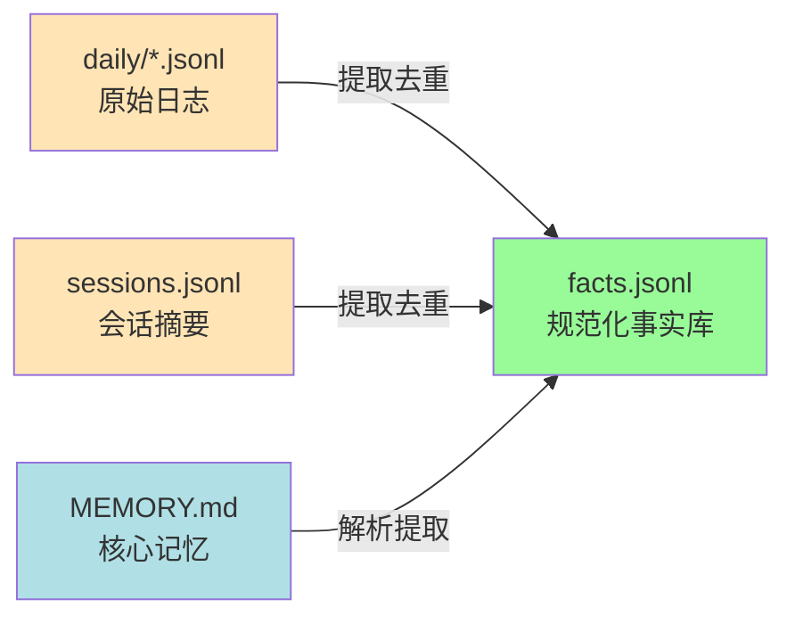

# 方案 C：数据存储格式

> **版本**: v1.0
> **创建日期**: 2026-02-18
> **系列**: 方案 C 设计文档 ([返回总览](./2026-02-18-01-总览与设计理念.md))

---

## 1. 目录结构

```
<project>/
└── .cursor/skills/memory-data/
    ├── MEMORY.md              # 核心记忆（用户可编辑）
    ├── daily/                 # 日志事件（按日期分文件）
    │   ├── 2026-02-16.jsonl   # 每天一个文件
    │   ├── 2026-02-17.jsonl
    │   └── ...
    ├── facts.jsonl            # 结构化事实（单文件，全量搜索）
    ├── sessions.jsonl         # 会话摘要（单文件，数据量小）
    └── index.sqlite           # 搜索索引（脚本维护）
```

### 1.1 为什么 daily 按日期分文件

| 文件 | 存储方式 | 原因 |
|------|----------|------|
| `daily/*.jsonl` | 按日期分文件 | 高频追加，按日期归档便于清理旧数据 |
| `facts.jsonl` | 单文件 | 去重后的事实库，需要全量搜索，不适合分文件 |
| `sessions.jsonl` | 单文件 | 数据量小（每次会话一条），单文件足够 |

### 1.2 各文件职责

| 文件 | 写入者 | 读取者 | 生命周期 |
|------|--------|--------|----------|
| `MEMORY.md` | 用户/Agent | sessionStart Hook | 长期（用户手动维护） |
| `daily/*.jsonl` | Agent（preCompact 时） | 同步脚本 → SQLite | 中期（可按日期清理旧文件） |
| `facts.jsonl` | 同步脚本（从 daily 提取去重） | sessionStart Hook、search_memory.py | 长期（去重后的事实库） |
| `sessions.jsonl` | Agent（stop 时） | sessionStart Hook | 长期（每次会话一条摘要） |
| `index.sqlite` | 同步脚本（自动生成） | search_memory.py | 派生（可从 JSONL 重建） |

---

## 2. daily/YYYY-MM-DD.jsonl 格式

每天一个文件，文件名为 `YYYY-MM-DD.jsonl`，记录当天所有会话中的事件和提取的事实。

### 2.1 示例数据

```jsonl
{"id":"log-103000","type":"session_start","timestamp":"2026-02-17T10:30:00Z","workspace":"/Users/user/project"}
{"id":"log-113000","type":"fact","memory_type":"W","content":"决定使用 Redis 作为会话缓存","entities":["redis","session"],"confidence":1.0,"timestamp":"2026-02-17T11:30:00Z","source":{"session":"conv-123"}}
{"id":"log-113500","type":"fact","memory_type":"O","content":"用户偏好 2 空格缩进","entities":["user","coding-style"],"confidence":0.85,"timestamp":"2026-02-17T11:35:00Z","source":{"session":"conv-123"}}
{"id":"log-120000","type":"session_end","timestamp":"2026-02-17T12:00:00Z","session_id":"conv-123","reason":"completed"}
```

### 2.2 字段说明

| 字段 | 类型 | 必填 | 说明 |
|------|------|------|------|
| `id` | string | 是 | 唯一标识，格式 `log-HHMMSS`（时分秒） |
| `type` | string | 是 | 事件类型：`session_start`、`session_end`、`fact`、`preference`、`action` |
| `timestamp` | string | 是 | 事件时间（ISO 8601 UTC） |
| `session_id` | string | 否 | 关联的会话 ID |
| `workspace` | string | 否 | 工作区路径（仅 session_start） |
| `memory_type` | string | 否 | 记忆类型 W/B/O（仅 fact/preference） |
| `content` | string | 否 | 事实内容（仅 fact/preference） |
| `entities` | string[] | 否 | 相关实体标签（仅 fact/preference） |
| `confidence` | float | 否 | 置信度（仅 preference，默认 0.8） |
| `duration_ms` | int | 否 | 会话时长毫秒（仅 session_end） |
| `reason` | string | 否 | 结束原因（仅 session_end：completed/interrupted） |
| `source` | object | 否 | 来源信息 `{session: "会话ID"}` |

### 2.3 事件类型说明

| type | 说明 | 触发时机 |
|------|------|----------|
| `session_start` | 会话开始标记 | sessionStart Hook |
| `session_end` | 会话结束标记 | stop Hook |
| `fact` | 事实记录 | Agent 在 preCompact 时提取 |
| `preference` | 偏好记录 | Agent 在 preCompact 时提取 |
| `action` | 操作记录 | Agent 执行重要操作时 |

---

## 3. sessions.jsonl 格式

单文件，每次会话结束时追加一条摘要记录。

### 3.1 示例数据

```jsonl
{"id":"sum-120000","session_id":"conv-123","topic":"Redis 缓存方案设计","summary":"讨论了会话缓存的技术选型，决定采用 Redis 替代内存存储。设计了缓存失效策略和分布式锁方案。","decisions":["使用 Redis 作为缓存","缓存 TTL 设为 24 小时"],"todos":["实现 Redis 连接池","编写缓存失效测试"],"timestamp":"2026-02-17T12:00:00Z"}
```

### 3.2 字段说明

| 字段 | 类型 | 必填 | 说明 |
|------|------|------|------|
| `id` | string | 是 | 唯一标识，格式 `sum-HHMMSS` |
| `session_id` | string | 是 | 关联的会话 ID |
| `topic` | string | 是 | 会话主题（简短描述） |
| `summary` | string | 是 | 会话摘要（100-200 字） |
| `decisions` | string[] | 是 | 本次会话做出的关键决策 |
| `todos` | string[] | 否 | 待办事项 |
| `timestamp` | string | 是 | 会话结束时间（ISO 8601 UTC） |

---

## 4. facts.jsonl 格式

从 `daily/*.jsonl` 和 `sessions.jsonl` 中提取并去重后的规范化事实库。每行一个事实条目。

### 4.1 示例数据

```jsonl
{"id":"fact-001","type":"W","content":"Cursor Hooks 支持 sessionStart, preCompact, sessionEnd 等事件","entities":["cursor-hooks"],"confidence":1.0,"evidence":["log-113000"],"source":{"file":"daily/2026-02-17.jsonl","id":"log-113000"},"created_at":"2026-02-17T11:30:00Z","updated_at":"2026-02-17T11:30:00Z"}
{"id":"fact-002","type":"B","content":"Memory Skill 设计于 2026-02-02 开始","entities":["memory"],"confidence":1.0,"evidence":["sum-120000"],"source":{"file":"sessions.jsonl","id":"sum-120000"},"created_at":"2026-02-17T12:00:00Z","updated_at":"2026-02-17T12:00:00Z"}
{"id":"fact-003","type":"O","content":"用户偏好使用 Python 实现 hook 脚本","entities":["user","python"],"confidence":0.85,"evidence":["log-113500","sum-120000"],"source":{"file":"daily/2026-02-17.jsonl","id":"log-113500"},"created_at":"2026-02-17T11:35:00Z","updated_at":"2026-02-17T12:00:00Z"}
{"id":"fact-004","type":"W","content":"项目使用 PostgreSQL 数据库","entities":["postgresql","database"],"confidence":1.0,"evidence":[],"source":{"file":"MEMORY.md","line":15},"created_at":"2026-02-16T00:00:00Z","updated_at":"2026-02-16T00:00:00Z"}
```

### 4.2 字段说明

| 字段 | 类型 | 必填 | 说明 |
|------|------|------|------|
| `id` | string | 是 | 唯一标识，格式 `fact-NNN` |
| `type` | string | 是 | 记忆类型：`W`(World)、`B`(Biographical)、`O`(Opinion)、`S`(Summary) |
| `content` | string | 是 | 事实内容，一句话描述 |
| `entities` | string[] | 是 | 相关实体标签（用于检索和关联） |
| `confidence` | float | 是 | 置信度 0.0-1.0（W 类型通常 1.0，O 类型根据证据强度） |
| `evidence` | string[] | 否 | 引用的其他 fact/log ID（用于溯源） |
| `source` | object | 是 | 来源信息：`{file, id}` 或 `{file, line}` |
| `created_at` | string | 是 | 首次创建时间（ISO 8601 UTC） |
| `updated_at` | string | 是 | 最后更新时间（ISO 8601 UTC） |

### 4.3 facts.jsonl 与 daily/*.jsonl 的关系



- **daily/*.jsonl** 是原始日志，记录每次对话中提取的所有事件（含重复）
- **facts.jsonl** 是去重后的事实库，同一事实只保留一条，通过 `evidence` 关联多个来源
- **同步时机**：`sessionStart` Hook 中的索引同步脚本负责从 daily 和 sessions 中提取新事实到 facts.jsonl

---

## 5. MEMORY.md 格式

MEMORY.md 是唯一用户可直接编辑的文件，始终在 `sessionStart` 时全量加载到上下文中。

### 5.1 示例内容

```markdown
# 核心记忆

## 用户偏好
- 语言：中文
- Coding style: 2-space indent, TypeScript preferred
- Communication: Technical, concise

## 项目背景
- 数据库：PostgreSQL
- Cache: Redis
- Framework: Express + TypeScript

## 重要决策
- 2026-02-16：采用 JWT 进行 API 认证
- 2026-02-17: Switched to Redis for session caching
```

### 5.2 MEMORY.md 特点

| 属性 | 值 |
|------|-----|
| 编辑方式 | 用户手动编辑 或 Agent 通过编辑工具修改 |
| 加载方式 | sessionStart 时全量加载到 additional_context |
| 格式要求 | 标准 Markdown，无特殊格式要求 |
| Git 提交 | 推荐提交（核心记忆值得版本控制） |

---

## 相关文档

- [01-总览与设计理念](./2026-02-18-01-总览与设计理念.md) — 方案概述
- [05-SKILL与Rules设计](./2026-02-18-05-SKILL与Rules设计.md) — JSONL 写入格式的指导
- [07-JSONL与SQLite关系](./2026-02-18-07-JSONL与SQLite关系.md) — JSONL 与 SQLite 的数据流动
- [08-SQLite索引设计](./2026-02-18-08-SQLite索引设计.md) — SQLite 中如何使用这些数据
