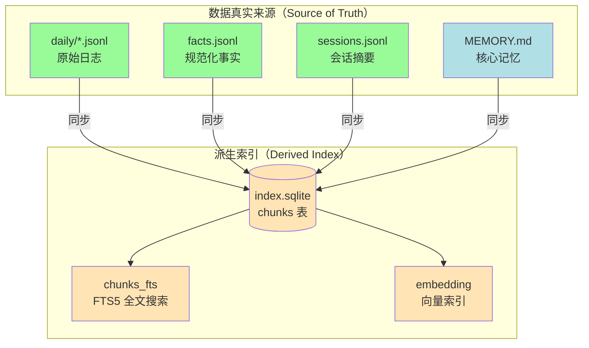
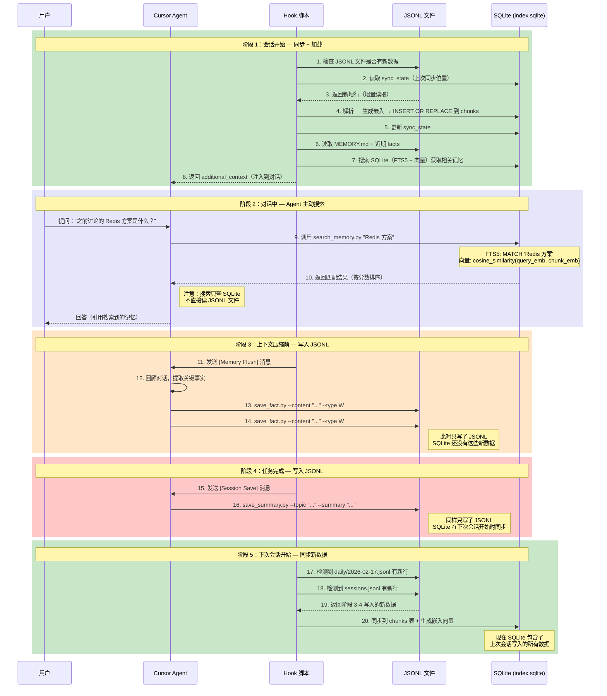
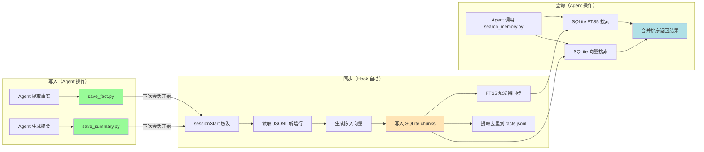

# 方案 C：JSONL 与 SQLite 关系

> **版本**: v1.0
> **创建日期**: 2026-02-18
> **系列**: 方案 C 设计文档 ([返回总览](./2026-02-18-01-总览与设计理念.md))

---

## 1. 核心问题：是不是存储了两份一样的数据？

**是的，文本内容确实存储了两份。** 但这是有意为之的设计，类似于数据库中"主表 + 索引"的关系：

- **JSONL** = 主表（持久化存储，Agent 写入的地方，可恢复、可 Git 追踪）
- **SQLite** = 索引（JSONL 的副本 + 嵌入向量 + FTS5 全文索引，用于高效搜索）

举例：当 Agent 写入一条事实 `{"id":"fact-001","content":"项目使用 PostgreSQL"}` 到 `facts.jsonl` 后，下次会话开始时，同步脚本会把这条记录**复制**到 SQLite 的 `chunks` 表中，同时生成嵌入向量。此时 `"项目使用 PostgreSQL"` 这段文本确实存在于两个地方。

---

## 2. 为什么接受这种冗余

| 如果只保留 JSONL | 如果只保留 SQLite |
|-----------------|-----------------|
| 搜索需要逐行扫描所有文件（慢） | Agent 需要通过 Python 脚本写入（复杂） |
| 无法做语义搜索（无向量） | 写入失败时数据丢失（SQLite 不如文件稳定） |
| 数据量大时性能线性下降 | 无法简单地用 CLI 命令追加 |

两层存储的代价是磁盘空间（约 2x 文本大小 + 向量数据），但换来了：
- **写入简单**：Agent 只需调用 `save_fact.py` / `save_summary.py`
- **搜索高效**：FTS5 + 向量搜索，毫秒级响应
- **容错性好**：SQLite 损坏时可从 JSONL 完全重建

---

## 3. 两层存储架构



---

## 4. 它们的区别

| 维度 | JSONL 文件 | SQLite (index.sqlite) |
|------|-----------|----------------------|
| **角色** | 数据真实来源（Source of Truth） | 派生索引（可重建） |
| **写入方** | Agent（通过 save_fact.py / save_summary.py 追加） | 同步脚本（sessionStart 时自动运行） |
| **数据内容** | 完整的原始记录（所有字段） | 提取的关键字段 + 嵌入向量 |
| **独有数据** | 无（JSONL 是原始数据） | `embedding` 向量（JSONL 中没有） |
| **搜索能力** | 只能逐行扫描 | FTS5 全文搜索 + 向量相似度搜索 |
| **删除后果** | **数据丢失**，无法恢复 | **无影响**，下次启动自动从 JSONL 重建 |
| **文件大小** | 较小（纯文本 JSON） | 较大（含向量数据） |
| **Git 提交** | 可选（facts.jsonl 通常不提交） | 不提交（.gitignore 排除） |

---

## 5. 为什么需要两层

```
写入路径（快速、简单）：
  Agent → save_fact.py --content "..." --type W    ← 一行命令，毫秒级
  Agent → save_summary.py --topic "..." --summary "..."   ← 会话结束时

读取路径（高效、智能）：
  search_memory.py "JWT 认证" → SQLite FTS5 + 向量搜索   ← 毫秒级语义检索
```

- **JSONL 优势**：写入极简（`save_fact.py` / `save_summary.py`），Agent 通过 CLI 命令追加，无需数据库驱动
- **SQLite 优势**：读取高效（FTS5 + 向量搜索），支持复杂查询和排名

如果只用 JSONL，每次搜索需要全文件扫描，随着数据增长会越来越慢。如果只用 SQLite，Agent 需要通过 Python 脚本写入，增加了复杂度和失败风险。

---

## 6. 数据重叠度

| JSONL 字段 | SQLite chunks 表 | 是否重复 |
|-----------|-----------------|---------|
| `id` | `id` | 是（作为主键关联） |
| `content` | `content` | 是（用于 FTS5 索引） |
| `type` | `type` | 是 |
| `memory_type` | `memory_type` | 是 |
| `entities` | `entities` | 是（用于 FTS5 索引） |
| `confidence` | `confidence` | 是 |
| `source` | `source_file` + `source_id` | 部分（拆分存储） |
| `timestamp` | `timestamp` | 是 |
| `evidence` | — | 否（SQLite 不存储） |
| `created_at` / `updated_at` | — | 否（SQLite 不存储） |
| — | `embedding` | 否（JSONL 不存储向量） |

**结论**：约 70% 的字段是重复的，但这是有意为之的设计——JSONL 保存完整记录用于持久化和溯源，SQLite 保存关键字段 + 向量用于高效检索。

---

## 7. 数据流动全景图

下图展示了数据在 JSONL 和 SQLite 之间的完整流动过程，包括**生成（写入）** 和 **查询（读取）** 两个方向：



---

## 8. 数据流动总结

### 8.1 写入方向（生成数据）

```
Agent 提取事实/摘要
    ↓
save_fact.py / save_summary.py    ← Agent 通过 CLI 写 JSONL（简单、快速）
    ↓
（等待下次会话开始）
    ↓
sessionStart Hook 检测到新数据
    ↓
读取新增行 → 生成嵌入向量 → 写入 SQLite   ← 脚本自动同步
```

**关键点**：Agent 只写 JSONL，从不直接写 SQLite。SQLite 的数据由同步脚本在 `sessionStart` 时自动填充。

### 8.2 查询方向（读取数据）

```
Agent 需要查找历史记忆
    ↓
调用 search_memory.py "查询内容"
    ↓
search_memory.py 查询 SQLite         ← 只查 SQLite（高效）
    ├── FTS5 关键词搜索
    └── 向量相似度搜索
    ↓
返回匹配结果给 Agent
```

**关键点**：搜索只查 SQLite，从不直接扫描 JSONL 文件。SQLite 是唯一的搜索入口。

### 8.3 完整的数据生命周期



---

## 9. 时间线视角

| 时间点 | JSONL 状态 | SQLite 状态 | 说明 |
|--------|-----------|-------------|------|
| 会话 A 开始 | 有历史数据 | 已同步到最新 | sessionStart 同步完成 |
| 会话 A 中 Agent 写入事实 | **新增 2 行** | 未同步（缺少新数据） | Agent 只写 JSONL |
| 会话 A 中 Agent 搜索 | — | 返回旧数据 | 搜索不包含刚写入的事实 |
| 会话 A 结束 | 新增摘要 1 行 | 未同步 | stop Hook 触发写入 |
| 会话 B 开始 | 有 3 行新数据 | **同步 3 行新数据** | sessionStart 增量同步 |
| 会话 B 中 Agent 搜索 | — | 返回包含新数据的结果 | 现在能搜到会话 A 的事实 |

> **注意**：在同一个会话内，Agent 刚写入 JSONL 的数据**不会立即出现在 SQLite 搜索结果中**。这些数据要等到下次会话的 `sessionStart` 同步后才能被搜索到。这是一个有意的设计权衡——简化了写入路径，代价是同一会话内的新事实不可搜索（但 Agent 本身已经知道这些事实，因为它刚刚提取的）。

---

## 相关文档

- [01-总览与设计理念](./2026-02-18-01-总览与设计理念.md) — 方案概述
- [06-数据存储格式](./2026-02-18-06-数据存储格式.md) — JSONL 各格式定义
- [08-SQLite索引设计](./2026-02-18-08-SQLite索引设计.md) — SQLite 表结构和搜索方式
