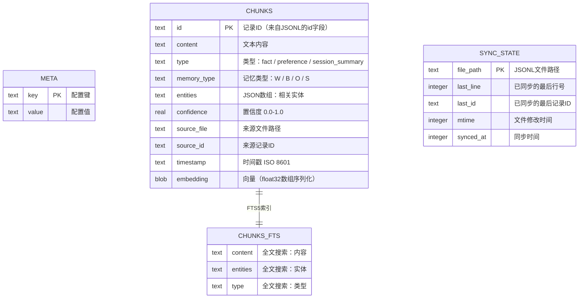
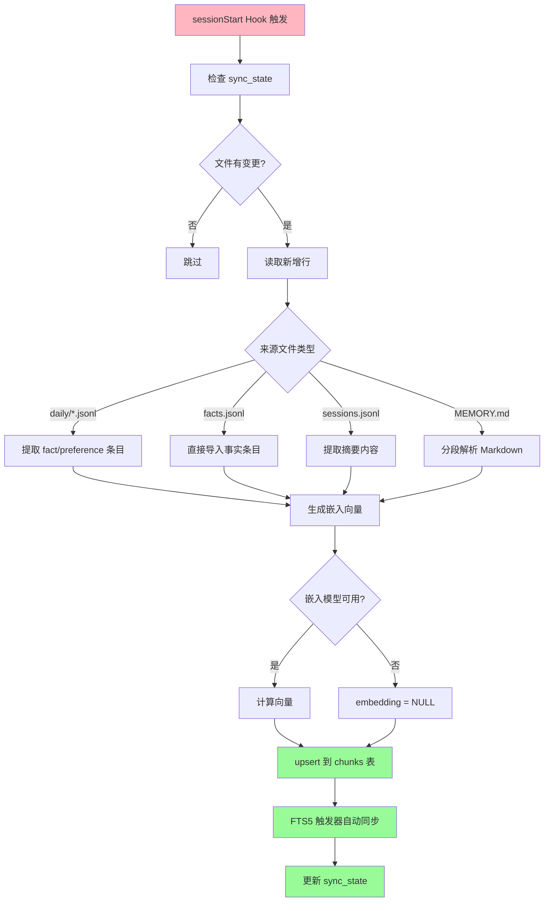

# 方案 C：SQLite 索引设计

> **版本**: v1.0
> **创建日期**: 2026-02-18
> **系列**: 方案 C 设计文档 ([返回总览](./2026-02-18-01-总览与设计理念.md))

---

SQLite 是 JSONL 数据的**派生索引**，不是数据的真实来源。即使 index.sqlite 被删除，也可以从 JSONL 文件完全重建。

> 关于 JSONL 与 SQLite 的关系，见 [07-JSONL与SQLite关系](./2026-02-18-07-JSONL与SQLite关系.md)

---

## 1. 表结构总览



---

## 2. chunks 表 — 核心数据表

存储从所有 JSONL 文件和 MEMORY.md 中提取的记忆条目，是搜索的主要目标。

### 2.1 建表语句

```sql
CREATE TABLE IF NOT EXISTS chunks (
    id TEXT PRIMARY KEY,          -- 来自 JSONL 的 id 字段（如 fact-001, sum-001）
    content TEXT NOT NULL,        -- 记忆内容文本
    type TEXT,                    -- 条目类型：fact / preference / session_summary / core
    memory_type TEXT,             -- 记忆分类：W(World) / B(Biographical) / O(Opinion) / S(Summary)
    entities TEXT,                -- JSON 数组，相关实体标签（如 ["redis","database"]）
    confidence REAL DEFAULT 0.8,  -- 置信度，0.0-1.0
    source_file TEXT,             -- 来源文件（如 "daily/2026-02-17.jsonl", "facts.jsonl"）
    source_id TEXT,               -- 来源记录 ID
    timestamp TEXT,               -- 记录时间 ISO 8601
    embedding BLOB                -- 嵌入向量（struct.pack 序列化的 float32 数组）
);
```

### 2.2 数据来源映射

| source_file | type | 说明 |
|-------------|------|------|
| `daily/*.jsonl` | fact / preference | 日志中的事实和偏好条目 |
| `facts.jsonl` | fact / preference | 去重后的规范化事实 |
| `sessions.jsonl` | session_summary | 会话摘要 |
| `MEMORY.md` | core | 核心记忆的各段落 |

### 2.3 示例数据

| id | content | type | memory_type | entities | confidence | source_file | timestamp |
|----|---------|------|-------------|----------|------------|-------------|-----------|
| `fact-001` | 项目使用 PostgreSQL 数据库 | fact | W | `["postgresql","database"]` | 1.0 | `facts.jsonl` | 2026-02-16T14:30:00Z |
| `fact-002` | 用户偏好 2 空格缩进 | preference | O | `["user","coding-style"]` | 0.85 | `facts.jsonl` | 2026-02-17T11:35:00Z |
| `fact-003` | 2026-02-17 完成了 Redis 缓存方案设计 | fact | B | `["redis","cache"]` | 1.0 | `daily/2026-02-17.jsonl` | 2026-02-17T11:30:00Z |
| `sum-120000` | 讨论了会话缓存的技术选型，决定采用 Redis 替代内存存储 | session_summary | S | `["redis","cache"]` | 1.0 | `sessions.jsonl` | 2026-02-17T12:00:00Z |
| `core-prefs` | Language: Chinese; Coding style: 2-space indent, TypeScript preferred | core | — | `["user"]` | 1.0 | `MEMORY.md` | 2026-02-17T10:30:00Z |
| `core-project` | Database: PostgreSQL; Cache: Redis; Framework: Express + TypeScript | core | — | `["postgresql","redis","express"]` | 1.0 | `MEMORY.md` | 2026-02-17T10:30:00Z |

> `embedding` 列为 BLOB 类型，存储 `struct.pack` 序列化的 float32 数组（如 384 维向量 = 1536 字节），表格中省略。

### 2.4 chunks 表存储了什么

chunks 表把所有来源（JSONL 文件 + MEMORY.md）的记忆内容统一存储在一个表中，使得搜索时只需查询一张表即可覆盖所有记忆。每一行就是一条"可搜索的记忆片段"：

- 来自 `daily/*.jsonl` 的行 → 原始对话中提取的事实和偏好
- 来自 `facts.jsonl` 的行 → 去重后的规范化事实（搜索时优先返回这些）
- 来自 `sessions.jsonl` 的行 → 每次会话的摘要（用于回答"上次讨论了什么"）
- 来自 `MEMORY.md` 的行 → 核心记忆的各段落（用户手动维护的重要信息）

---

## 3. chunks_fts 表 — FTS5 全文搜索虚拟表

基于 SQLite FTS5 的全文搜索索引，支持 BM25 排名。

### 3.1 建表语句

```sql
CREATE VIRTUAL TABLE IF NOT EXISTS chunks_fts USING fts5(
    content,                      -- 索引内容文本
    entities,                     -- 索引实体标签
    type,                         -- 索引类型
    content='chunks',             -- 内容表指向 chunks
    content_rowid='rowid'         -- 使用 chunks 的 rowid
);
```

### 3.2 示例数据

FTS5 虚拟表的数据通过触发器自动从 chunks 同步：

| rowid | content | entities | type |
|-------|---------|----------|------|
| 1 | 项目使用 PostgreSQL 数据库 | `["postgresql","database"]` | fact |
| 2 | 用户偏好 2 空格缩进 | `["user","coding-style"]` | preference |
| 3 | 2026-02-17 完成了 Redis 缓存方案设计 | `["redis","cache"]` | fact |
| 4 | 讨论了会话缓存的技术选型，决定采用 Redis 替代内存存储 | `["redis","cache"]` | session_summary |

### 3.3 搜索示例

```sql
-- 搜索包含 "Redis" 的记忆
SELECT c.id, c.content, c.type, bm25(chunks_fts) as rank
FROM chunks_fts f
JOIN chunks c ON c.rowid = f.rowid
WHERE chunks_fts MATCH 'Redis'
ORDER BY rank;

-- 结果：
-- fact-003  | 2026-02-17 完成了 Redis 缓存方案设计        | fact            | -1.2
-- sum-120000| 讨论了会话缓存的技术选型，决定采用 Redis...     | session_summary | -0.8
```

### 3.4 自动同步触发器

保持 chunks 和 chunks_fts 数据一致：

```sql
-- 插入时自动同步到 FTS
CREATE TRIGGER IF NOT EXISTS chunks_ai AFTER INSERT ON chunks BEGIN
    INSERT INTO chunks_fts(rowid, content, entities, type)
    VALUES (new.rowid, new.content, new.entities, new.type);
END;

-- 删除时自动从 FTS 移除
CREATE TRIGGER IF NOT EXISTS chunks_ad AFTER DELETE ON chunks BEGIN
    INSERT INTO chunks_fts(chunks_fts, rowid, content, entities, type)
    VALUES ('delete', old.rowid, old.content, old.entities, old.type);
END;

-- 更新时先删后插
CREATE TRIGGER IF NOT EXISTS chunks_au AFTER UPDATE ON chunks BEGIN
    INSERT INTO chunks_fts(chunks_fts, rowid, content, entities, type)
    VALUES ('delete', old.rowid, old.content, old.entities, old.type);
    INSERT INTO chunks_fts(rowid, content, entities, type)
    VALUES (new.rowid, new.content, new.entities, new.type);
END;
```

---

## 4. meta 表 — 元数据

存储索引的配置和状态信息。

### 4.1 建表语句

```sql
CREATE TABLE IF NOT EXISTS meta (
    key TEXT PRIMARY KEY,
    value TEXT
);
```

### 4.2 示例数据

| key | value |
|-----|-------|
| `schema_version` | `1` |
| `last_sync` | `2026-02-17T12:00:00Z` |
| `embedding_model` | `BAAI/bge-small-en-v1.5` |
| `embedding_dims` | `384` |
| `total_chunks` | `156` |
| `created_at` | `2026-02-15T08:00:00Z` |

### 4.3 常用 key 说明

| key | 说明 |
|-----|------|
| `schema_version` | Schema 版本号，用于未来数据库迁移 |
| `last_sync` | 最后一次 JSONL → SQLite 同步的时间 |
| `embedding_model` | 当前使用的嵌入模型名称 |
| `embedding_dims` | 向量维度（用于验证向量一致性） |
| `total_chunks` | 当前 chunks 表的总行数（用于快速统计） |
| `created_at` | 数据库首次创建时间 |

---

## 5. sync_state 表 — 同步状态追踪

追踪每个 JSONL 文件的同步进度，实现增量同步。

### 5.1 建表语句

```sql
CREATE TABLE IF NOT EXISTS sync_state (
    file_path TEXT PRIMARY KEY,   -- JSONL 文件相对路径
    last_line INTEGER DEFAULT 0,  -- 已同步的最后行号
    last_id TEXT,                 -- 已同步的最后记录 ID
    mtime INTEGER,                -- 文件修改时间（用于检测变更）
    synced_at INTEGER             -- 同步时间戳
);
```

### 5.2 示例数据

| file_path | last_line | last_id | mtime | synced_at |
|-----------|-----------|---------|-------|-----------|
| `daily/2026-02-17.jsonl` | 15 | `log-143000` | 1739800200 | 1739800500 |
| `facts.jsonl` | 42 | `fact-042` | 1739799000 | 1739800500 |
| `sessions.jsonl` | 8 | `sum-120000` | 1739798000 | 1739800500 |

---

## 6. 搜索方式

### 6.1 FTS5 关键词搜索

```sql
SELECT c.*, bm25(chunks_fts) as rank
FROM chunks_fts f
JOIN chunks c ON c.rowid = f.rowid
WHERE chunks_fts MATCH '关键词'
ORDER BY rank
LIMIT 10;
```

### 6.2 向量相似度搜索

当 `sqlite-vec` 扩展可用时，使用原生向量搜索；否则降级为暴力扫描余弦相似度：

```python
# 有 sqlite-vec 时：原生向量搜索（高效）
SELECT id, content, distance
FROM chunks_vec
WHERE embedding MATCH ?
ORDER BY distance
LIMIT 10;

# 无 sqlite-vec 时：暴力扫描（降级方案）
rows = db.execute("SELECT * FROM chunks WHERE embedding IS NOT NULL")
for row in rows:
    score = cosine_similarity(query_embedding, row.embedding)
```

### 6.3 混合搜索（推荐）

结合 FTS5 和向量搜索的结果，通过分数加权合并：

```python
def hybrid_search(query: str, limit: int = 10):
    # 1. FTS5 关键词搜索
    fts_results = db.search_fts(query, limit=limit * 2)
    
    # 2. 向量相似度搜索
    query_embedding = embedder.embed(query)
    vec_results = db.search_vector(query_embedding, limit=limit * 2)
    
    # 3. 分数融合（Reciprocal Rank Fusion）
    merged = reciprocal_rank_fusion(fts_results, vec_results)
    return merged[:limit]
```

---

## 7. Chunk 分割与重叠策略

当 MEMORY.md 或较长的会话摘要被导入 SQLite 时，需要将文本分割为多个 chunk 以便精确搜索。

### 7.1 为什么需要 Chunk 分割

| 问题 | 不分割 | 分割后 |
|------|--------|--------|
| 长文档搜索 | 整段匹配，排名粗糙 | 段落级匹配，排名精准 |
| 嵌入向量质量 | 长文本嵌入语义模糊 | 短文本嵌入语义清晰 |
| 上下文加载 | 整篇加载浪费 token | 按需加载相关段落 |

### 7.2 分割参数

| 参数 | 默认值 | 说明 |
|------|--------|------|
| `chunk_tokens` | 400 | 每个 chunk 最大 token 数（约 1600 字符） |
| `chunk_overlap` | 80 | 相邻 chunk 重叠的 token 数（约 320 字符） |

> 参考自 clawdbot 的 `chunkMarkdown()` 实现（`code/clawdbot/src/memory/internal.ts`）

### 7.3 重叠机制

重叠（overlap）确保 chunk 边界处不丢失语义上下文：

```
原文（1200 字符）:
┌─────────────────────────────────────────┐
│ ...段落A... ...段落B... ...段落C...      │
└─────────────────────────────────────────┘

分割后（chunk_tokens=400, overlap=80）:
Chunk 1: ┌──── 400 tokens ────┐
Chunk 2:              ┌── 80 overlap ──┌──── 400 tokens ────┐
Chunk 3:                                        ┌── 80 ──┌──── 400 tokens ────┐
```

每个 chunk 的开头包含前一个 chunk 末尾约 80 token 的内容。这样即使一个概念跨越了 chunk 边界，也不会被完全切断。

### 7.4 哪些数据需要分割

| 数据来源 | 是否分割 | 理由 |
|----------|----------|------|
| MEMORY.md | 是（按 Markdown 标题分段） | 可能较长，包含多个主题 |
| sessions.jsonl | 通常不需要 | 每条摘要 100-200 字，不超过 chunk 限制 |
| facts.jsonl | 不需要 | 每条事实一句话 |
| daily/*.jsonl | 不需要 | 每条记录一句话 |

---

## 8. 数据同步流程（JSONL → SQLite）



### 7.1 同步策略

| 策略 | 说明 |
|------|------|
| **增量同步** | 通过 `sync_state` 追踪每个文件的同步进度，只处理新增行 |
| **幂等操作** | 使用 `INSERT OR REPLACE` 确保重复同步不会产生重复数据 |
| **降级容忍** | 嵌入模型不可用时，仍然同步文本数据，FTS5 搜索可正常工作 |
| **完全重建** | 删除 `index.sqlite` 后，下次同步会从所有 JSONL 文件完全重建索引 |

---

## 相关文档

- [01-总览与设计理念](./2026-02-18-01-总览与设计理念.md) — 方案概述
- [06-数据存储格式](./2026-02-18-06-数据存储格式.md) — JSONL 格式定义
- [07-JSONL与SQLite关系](./2026-02-18-07-JSONL与SQLite关系.md) — 两层存储设计
- [11-本地嵌入模型选型](./2026-02-18-11-本地嵌入模型选型.md) — 嵌入向量生成方案
