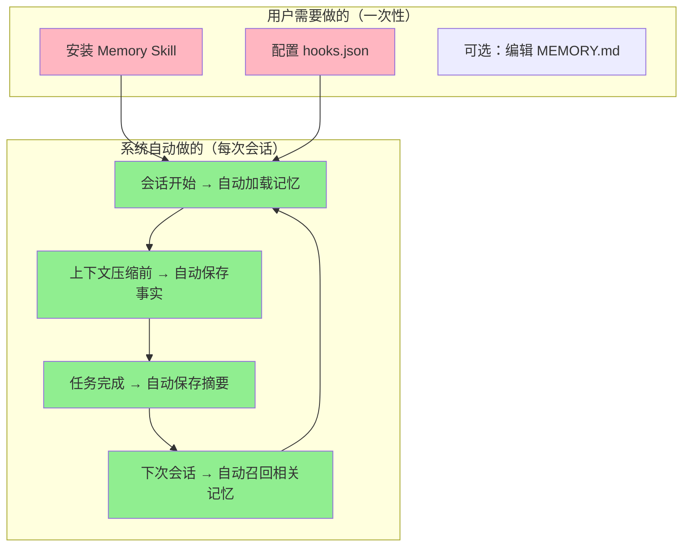

# 方案 C：用户参与与配置指南

> **版本**: v1.0
> **创建日期**: 2026-02-18
> **系列**: 方案 C 设计文档 ([返回总览](./2026-02-18-01-总览与设计理念.md))

---

## 1. 用户参与说明

### 1.1 用户需要做什么？

**几乎不需要做任何事情。** 记忆系统在后台自动运行。



### 1.2 用户参与的三个层次

#### 层次 1：零参与（推荐）

安装后不需要任何操作，系统自动运行。

- 会话开始时自动加载历史记忆
- 上下文压缩前自动保存关键事实
- 任务完成后自动保存会话摘要
- 用户完全无感知

#### 层次 2：轻度参与（可选）

用户可以手动编辑 `MEMORY.md` 来管理核心记忆。

```markdown
# 用户可以直接编辑这个文件

## 我的偏好
- 使用中文回答
- 代码注释用英文
- 偏好函数式编程风格
```

#### 层次 3：主动使用（高级）

用户可以主动要求 Agent 搜索或管理记忆：

- "帮我搜索之前关于 API 设计的讨论"
- "记住：以后所有 API 都要加 rate limiting"
- "查看最近的会话摘要"

### 1.3 用户可见的变化

| 场景 | 用户体验 | 背后发生了什么 |
|------|----------|---------------|
| 打开 Cursor 开始对话 | Agent 似乎"记得"之前的讨论 | sessionStart Hook 注入了历史记忆 |
| 长对话中途 | 无感知（对话正常继续） | preCompact Hook 触发，Agent 静默保存事实 |
| 完成任务后 | 无感知 | stop Hook 触发，Agent 静默保存摘要 |
| 下次打开项目 | Agent 提到"上次我们讨论了..." | sessionStart 加载了上次的摘要 |

---

## 2. 一次性安装步骤

### 步骤 1：安装 Skill

```bash
# 将 memory-skill 复制到 Cursor skills 目录
cp -r memory-skill ~/.cursor/skills/memory-skill
```

确保以下文件存在：
```
~/.cursor/skills/memory-skill/
├── SKILL.md
└── scripts/
    ├── load_memory.py
    ├── flush_memory.py
    ├── prompt_session_save.py
    ├── sync_and_cleanup.py
    ├── search_memory.py
    ├── sync_index.py
    └── init.py          # 一键初始化脚本
```

### 步骤 2：一键初始化（推荐）

安装 Skill 后，运行 `init.py` 自动完成所有配置：

```bash
python3 ~/.cursor/skills/memory-skill/scripts/init.py [--global]
```

**init.py 自动执行的操作**：

| 操作 | 说明 | 目标路径 |
|------|------|----------|
| 1. 创建 hooks.json | 写入三个 Hook 配置 | `<project>/.cursor/hooks.json`（默认）或 `~/.cursor/hooks.json`（--global） |
| 2. 创建 Rules 文件 | 写入 memory-rules.mdc | `<project>/.cursor/rules/memory-rules.mdc`（默认）或 `~/.cursor/rules/memory-rules.mdc`（--global） |
| 3. 初始化存储目录 | 创建 `.cursor/skills/memory-data/` 及子目录 | `<project>/.cursor/skills/memory-data/` |
| 4. 创建 MEMORY.md | 生成默认模板 | `<project>/.cursor/skills/memory-data/MEMORY.md` |
| 5. 安装 Python 依赖 | 自动 `pip install sentence-transformers` | 用户 Python 环境 |
| 6. 下载嵌入模型 | 预下载到 `~/.cursor/skills/memory-skill/models/` | 默认 BGE-small-zh-v1.5（开发），可选 Qwen3-Embedding-0.6B（生产） |

**init.py 逻辑**：

```python
import os, json, argparse, subprocess, sys

def main():
    parser = argparse.ArgumentParser(description='Memory Skill 一键初始化')
    parser.add_argument('--global', dest='use_global', action='store_true',
                        help='配置到全局 ~/.cursor/ 而非项目级')
    parser.add_argument('--production', action='store_true',
                        help='使用生产级模型 Qwen3-Embedding-0.6B（默认使用 BGE-small-zh-v1.5）')
    parser.add_argument('--skip-model', action='store_true',
                        help='跳过模型下载（仅配置文件）')
    args = parser.parse_args()

    project_dir = os.getcwd()
    cursor_dir = os.path.expanduser('~/.cursor') if args.use_global else os.path.join(project_dir, '.cursor')

    # 1-4: 创建配置文件和目录
    setup_config(cursor_dir, project_dir)

    # 5: 安装 Python 依赖
    if not args.skip_model:
        install_dependencies()

    # 6: 下载嵌入模型
    if not args.skip_model:
        model = 'Qwen/Qwen3-Embedding-0.6B' if args.production else 'BAAI/bge-small-zh-v1.5'
        download_model(model)

def install_dependencies():
    """自动安装 sentence-transformers（用户无需手动操作）"""
    print("正在安装依赖...")
    subprocess.check_call([sys.executable, '-m', 'pip', 'install',
                          'sentence-transformers', '-q'])
    print("  ✓ sentence-transformers 安装完成")

def download_model(model_name):
    """预下载嵌入模型到本地缓存"""
    print(f"正在下载嵌入模型: {model_name}...")
    from sentence_transformers import SentenceTransformer
    SentenceTransformer(model_name)
    print(f"  ✓ {model_name} 下载完成（缓存于 ~/.memory-skill/models/）")
```

**参数说明**：

| 参数 | 说明 |
|------|------|
| 无参数 | 项目级配置 + 安装依赖 + 下载 BGE-small-zh-v1.5（开发模型，96MB） |
| `--global` | 配置到全局（`~/.cursor/`），对所有项目生效 |
| `--production` | 下载 Qwen3-Embedding-0.6B（生产模型，1.2GB，中英双语最佳） |
| `--skip-model` | 仅创建配置文件，不安装依赖和模型 |

**典型使用流程**：

```bash
# 开发阶段：一键初始化（自动安装依赖 + 下载 BGE-small-zh-v1.5）
python3 ~/.cursor/skills/memory-skill/scripts/init.py

# 验证通过后，升级到生产模型
python3 ~/.cursor/skills/memory-skill/scripts/init.py --production

# 仅配置文件（已有依赖和模型时）
python3 ~/.cursor/skills/memory-skill/scripts/init.py --skip-model
```

**hooks.json 合并策略**：如果 `hooks.json` 已存在（用户有其他 Hook），init.py 会读取现有配置并合并 memory-skill 的 Hook，不会覆盖用户已有的配置。

### 步骤 3：手动配置（可选，替代步骤 2）

如果不使用 init.py，也可以手动完成配置：

**3a. 创建 hooks.json**

在项目根目录创建 `.cursor/hooks.json`：

```json
{
  "version": 1,
  "hooks": {
    "sessionStart": [
      {
        "command": "python3 ~/.cursor/skills/memory-skill/scripts/load_memory.py",
        "timeout": 10
      }
    ],
    "preCompact": [
      {
        "command": "python3 ~/.cursor/skills/memory-skill/scripts/flush_memory.py",
        "timeout": 5
      }
    ],
    "stop": [
      {
        "command": "python3 ~/.cursor/skills/memory-skill/scripts/prompt_session_save.py",
        "loop_limit": 1
      }
    ]
  }
}
```

**3b. 创建 Rules 文件**

创建 `.cursor/rules/memory-rules.mdc`，内容见 [05-SKILL与Rules设计](./2026-02-18-05-SKILL与Rules设计.md)。

**3c. 初始化存储目录**

```bash
mkdir -p .cursor/skills/memory-data/daily
touch .cursor/skills/memory-data/MEMORY.md
touch .cursor/skills/memory-data/sessions.jsonl
touch .cursor/skills/memory-data/facts.jsonl
```

---

## 3. hooks.json 参数说明

| 参数 | 说明 | 推荐值 |
|------|------|--------|
| `timeout` (sessionStart) | 读取记忆的超时时间 | 10 秒 |
| `timeout` (preCompact) | 构建 prompt 的超时时间 | 5 秒（不再需要 30 秒） |
| `loop_limit` (stop) | followup_message 最大执行次数 | 1（只执行一次摘要保存） |

### 3.1 超时时间说明

| Hook | 原方案超时 | 方案 C 超时 | 差异原因 |
|------|-----------|------------|----------|
| sessionStart | 10 秒 | 10 秒 | 一致（均为文件读取 + SQLite 查询） |
| preCompact | 30 秒 | 5 秒 | 不再调用外部 LLM，只做字符串拼接 |
| stop | — | — | 使用 `loop_limit` 而非 `timeout` |

### 3.2 全局 vs 项目级配置

| 配置位置 | 路径 | 效果 |
|----------|------|------|
| 全局 | `~/.cursor/hooks.json` | 对所有项目生效 |
| 项目级 | `<project>/.cursor/hooks.json` | 仅对当前项目生效，覆盖全局配置 |

推荐使用全局配置，这样所有项目都自动获得记忆能力。如果某个项目需要特殊配置（如不同的超时时间），可以在项目级覆盖。

---

## 4. 常见问题

### Q: 记忆系统会影响 Agent 的响应速度吗？

A: 几乎不会。sessionStart 的额外延迟约 1-3 秒（文件读取 + SQLite 查询）。preCompact 和 stop 的 Hook 脚本执行只需几毫秒。Agent 的写入操作（save_fact.py / save_summary.py）也是毫秒级的。

### Q: 记忆数据会占用多少磁盘空间？

A: 非常少。每条 JSONL 记录约 200-500 字节。假设每天写入 20 条记录，一年约 2-4 MB。SQLite 索引（含向量）约为 JSONL 的 3-5 倍，一年约 10-20 MB。

### Q: 如果 SQLite 索引损坏怎么办？

A: 直接删除 `index.sqlite`，下次 sessionStart 会从 JSONL 文件完全重建。JSONL 文件是数据真实来源，不会因 SQLite 损坏而丢失。

### Q: 如何清理旧的记忆数据？

A: 删除 `daily/` 目录下的旧日期文件即可（如删除 30 天前的 `*.jsonl`）。`facts.jsonl` 中的去重事实不受影响。下次 sessionStart 时 SQLite 会自动重建。

---

## 相关文档

- [01-总览与设计理念](./2026-02-18-01-总览与设计理念.md) — 方案概述
- [05-SKILL与Rules设计](./2026-02-18-05-SKILL与Rules设计.md) — Rules 文件内容
- [06-数据存储格式](./2026-02-18-06-数据存储格式.md) — 目录结构和格式
