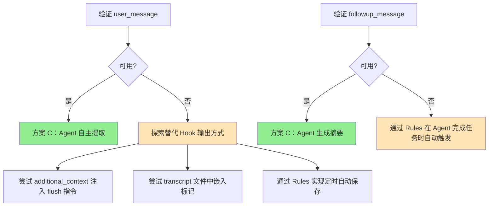

# 方案 C：风险与验证计划

> **版本**: v1.0
> **创建日期**: 2026-02-18
> **系列**: 方案 C 设计文档 ([返回总览](./2026-02-18-01-总览与设计理念.md))

---

## 1. 需要验证的关键假设

| 假设 | 风险等级 | 验证方法 |
|------|----------|----------|
| preCompact 的 `user_message` 会被 Agent 接收并执行 | 高 | 编写测试 Hook，观察 Agent 行为 |
| `user_message` 在压缩**前**注入（Agent 仍有完整上下文） | 高 | 测试 Hook 中让 Agent 报告上下文大小 |
| stop 的 `followup_message` 能让 Agent 继续执行一轮 | 中 | 编写测试 Hook，观察 Agent 是否继续 |
| Agent 会按照 SKILL.md 的格式写入 JSONL | 中 | 多次测试，检查写入格式 |
| Rules 能有效强制 Agent 响应 flush 指令 | 中 | 对比有/无 Rules 的 Agent 行为 |

### 1.1 高风险假设详解

**假设 1：`user_message` 会被 Agent 接收并执行**

这是方案 C 的核心假设。如果 `user_message` 返回值不能作为"用户消息"注入到 Agent 上下文中，整个方案就无法工作。

- **预期行为**：preCompact Hook 返回 `{"user_message": "[Memory Flush]..."}`，Agent 收到这条消息并执行记忆写入
- **可能的失败**：`user_message` 被 Cursor 忽略、仅显示给用户但不触发 Agent 响应、在压缩之后才注入
- **验证优先级**：最高

**假设 2：`user_message` 在压缩前注入**

即使 `user_message` 能被 Agent 收到，如果它在上下文压缩**之后**才注入，Agent 就已经丢失了完整的对话内容，提取质量会大幅下降。

- **预期行为**：Agent 在收到 `[Memory Flush]` 时仍能看到完整对话
- **可能的失败**：消息在压缩后注入，Agent 只能看到压缩后的摘要
- **验证方法**：让 Agent 在收到消息时报告当前上下文中的消息数量

---

## 2. 最小验证测试

### 测试 1：preCompact user_message

```python
# test_pre_compact.py - 最小测试
import sys, json

def main():
    event = json.loads(sys.stdin.read())
    print(json.dumps({
        "user_message": "[TEST] 请在当前目录创建一个文件 .memory-test.txt，内容为 'preCompact works'"
    }))

if __name__ == "__main__":
    main()
```

**配置**：
```json
{
  "version": 1,
  "hooks": {
    "preCompact": [
      {
        "command": "python3 test_pre_compact.py",
        "timeout": 5
      }
    ]
  }
}
```

**验证步骤**：
1. 配置 Hook
2. 开始长对话触发上下文压缩
3. 检查 `.memory-test.txt` 是否被创建
4. 如果创建了，说明 `user_message` 有效

**预期结果**：`.memory-test.txt` 文件被创建，内容为 `preCompact works`

### 测试 2：stop followup_message

```python
# test_stop.py - 最小测试
import sys, json

def main():
    event = json.loads(sys.stdin.read())
    if event.get('status') == 'completed':
        print(json.dumps({
            "followup_message": "[TEST] 请在当前目录创建一个文件 .stop-test.txt，内容为 'stop hook works'"
        }))
    else:
        print(json.dumps({}))

if __name__ == "__main__":
    main()
```

**验证步骤**：
1. 配置 Hook
2. 让 Agent 完成一个简单任务
3. 检查 `.stop-test.txt` 是否被创建
4. 如果创建了，说明 `followup_message` 有效

**预期结果**：`.stop-test.txt` 文件被创建，内容为 `stop hook works`

### 测试 3：上下文完整性验证

```python
# test_context.py - 验证 Agent 在收到 user_message 时是否有完整上下文
import sys, json

def main():
    event = json.loads(sys.stdin.read())
    print(json.dumps({
        "user_message": "[CONTEXT TEST] 请回答以下问题（直接在响应中回答，不要创建文件）：\n1. 当前对话中有多少条消息？\n2. 最早的一条消息内容是什么？\n3. 你是否能看到完整的对话历史？"
    }))

if __name__ == "__main__":
    main()
```

**验证步骤**：
1. 配置 Hook
2. 进行一段包含明确信息的对话（如讨论特定技术方案）
3. 等待 preCompact 触发
4. 检查 Agent 的响应是否包含完整的对话信息

---

## 3. 验证失败时的应对策略

如果验证失败（user_message / followup_message 不可用），不考虑第三方 LLM 降级，而是探索 Cursor Hook 机制内的替代方案：



### 3.1 替代方案清单

| 方案 | 适用场景 | 原理 |
|------|----------|------|
| **additional_context 注入** | user_message 不可用 | 在 sessionStart 的 additional_context 中嵌入"遇到压缩时自动保存"指令 |
| **Rules 定时保存** | 两者都不可用 | 通过 Rules 约束 Agent 在每次完成任务后主动检查并保存 |
| **transcript 标记** | user_message 不可用 | 在 preCompact 中读取 transcript，标记需要保存的内容片段 |

---

## 4. 验证执行计划

| 阶段 | 内容 | 预计时间 | 通过标准 |
|------|------|----------|----------|
| 1 | 测试 1：preCompact user_message | 30 分钟 | `.memory-test.txt` 被创建 |
| 2 | 测试 2：stop followup_message | 30 分钟 | `.stop-test.txt` 被创建 |
| 3 | 测试 3：上下文完整性 | 30 分钟 | Agent 能回答完整对话信息 |
| 4 | 集成测试：完整记忆流程 | 1 小时 | JSONL 文件正确写入、格式正确 |
| 5 | Rules 有效性测试 | 30 分钟 | 有/无 Rules 对比 Agent 行为差异 |

### 4.1 阶段 1-2 失败时的决策

如果阶段 1 或阶段 2 的测试失败：

1. **检查 Cursor 文档**：确认 `user_message` / `followup_message` 的预期行为
2. **尝试替代方式**：如用 `additional_context` 注入指令、通过 Rules 实现自动保存
3. **更新设计文档**：记录验证结果和最终方案选择

---

## 5. 已知局限

| 局限 | 影响 | 缓解措施 |
|------|------|----------|
| 同一会话内新事实不可搜索 | Agent 在同一会话中搜索不到刚提取的事实 | Agent 本身已知道这些事实（因为刚提取的） |
| Agent 模型变化可能影响写入质量 | 不同版本的 Agent 可能写出不同质量的事实 | SKILL.md 提供明确模板，Rules 约束格式 |
| 嵌入模型不可用时无向量搜索 | FTS5 仍可工作，但语义搜索不可用 | 降级为纯关键词搜索 |
| 首次使用时无历史记忆 | 第一次会话没有可加载的记忆 | 正常现象，从第二次会话开始积累 |

---

## 相关文档

- [01-总览与设计理念](./2026-02-18-01-总览与设计理念.md) — 方案概述
- [02-方案对比分析](./2026-02-18-02-方案对比分析.md) — 方案风险对比
- [04-Hook 详细设计](./2026-02-18-04-Hook详细设计.md) — Hook 返回值机制
