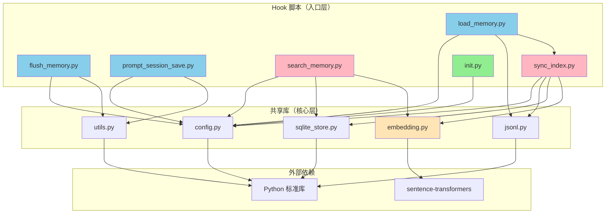

# 方案 C：开发实现指南

> **版本**: v1.0
> **创建日期**: 2026-02-18
> **系列**: 方案 C 设计文档 ([返回总览](./2026-02-18-01-总览与设计理念.md))

---

## 1. 技术栈

| 类别 | 选择 | 理由 |
|------|------|------|
| **主要语言** | Python 3.9+ | Cursor Hooks 原生支持，生态丰富，sentence-transformers 依赖 |
| **嵌入模型** | sentence-transformers（PyTorch CPU） | 开发阶段：BGE-small-zh-v1.5（96MB）；生产：Qwen3-Embedding-0.6B |
| **搜索索引** | SQLite 3 + FTS5 | Python 标准库内置，零依赖 |
| **数据存储** | JSONL + Markdown | 纯文本，Git 友好，Agent 可直接写入 |
| **配置格式** | JSON（hooks.json）+ Markdown（SKILL.md / Rules） | Cursor 原生支持 |
| **包管理** | pip + requirements.txt | Python 标准方式 |

### 1.1 Python 依赖

| 包 | 用途 | 是否必须 |
|----|------|----------|
| `sentence-transformers` | 加载嵌入模型、生成向量 | 可选（无则降级为纯 FTS5 搜索） |
| `torch`（CPU） | sentence-transformers 的底层依赖 | 跟随 sentence-transformers |
| `numpy` | 向量计算 | 跟随 sentence-transformers |

> 核心 Hook 脚本（session_start / pre_compact / stop）仅使用 Python 标准库，无第三方依赖。
> 嵌入功能为可选增强，仅 `sync_index.py` 和 `search_memory.py` 需要 `sentence-transformers`。

---

## 2. 项目代码结构

```
memory-skill/
├── SKILL.md                        # Cursor Skill 定义文件
├── requirements.txt                # Python 依赖
│
├── scripts/                        # 核心脚本目录
│   ├── load_memory.py              # Hook: 加载历史记忆到 Agent 上下文
│   ├── flush_memory.py             # Hook: 构建记忆刷写指令（压缩前提取事实）
│   ├── prompt_session_save.py       # Hook: 构建会话保存指令（生成摘要）
│   ├── sync_and_cleanup.py          # Hook: 索引同步+元数据记录+日志清理
│   ├── search_memory.py            # 工具: Agent 主动搜索历史记忆
│   ├── sync_index.py               # 工具: JSONL → SQLite 增量同步 + 嵌入生成
│   └── init.py                     # 工具: 一键初始化配置
│
├── lib/                            # 共享库
│   ├── __init__.py
│   ├── config.py                   # 路径常量、默认配置
│   ├── jsonl.py                    # JSONL 文件读写工具
│   ├── sqlite_store.py             # SQLite 操作封装（建表、增删查改）
│   ├── embedding.py                # 嵌入模型加载与向量生成
│   └── utils.py                    # 通用工具函数（时间处理、日志等）
│
├── templates/                      # 模板文件
│   ├── hooks.json                  # hooks.json 模板
│   ├── memory-rules.mdc            # Rules 模板
│   └── MEMORY.md                   # MEMORY.md 初始模板
│
└── tests/                          # 测试（验证阶段使用）
    ├── test_pre_compact.py         # preCompact Hook 验证脚本
    ├── test_stop.py                # stop Hook 验证脚本
    └── test_context.py             # 上下文完整性验证脚本
```

### 2.1 安装后的完整目录

```
<project>/
├── .cursor/
│   ├── hooks.json                  # Hook 配置
│   ├── rules/
│   │   └── memory-rules.mdc       # Agent 行为规则
│   ├── skills/
│   │   └── memory-skill/          # ← Skill 代码
│   │       ├── SKILL.md
│   │       ├── scripts/
│   │       ├── lib/
│   │       └── templates/
│   └── skills/
│       ├── memory-skill/          # ← Skill 代码
│       │   ├── SKILL.md
│       │   ├── scripts/
│       │   ├── lib/
│       │   └── templates/
│       └── memory-data/           # ← 运行时数据目录
│           ├── MEMORY.md          # 核心记忆（用户可编辑）
│           ├── daily/             # 按日期分文件的事件日志
│           │   ├── 2026-02-17.jsonl
│           │   └── 2026-02-18.jsonl
│           ├── facts.jsonl        # 去重后的事实库
│           ├── sessions.jsonl     # 会话摘要
│           └── index.sqlite       # 搜索索引（自动生成）

全局安装模式：
~/.cursor/
├── skills/
│   ├── memory-skill/              # ← Skill 代码（全局共享）
│   └── memory-data/               # ← 全局运行时数据
├── rules/
│   └── memory-rules.mdc
└── hooks.json
```

---

## 3. 各模块职责说明

### 3.1 Hook 脚本（scripts/）

Hook 脚本是系统的入口，由 Cursor IDE 自动调用。**所有 Hook 脚本仅使用 Python 标准库。**

| 脚本 | 触发方式 | 输入 | 输出 | 核心逻辑 |
|------|----------|------|------|----------|
| `load_memory.py` | sessionStart Hook | stdin JSON（事件信息） | stdout JSON（`additional_context`） | 读取 MEMORY.md + facts.jsonl + sessions.jsonl，组装上下文字符串；调用 sync_index.py 增量同步 |
| `flush_memory.py` | preCompact Hook | stdin JSON（事件信息 + 上下文使用率） | stdout JSON（`user_message`） | 用模板变量拼接 flush prompt 字符串 |
| `prompt_session_save.py` | stop Hook | stdin JSON（事件信息 + status） | stdout JSON（`followup_message`） | 仅 status=completed 时输出 save prompt |
| `sync_and_cleanup.py` | sessionEnd Hook | stdin JSON（会话元数据） | 无（fire-and-forget） | 同步索引 + 记录元数据 + 清理日志 |
| `search_memory.py` | Agent 主动调用 | CLI 参数（查询词 + 选项） | stdout JSON（搜索结果列表） | 调用 sqlite_store 执行 FTS5 + 向量混合搜索 |
| `sync_index.py` | load_memory.py 内部调用 | 无（读取 .cursor/skills/memory-data/ 目录） | 无（写入 index.sqlite） | 增量读取 JSONL，生成嵌入，写入 SQLite |
| `init.py` | 用户手动调用 | CLI 参数（--global 可选） | 终端输出（配置结果） | 创建 hooks.json、Rules、存储目录、预下载模型 |

### 3.2 共享库（lib/）

| 模块 | 职责 | 依赖 |
|------|------|------|
| `config.py` | 定义路径常量（.cursor/skills/memory-data、daily/、index.sqlite 等）、默认参数（facts 加载条数、天数等） | 标准库 |
| `jsonl.py` | JSONL 文件的读取（按行解析）、追加、按时间/数量过滤 | 标准库 |
| `sqlite_store.py` | SQLite 连接管理、建表（chunks / chunks_fts / meta / sync_state）、增删查改、FTS5 搜索、向量搜索 | 标准库（sqlite3） |
| `embedding.py` | 嵌入模型的惰性加载、文本向量化、向量序列化/反序列化 | sentence-transformers（可选） |
| `utils.py` | ISO 时间处理、会话 ID 解析、日志输出 | 标准库 |

### 3.3 模板文件（templates/）

| 文件 | 用途 | 使用者 |
|------|------|--------|
| `hooks.json` | hooks.json 的标准模板 | init.py |
| `memory-rules.mdc` | Rules 文件的标准模板 | init.py |
| `MEMORY.md` | MEMORY.md 的初始模板（含基本结构） | init.py |

---

## 4. 模块依赖关系



**颜色说明**：
- 蓝色：纯标准库，零依赖
- 粉色：依赖 sentence-transformers（可选）
- 绿色：独立工具
- 黄色：可选模块

---

## 5. 实现阶段

### 阶段 1：核心骨架（最小可运行）

**目标**：让 Hook 系统能正常触发和响应，不含搜索和嵌入功能。

| 优先级 | 文件 | 说明 |
|--------|------|------|
| 1 | `lib/config.py` | 路径常量、默认参数 |
| 2 | `lib/utils.py` | 时间处理、基础工具 |
| 3 | `lib/jsonl.py` | JSONL 读写 |
| 4 | `scripts/flush_memory.py` | flush prompt 构建 |
| 5 | `scripts/prompt_session_save.py` | save prompt 构建 |
| 5.5 | `scripts/sync_and_cleanup.py` | 索引同步 + 元数据记录 + 日志清理 |
| 6 | `scripts/load_memory.py` | 记忆加载（不含 SQLite 搜索） |
| 7 | `SKILL.md` | Agent 行为指导 |
| 8 | `templates/` | 配置模板 |

**验收**：配置 Hook 后，会话中 preCompact 和 stop 能正确触发，Agent 能按指令写入 JSONL。

### 阶段 2：初始化工具

**目标**：用户能通过 `init.py` 一键完成配置。

| 优先级 | 文件 | 说明 |
|--------|------|------|
| 1 | `scripts/init.py` | 一键配置（hooks.json + Rules + 存储目录）|
| 2 | `templates/hooks.json` | 标准 hooks.json 模板 |
| 3 | `templates/memory-rules.mdc` | 标准 Rules 模板 |
| 4 | `templates/MEMORY.md` | MEMORY.md 初始模板 |

**验收**：运行 `python3 init.py` 后，所有配置文件和目录自动创建，Hook 系统可立即使用。

### 阶段 3：搜索与索引

**目标**：实现 SQLite 搜索索引和 Agent 主动搜索功能。

| 优先级 | 文件 | 说明 |
|--------|------|------|
| 1 | `lib/sqlite_store.py` | SQLite 表结构、CRUD、FTS5 搜索 |
| 2 | `scripts/sync_index.py` | JSONL → SQLite 增量同步 |
| 3 | `scripts/search_memory.py` | CLI 搜索工具 |
| 4 | 修改 `load_memory.py` | 增加 sync_index.py 调用和 SQLite 搜索 |

**验收**：sync_index.py 能从 JSONL 增量同步到 SQLite；search_memory.py 能通过 FTS5 关键词搜索返回结果。

### 阶段 4：嵌入增强

**目标**：增加向量嵌入能力，实现语义搜索。

| 优先级 | 文件 | 说明 |
|--------|------|------|
| 1 | `lib/embedding.py` | 模型加载、向量生成、序列化 |
| 2 | 修改 `sync_index.py` | 增量生成嵌入向量 |
| 3 | 修改 `search_memory.py` | FTS5 + 向量混合搜索 |
| 4 | 修改 `init.py` | 增加模型预下载功能 |
| 5 | `requirements.txt` | 声明 sentence-transformers 依赖 |

**验收**：search_memory.py 能同时使用关键词和语义进行搜索；无 sentence-transformers 时自动降级为纯 FTS5。

### 阶段 5：验证与优化

**目标**：验证关键假设，确认系统可靠性。

| 优先级 | 文件 | 说明 |
|--------|------|------|
| 1 | `tests/test_pre_compact.py` | 验证 user_message 是否有效 |
| 2 | `tests/test_stop.py` | 验证 followup_message 是否有效 |
| 3 | `tests/test_context.py` | 验证上下文完整性 |

**验收**：所有关键假设通过验证，或确定替代方案。

---

## 6. 各脚本输入输出规格

### 6.1 load_memory.py

```
输入: stdin JSON
{
  "type": "sessionStart",
  "conversation_id": "conv-xxx",
  "workspace_roots": ["/path/to/project"]
}

输出: stdout JSON
{
  "additional_context": "## 核心记忆\n...\n## 近期事实\n...\n## 上次会话\n..."
}

超时: 10-20 秒
退出码: 0（成功）/ 非 0（失败，Cursor 静默跳过）
```

**内部调用链**：
```
load_memory.py
  → config.py（获取 .cursor/skills/memory-data 路径）
  → sync_index.py（增量同步 JSONL → SQLite）
  → jsonl.py（读取 facts.jsonl, sessions.jsonl）
  → 读取 MEMORY.md（标准文件读取）
  → 组装 additional_context 字符串
  → 输出 JSON
```

### 6.2 flush_memory.py

```
输入: stdin JSON
{
  "type": "preCompact",
  "conversation_id": "conv-xxx",
  "workspace_roots": ["/path/to/project"],
  "context_usage_percent": 85,
  "message_count": 30
}

输出: stdout JSON
{
  "user_message": "[Memory Flush]\n\n上下文即将压缩..."
}

超时: 5 秒
退出码: 0
```

**内部调用链**：
```
flush_memory.py
  → config.py（获取路径）
  → utils.py（获取时间戳）
  → 拼接 flush prompt 模板
  → 输出 JSON
```

### 6.3 prompt_session_save.py

```
输入: stdin JSON
{
  "type": "stop",
  "conversation_id": "conv-xxx",
  "workspace_roots": ["/path/to/project"],
  "status": "completed"
}

输出: stdout JSON
{
  "followup_message": "[Session Save]\n\n任务已完成..."
}
（status != "completed" 时输出 {}）

loop_limit: 1
退出码: 0
```

### 6.4 search_memory.py

```
输入: CLI 参数
python3 search_memory.py "查询关键词" [--max-results 10] [--method hybrid|fts|vector]

输出: stdout JSON
{
  "results": [
    {"content": "...", "type": "W", "score": 0.92, "source": "facts.jsonl", "timestamp": "..."},
    ...
  ],
  "method": "hybrid",
  "total": 5
}

退出码: 0（成功）/ 1（无结果）/ 2（索引不存在）
```

### 6.5 sync_index.py

```
输入: CLI 参数（可选）
python3 sync_index.py [--rebuild] [--project-path /path/to/project]

输出: 终端日志
Syncing 3 new entries from daily/2026-02-18.jsonl
Generated embeddings for 3 entries
Sync complete: 3 new, 0 updated, 150 total

退出码: 0（成功）/ 1（错误）
```

### 6.6 init.py

```
输入: CLI 参数
python3 init.py [--global] [--skip-model]

输出: 终端日志
Memory Skill 初始化完成！
  hooks.json: /path/to/.cursor/hooks.json
  rules: /path/to/.cursor/rules/memory-rules.mdc
  数据目录: /path/to/.cursor/skills/memory-data
  模型缓存: ~/.memory-skill/models/ (BAAI/bge-small-zh-v1.5 ✓)

退出码: 0
```

---

## 7. 关键实现约束

| 约束 | 说明 |
|------|------|
| Hook 脚本零第三方依赖 | load_memory / flush_memory / save_session 仅使用 Python 标准库 |
| 嵌入功能可选 | embedding.py 导入失败时，所有功能降级为纯 FTS5 |
| 所有文件操作原子性 | JSONL 追加使用 `echo >>` 或 `with open('a')`，不读取-修改-写入 |
| SQLite 可重建 | index.sqlite 可随时删除，sync_index.py 从 JSONL 完全重建 |
| 配置合并不覆盖 | init.py 合并 hooks.json 时保留用户已有配置|
| 静默失败 | 所有 Hook 脚本异常时返回空 JSON（`{}`），不阻塞 Cursor |

---

## 相关文档

- [01-总览与设计理念](./2026-02-18-01-总览与设计理念.md) — 方案概述
- [04-Hook 详细设计](./2026-02-18-04-Hook详细设计.md) — 各 Hook 的详细逻辑
- [05-SKILL 与 Rules 设计](./2026-02-18-05-SKILL与Rules设计.md) — SKILL.md 和 Rules 内容
- [08-SQLite 索引设计](./2026-02-18-08-SQLite索引设计.md) — SQLite 表结构
- [09-用户参与与配置指南](./2026-02-18-09-用户参与与配置指南.md) — init.py 使用说明
- [11-本地嵌入模型选型](./2026-02-18-11-本地嵌入模型选型.md) — 嵌入模型选择
