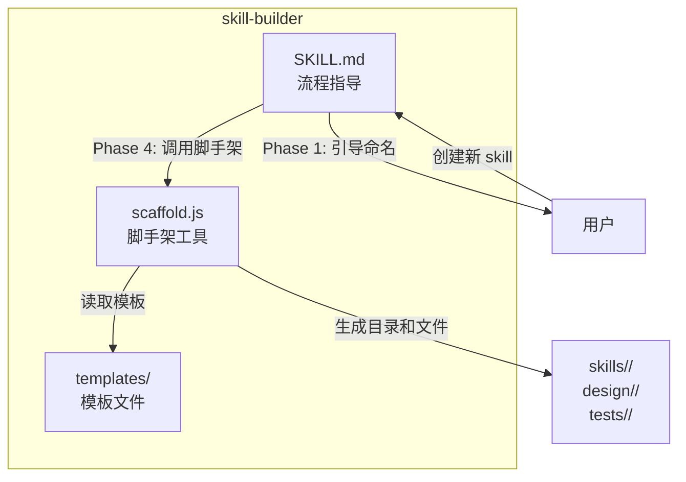

# Skill Builder — 设计文档

## 1. 需求

### 1.1 背景

skillix-hub 项目中每个 Skill 的开发都遵循相同的生命周期：需求命名、设计文档、讨论迭代、代码开发、单元测试、测试报告、README 同步、docs 同步。目前这些规范分散在各个已有 Skill 的代码和文档中，缺少统一的流程指导。

### 1.2 目标

提供一个"元 Skill"，标准化 skillix-hub 项目中新 Skill 的开发流程：

- 定义完整的 8 阶段开发生命周期
- 提供脚手架工具自动创建目录结构和模板文件
- 确保所有新 Skill 遵循统一的命名、目录、测试、文档规范
- 减少重复劳动，提升开发效率

### 1.3 使用场景

| 场景 | 触发方式 | 说明 |
|------|----------|------|
| 用户要求创建新 Skill | 自然语言 | "帮我创建一个新 skill" |
| 初始化 Skill 目录结构 | CLI 命令 | `scaffold.js init` 创建模板 |
| 查看开发流程规范 | 自然语言 | "skill 开发流程是什么" |

## 2. 开发流程

### 各阶段产出物

| 阶段 | 产出物 | 路径规范 |
|------|--------|----------|
| 需求命名 | 3-5 个命名推荐 + Skill 名称确认 + 技术栈确认 | - |
| 设计文档 | Markdown 设计文档 | `design/<name>/YYYY-MM-DD-NN-描述.md` |
| 讨论迭代 | 确认后的设计方案 | - |
| 代码开发 | Skill 源码 | `skills/<name>/` |
| 单元测试 | 测试文件（沙箱模式） | `tests/<name>/src/unit/test_*.js` + `testdata/` |
| 测试报告 | Markdown 报告 | `tests/<name>/reports/YYYY-MM-DD-NN-test-report.md` |
| README 同步 | README.md + README_EN.md | 项目根目录 |
| docs 同步 | skills-data.js | `docs/scripts/skills-data.js` |

## 3. 技术方案

### 3.1 方案概述

混合型实现：SKILL.md 作为核心指导文档 + scaffold.js 作为脚手架工具 + templates 目录存放模板文件。

### 3.2 架构

### 3.3 scaffold.js 设计

**命令**：`node skills/skill-builder/scaffold.js init '<json>'`

**参数**：

| 参数 | 类型 | 默认值 | 说明 |
|------|------|--------|------|
| `name` | string | 必填 | Skill 名称（小写+连字符） |
| `tech` | string | `node` | 技术栈：`node` / `python` |
| `description` | string | `""` | 简短描述 |

**执行效果**：

1. 验证名称格式（小写字母+数字+连字符）
2. 检查目录是否已存在（避免覆盖）
3. 创建目录结构：
   - `skills/<name>/lib/`
   - `design/<name>/`
   - `tests/<name>/src/unit/`
   - `tests/<name>/reports/`
4. 从 templates 生成初始文件（替换占位符 `{{name}}`、`{{description}}`）
5. 输出 JSON 确认创建的文件列表

### 3.4 模板文件

| 模板 | 生成目标 | 说明 |
|------|----------|------|
| `SKILL.md.tpl` | `skills/<name>/SKILL.md` | SKILL.md 骨架 |
| `design-doc.md.tpl` | `design/<name>/YYYY-MM-DD-01-设计文档.md` | 设计文档骨架 |
| `tool.js.tpl` | `skills/<name>/tool.js` | Node.js CLI 入口 |
| `run_tests.js.tpl` | `tests/<name>/run_tests.js` | 测试运行器 |
| `test_unit.js.tpl` | `tests/<name>/src/unit/test_example.js` | 示例单元测试 |

## 4. 实现计划

1. 编写 SKILL.md（8 阶段流程指导 + 规范 + 自然语言交互指南）
2. 编写模板文件（5 个 .tpl 文件）
3. 实现 scaffold.js（目录创建 + 模板渲染 + 参数验证）
4. 编写单元测试（测试 scaffold 的参数验证和目录创建）
5. 运行测试生成报告
6. 同步 README.md、README_EN.md、docs/scripts/skills-data.js

## 5. 风险与注意事项

| 风险 | 缓解措施 |
|------|----------|
| 模板与实际项目规范不同步 | 模板从现有 Skill 提取，保持一致 |
| scaffold 覆盖已有文件 | 检查目录是否存在，拒绝覆盖 |
| 新 Skill 技术栈不在预设范围 | 支持 node/python 两种，其他可手动调整 |
