# Skill Store — 设计文档

## 1. 需求

### 1.1 背景

skillix-hub 项目已积累了 10+ 个 Cursor Skill，分布在全局（`~/.cursor/skills/`）和项目级（`.cursor/skills/`）两个层级。随着 Skill 生态扩展，需要一个统一的包管理器来发现、安装和更新 Skill，类似 npm 之于 Node.js 包。

### 1.2 目标

1. 通过自然语言配置 Git 仓库源（GitHub 等），仓库中包含 Skill 源码
2. Clone/同步仓库到本地，**异步后台执行不阻塞会话**
3. 自动构建本地 Skill 索引，支持自然语言搜索推荐
4. 安装 Skill 到项目级或全局路径
5. 检测已安装 Skill 的版本变化，提示用户更新

### 1.3 使用场景

| 场景 | 触发方式 | 说明 |
|------|----------|------|
| 添加仓库源 | "添加 https://github.com/xxx/skills-repo" | 自然语言配置 Git URL |
| 同步仓库 | "同步所有仓库" / 会话启动自动触发 | 异步后台 git pull |
| 搜索 Skill | "我需要一个处理 PDF 的 Skill" | 基于索引的语义推荐 |
| 安装 Skill | "安装 pdf-processor 到全局" | 复制到目标路径 |
| 更新 Skill | "更新所有 Skill" / Hook 自动提示 | 版本比对 + 增量更新 |
| 查看状态 | "查看已安装的 Skill" | 列出安装信息和版本状态 |

## 2. 整体流程

```mermaid
flowchart TD
    subgraph config[配置阶段]
        A[用户添加仓库 URL] --> B[registry.py add]
        B --> C[sync.py clone]
        C --> D[index.py rebuild]
    end

    subgraph hook[会话启动 Hook]
        E[hook.py 被触发] --> F{时间阈值检查}
        F -->|未到期| G[读取 status.json]
        F -->|已到期| H[启动 async_worker 子进程]
        H --> I[后台 git pull]
        I --> J[后台重建索引]
        J --> K[后台比对版本]
        K --> L[写入 status.json]
        G --> M{有更新提示}
        M -->|是| N[输出更新提示]
        M -->|否| O[静默返回]
    end

    subgraph search[搜索安装]
        P[用户描述需求] --> Q[读取 index.json]
        Q --> R[语义匹配推荐]
        R --> S[用户选择]
        S --> T[install.py install]
        T --> U[记录 installed.json]
    end

    subgraph update[更新]
        V[用户请求更新] --> W[install.py update]
        W --> X[pull 并重新复制]
        X --> Y[更新 installed.json]
    end
```



## 3. 技术方案

### 3.1 方案 A：Python 脚本 + JSON 存储（推荐）

**原理**：每个功能模块一个 Python 脚本，数据用 JSON 文件存储，通过 subprocess 调用 git 命令。

**优点**：
- 与现有 Skill 生态一致（memory、behavior-prediction 等均用 Python）
- JSON 存储轻量，Agent 可直接读取理解
- 无需额外依赖，Python 标准库即可实现
- 异步执行通过 subprocess.Popen 天然支持

**缺点**：
- JSON 文件并发写入需要文件锁
- 大量 Skill 时 JSON 索引文件可能较大

### 3.2 方案 B：Node.js + SQLite

**原理**：使用 Node.js 实现，SQLite 存储索引和安装记录。

**优点**：
- SQLite 天然支持并发和事务
- 查询能力更强

**缺点**：
- 与 skill-builder 规范中 Python 技术栈不一致
- SQLite 文件 Agent 无法直接读取
- 增加 better-sqlite3 依赖

### 3.3 方案对比

| 维度 | A: Python + JSON | B: Node.js + SQLite |
|------|------------------|---------------------|
| 生态一致性 | ★★★★★ | ★★★ |
| Agent 可读性 | ★★★★★ | ★★ |
| 并发安全 | ★★★（需文件锁） | ★★★★★ |
| 依赖复杂度 | ★★★★★（无额外依赖） | ★★★ |
| 查询能力 | ★★★ | ★★★★★ |
| 异步支持 | ★★★★★ | ★★★★ |

**结论**：选择方案 A。Skill 数量预计在百级别，JSON 完全够用，且 Agent 可直接读取索引文件做语义匹配。

## 4. 推荐方案详细设计

### 4.1 目录结构

```
skills/skill-store/                 # Skill 源码（开发目录）
├── SKILL.md                        # 主指令文件
├── main.py                         # CLI 入口（install/update/uninstall）
├── requirements.txt                # Python 依赖（标准库即可，无额外依赖）
├── scripts/
│   ├── registry.py                 # 仓库配置管理
│   ├── sync.py                     # Clone / Pull 同步
│   ├── index.py                    # 索引构建与搜索
│   ├── install.py                  # Skill 安装 / 卸载 / 更新
│   ├── hook.py                     # 会话启动 Hook 入口
│   ├── async_worker.py             # 后台异步任务执行器
│   └── status.py                   # 状态查询（已安装 Skill、更新提示）
├── lib/
│   ├── config.py                   # 配置管理（路径、默认值）
│   ├── git_ops.py                  # Git 操作封装
│   ├── file_lock.py                # 文件锁（JSON 并发写入保护）
│   ├── version.py                  # 版本比对逻辑
│   └── dependency.py               # 依赖解析与循环检测
└── rules/
    └── skill-store-hook.mdc        # alwaysApply 规则

~/.cursor/skills/skill-store-data/  # 运行时数据（安装后）
├── config.json                     # 仓库配置
├── repos/                          # Clone 的仓库
│   └── <alias>/                    # 每个仓库一个目录
├── index.json                      # Skill 索引
├── installed.json                  # 已安装 Skill 版本记录
├── status.json                     # 异步任务状态（更新提示缓存）
└── worker.pid                      # 异步 worker PID 文件
```

### 4.2 CLI 命令设计

```bash
python3 scripts/<command>.py <action> [--param value]
```

#### main.py — skill-store 自身安装管理

```bash
# 安装 skill-store 到全局
python3 skills/skill-store/main.py install --target ~/.cursor/skills/skill-store

# 更新 skill-store
python3 skills/skill-store/main.py update --target ~/.cursor/skills/skill-store

# 卸载 skill-store（清理规则文件和数据）
python3 skills/skill-store/main.py uninstall --target ~/.cursor/skills/skill-store
```

**install 流程**：
1. 复制源码到目标路径（排除 `__pycache__`、`.pyc`、`data/`）
2. 安装 `rules/skill-store-hook.mdc` 到 `~/.cursor/rules/`
3. 创建数据目录 `~/.cursor/skills/skill-store-data/`
4. 初始化空的 config.json、index.json、installed.json、status.json

**update 流程**：
1. 备份数据目录 `skill-store-data/`
2. 删除旧版源码
3. 重新复制源码
4. 更新 `~/.cursor/rules/skill-store-hook.mdc`
5. 恢复数据目录

**uninstall 流程**：
1. 删除 `~/.cursor/rules/skill-store-hook.mdc`
2. 询问是否保留数据目录（config、repos、index 等）
3. 删除安装目录 `~/.cursor/skills/skill-store/`

#### registry.py — 仓库配置管理

```bash
# 添加仓库源
python3 scripts/registry.py add --url "https://github.com/user/repo" --alias "my-skills"

# 列出所有仓库源
python3 scripts/registry.py list

# 移除仓库源
python3 scripts/registry.py remove --alias "my-skills"
```

#### sync.py — 同步

```bash
# 同步所有仓库（前台执行）
python3 scripts/sync.py all

# 同步指定仓库
python3 scripts/sync.py one --alias "my-skills"
```

#### index.py — 索引

```bash
# 重建索引
python3 scripts/index.py rebuild

# 搜索（关键词）
python3 scripts/index.py search --query "pdf processing"

# 列出所有可用 Skill
python3 scripts/index.py list
```

#### install.py — 安装管理

```bash
# 安装 Skill（全局）
python3 scripts/install.py install --name "pdf-processor" --registry "my-skills" --scope global

# 安装 Skill（项目级）
python3 scripts/install.py install --name "pdf-processor" --registry "my-skills" --scope project --project-path "/path/to/project"

# 卸载 Skill
python3 scripts/install.py uninstall --name "pdf-processor" --scope global

# 更新 Skill
python3 scripts/install.py update --name "pdf-processor"

# 更新所有已安装 Skill
python3 scripts/install.py update-all

# 查看已安装 Skill
python3 scripts/install.py list
```

#### hook.py — 会话 Hook

```bash
# 会话启动时调用（由 alwaysApply 规则触发）
python3 scripts/hook.py
```

#### status.py — 状态查询

```bash
# 查看完整状态
python3 scripts/status.py

# 查看更新提示
python3 scripts/status.py updates
```

### 4.3 输出格式

所有命令返回 JSON 到 stdout：

```json
{
  "result": { ... },
  "error": null
}
```

错误时：

```json
{
  "result": null,
  "error": "error message"
}
```

### 4.4 数据格式设计

#### config.json

```json
{
  "registries": [
    {
      "url": "https://github.com/shetengteng/skillix-hub",
      "alias": "skillix-hub",
      "branch": "main",
      "skill_paths": ["skills/"],
      "added_at": "2026-02-26T10:00:00Z",
      "last_synced": null
    }
  ],
  "settings": {
    "clone_depth": 1
  }
}
```

**字段说明**：
- `skill_paths`：仓库中 Skill 所在的子目录列表，默认 `["skills/"]`，支持多路径
- `branch`：跟踪的分支，默认 `"main"`
- `sync_interval_minutes`：自动同步最小间隔，避免频繁 pull

#### index.json

```json
{
  "updated_at": "2026-02-26T10:05:00Z",
  "skills": [
    {
      "name": "pdf-processor",
      "description": "Extract text and tables from PDF files...",
      "registry_alias": "skillix-hub",
      "relative_path": "skills/pdf-processor",
      "commit_hash": "abc123def456",
      "commit_date": "2026-02-25T15:30:00Z",
      "has_skill_md": true
    }
  ]
}
```

#### installed.json

```json
{
  "installations": [
    {
      "name": "pdf-processor",
      "registry_alias": "skillix-hub",
      "source_commit": "abc123def456",
      "source_path": "skills/pdf-processor",
      "installed_at": "2026-02-26T11:00:00Z",
      "updated_at": "2026-02-26T11:00:00Z",
      "target_path": "~/.cursor/skills/pdf-processor",
      "scope": "global"
    }
  ]
}
```

#### status.json

```json
{
  "last_sync": "2026-02-26T10:05:00Z",
  "sync_in_progress": false,
  "pending_updates": [
    {
      "name": "pdf-processor",
      "installed_commit": "abc123",
      "latest_commit": "def456",
      "scope": "global",
      "target_path": "~/.cursor/skills/pdf-processor"
    }
  ],
  "sync_errors": []
}
```

## 5. 版本管理方案

### 5.1 版本标识策略

**采用 Git Commit Hash 作为版本标识**，不引入语义化版本号。

| 方案 | 优点 | 缺点 | 适用场景 |
|------|------|------|----------|
| **Git Commit Hash（推荐）** | 零配置，自动获取，精确到每次提交 | 无法表达 breaking change | Skill 生态早期，快速迭代 |
| 语义化版本（SemVer） | 表达兼容性，用户友好 | 需要 Skill 作者手动维护 tag | 成熟生态，多人协作 |
| 时间戳版本 | 简单直观 | 无法关联具体变更 | 日志场景 |

**选择理由**：
- Skill 生态处于早期，大部分 Skill 由个人维护，SemVer 增加维护负担
- Git Commit Hash 天然可用，无需 Skill 作者额外操作
- 通过 `git log` 可以查看具体变更内容，比版本号更有信息量
- 未来可平滑升级到 SemVer（检测 git tag 即可）

### 5.2 版本比对流程

```
已安装 Skill 的 commit hash（installed.json）
    ↓ 对比
仓库中该 Skill 目录的最新 commit hash
    ↓
不一致 → 标记为 pending_update → 写入 status.json
```

**获取 Skill 目录最新 commit 的方法**：

```bash
git -C repos/<alias> log -1 --format="%H" -- <skill_relative_path>
```

这样只追踪 Skill 目录自身的变更，仓库其他文件的变更不会触发更新提示。

### 5.3 版本检测时机

| 时机 | 触发方式 | 执行方式 |
|------|----------|----------|
| 每次会话启动 | hook.py（alwaysApply 规则触发） | **异步后台**，不阻塞 |
| 手动触发 | 用户说"检查更新"/"同步仓库" | 前台执行，立即返回结果 |
| 安装时 | install.py install | 记录当前 commit hash |
| 更新时 | install.py update | 拉取最新 → 重新复制 → 更新 hash |

### 5.4 更新提示机制

Hook 检测到版本差异后，写入 `status.json` 的 `pending_updates` 数组。Agent 在下次读取时展示：

```
[skill-store] 发现以下 Skill 有更新：
  - pdf-processor (全局): abc123 → def456
  - web-scraper (项目级): 111aaa → 222bbb
是否更新？输入 "更新所有" 或 "更新 pdf-processor"
```

### 5.5 未来扩展：SemVer 支持

当 Skill 生态成熟后，可通过以下方式平滑升级：
1. 检测仓库中是否有 git tag（如 `v1.0.0`）
2. 如有 tag，优先使用 tag 作为版本号
3. 如无 tag，回退到 commit hash
4. 在 index.json 中增加 `version` 字段（可选）

## 6. 异步执行机制

### 6.1 核心原则

**所有 Git 网络操作和索引重建均不阻塞会话流程。**

### 6.2 异步架构

```
hook.py（每次会话启动时调用，无参数）
  │
  ├── 1. 读取 status.json → 输出 pending_updates / orphaned_skills / sync_errors
  │
  ├── 2. 检查 last_sync 日期是否为今天
  │     └── 今天已同步过 → 跳过
  │
  ├── 3. 检查 worker.pid → 是否有正在运行的 worker
  │     └── 正在运行 → 跳过启动
  │
  └── 4. 启动 async_worker.py（subprocess.Popen, detach, 立即返回）

async_worker.py（独立后台进程）
  │
  ├── 写入 worker.pid
  ├── git pull 所有仓库
  ├── 重建 index.json
  ├── 比对已安装 Skill 版本
  ├── 检测孤立安装记录（Skill 被手动删除）
  ├── 写入 status.json
  └── 删除 worker.pid
```

### 6.3 防重复执行

- `async_worker.py` 启动时写入 PID 到 `worker.pid`
- `hook.py` 启动前检查 `worker.pid` 是否存在且进程仍在运行
- 如果进程已死但 PID 文件残留，清理后重新启动

### 6.4 错误处理

- 单个仓库 pull 失败不影响其他仓库
- 错误信息写入 `status.json` 的 `sync_errors` 数组
- Agent 下次读取时展示错误信息

## 7. 安装机制

### 7.1 安装范围

| 范围 | 目标路径 | 说明 |
|------|----------|------|
| 全局 | `~/.cursor/skills/<name>/` | 所有项目可用 |
| 项目级 | `<project>/.cursor/skills/<name>/` | 仅当前项目可用 |

### 7.2 安装流程

```
1. 解析依赖：读取 SKILL.md frontmatter 的 dependencies
2. 递归安装依赖（如有未安装的依赖）
3. 从 repos/<alias>/<skill_path> 复制 Skill 目录到目标路径
4. 排除：.git, node_modules, __pycache__, *.pyc, data/
5. 如有 package.json → 执行 npm install
6. 如有 requirements.txt → 执行 pip install -r
7. 检测并自动调用 Skill 自带的 install 命令：
   - 如有 tool.js 且支持 install → node tool.js install '{"target":"<target_path>"}'
   - 如有 main.py 且支持 install → python3 main.py install --target <target_path>
8. 记录安装信息到 installed.json（含 commit hash）
```

### 7.3 更新流程

```
1. git pull 对应仓库
2. 获取 Skill 目录最新 commit hash
3. 对比 installed.json 中的 source_commit
4. 如不一致：
   a. 备份目标路径中的 data/ 目录（用户数据）
   b. 删除目标路径中的源码文件
   c. 重新复制
   d. 恢复 data/ 目录
   e. 重新安装依赖
   f. 更新 installed.json
```

### 7.4 卸载流程

```
1. 删除目标路径
2. 从 installed.json 中移除记录
```

## 8. 依赖解析机制

### 8.1 依赖声明

Skill 在 SKILL.md 的 frontmatter 中声明依赖：

```yaml
---
name: web-automation-builder
description: ...
dependencies:
  - playwright
  - agent-interact
---
```

### 8.2 依赖解析流程

```
用户请求安装 Skill A
  ├── 读取 A 的 SKILL.md → 提取 dependencies 列表
  ├── 对每个依赖 D：
  │     ├── 检查 D 是否已安装（查 installed.json）
  │     │     └── 已安装 → 跳过
  │     ├── 在 index.json 中查找 D
  │     │     ├── 找到唯一匹配 → 递归解析 D 的依赖
  │     │     ├── 找到多个匹配（不同仓库） → 询问用户选择
  │     │     └── 未找到 → 警告用户，继续安装 A
  │     └── 安装 D（递归）
  └── 安装 A
```

### 8.3 循环依赖检测

使用访问集合（visited set）检测循环依赖，发现循环时中断并报错：

```
检测到循环依赖: A → B → C → A
请检查 Skill 的依赖声明。
```

### 8.4 依赖信息在索引中的体现

index.json 中增加 `dependencies` 字段：

```json
{
  "name": "web-automation-builder",
  "description": "...",
  "dependencies": ["playwright", "agent-interact"],
  ...
}
```

## 9. 异常处理

### 9.1 Skill 被用户手动删除

已安装的 Skill 可能被用户手动删除（直接删除目录），需要检测并处理：

```
状态检查流程（status.py / hook.py 中执行）：
  ├── 遍历 installed.json 中的每条安装记录
  ├── 检查 target_path 是否存在
  │     ├── 存在 → 正常
  │     └── 不存在 → 标记为 "orphaned"（孤立记录）
  └── 输出孤立记录列表，询问用户处理方式
```

**处理策略**：
- **自动清理**：从 installed.json 中移除孤立记录
- **提示重装**：告知用户 Skill 已被删除，是否重新安装

**在以下时机检测**：
- `status.py` 查询状态时
- `hook.py` 会话启动时（异步 worker 中执行）
- `install.py update` 更新时

### 9.2 仓库被删除或不可访问

```
sync.py pull 失败时：
  ├── 记录错误到 status.json 的 sync_errors
  ├── 保留上次成功的索引数据
  └── 不影响其他仓库的同步
```

### 9.3 SKILL.md 格式异常

```
index.py 构建索引时：
  ├── SKILL.md 不存在 → 跳过该目录
  ├── frontmatter 解析失败 → 跳过，记录警告
  └── name 或 description 缺失 → 跳过，记录警告
```

### 9.4 数据文件损坏

```
JSON 文件读取失败时：
  ├── config.json 损坏 → 使用默认配置，警告用户
  ├── index.json 损坏 → 触发完整重建
  ├── installed.json 损坏 → 扫描已安装目录重建记录
  └── status.json 损坏 → 重置为空状态
```

## 10. Hook 规则设计

### 10.1 简化策略

**一个 hook，一次调用，两件事**：每次会话启动时调用 `hook.py`，它同时完成：
1. 读取上次异步结果，展示更新提示（同步，< 100ms）
2. 启动后台 async_worker 执行同步（异步，立即返回）

| 触发方式 | 时机 | 执行内容 |
|----------|------|----------|
| **会话启动 Hook** | 每次会话启动 | 展示上次结果 + 如果今天未同步则异步启动同步 |
| **手动触发** | 用户说"检查更新"/"同步仓库" | 前台执行 sync + 版本比对，不受每日限制 |

### 10.2 skill-store-hook.mdc

```
---
alwaysApply: true
---

# Skill Store Hook

会话启动时执行：

\`\`\`bash
python3 ~/.cursor/skills/skill-store/scripts/hook.py
\`\`\`

如果输出包含更新提示或异常提示，展示给用户。
静默执行，不在回复中提及 hook 本身。
```

### 10.3 触发逻辑

```
hook.py（会话启动时调用，无参数）
  │
  ├── 1. 读取 status.json（同步，< 100ms）
  │     ├── 有 pending_updates → 输出更新提示
  │     ├── 有 orphaned_skills → 输出删除提示
  │     ├── 有 sync_errors → 输出错误信息
  │     └── 无 → 静默
  │
  ├── 2. 检查 last_sync 日期是否为今天
  │     └── 今天已同步过 → 跳过，不启动 worker
  │
  ├── 3. 检查 worker.pid → 是否有正在运行的 worker
  │     └── 正在运行 → 跳过启动
  │
  └── 4. 启动 async_worker.py（subprocess.Popen, detach, 立即返回）
```

**每日同步判断**：读取 `status.json` 中的 `last_sync` 时间戳，如果日期部分等于今天，则跳过同步。用户手动触发不受此限制。

### 10.4 执行性能

- `hook.py` 总耗时目标 < 200ms（读取 JSON + 启动子进程）
- `async_worker.py` 后台执行，不限时，不阻塞会话

## 11. 实现计划

### Phase 1：核心功能（MVP）

1. `lib/config.py` — 路径管理、默认配置
2. `lib/git_ops.py` — Git clone/pull/log 封装
3. `lib/file_lock.py` — JSON 文件锁
4. `scripts/registry.py` — 仓库增删改查
5. `scripts/sync.py` — Clone/Pull 同步
6. `scripts/index.py` — 索引构建与搜索

### Phase 2：安装、版本管理与依赖解析

7. `lib/version.py` — 版本比对逻辑
8. `lib/dependency.py` — 依赖解析与循环检测
9. `scripts/install.py` — 安装/卸载/更新（含依赖自动安装 + 调用 Skill 自带 install）
10. `scripts/status.py` — 状态查询

### Phase 3：异步 Hook

11. `scripts/hook.py` — 会话启动 Hook
12. `scripts/async_worker.py` — 后台异步 worker
13. `rules/skill-store-hook.mdc` — alwaysApply 规则

### Phase 4：自身安装管理与集成

14. `main.py` — skill-store 自身的 install/update/uninstall
15. `SKILL.md` — 完整指令文件
16. 集成测试与文档

## 10. 风险与注意事项

| 风险 | 影响 | 缓解措施 |
|------|------|----------|
| 私有仓库认证 | 无法 clone/pull | 依赖用户本地 Git 凭证，不存储密码 |
| JSON 并发写入 | 数据损坏 | file_lock.py 提供文件锁保护 |
| 大仓库 clone 耗时 | 首次配置慢 | `--depth 1` 浅克隆 + 异步执行 |
| worker 进程异常退出 | PID 文件残留 | hook.py 检测进程存活状态，自动清理 |
| Skill 目录结构不规范 | 索引遗漏 | 仅识别包含 SKILL.md 的目录，跳过不规范的 |
| 网络不可用 | 同步失败 | 错误写入 status.json，不影响已有索引 |
| Skill 被用户手动删除 | installed.json 与实际不一致 | 定期检测孤立记录，自动清理或提示重装 |
| 数据文件损坏 | 功能异常 | 各文件独立降级策略（重建/重置/默认值） |

## 11. 已确认的设计决策

| # | 问题 | 决策 |
|---|------|------|
| 1 | 仓库中 Skill 路径约定 | **支持自定义路径**：config.json 中通过 `skill_paths` 配置，默认 `["skills/"]` |
| 2 | 安装时是否执行 Skill 自带的 install 命令 | **自动调用**：检测 Skill 中是否有 `tool.js` 或 `main.py` 且支持 `install` 命令，如有则自动执行 |
| 3 | 多仓库同名 Skill 冲突 | **冲突时询问用户选择**：展示来源仓库信息，让用户决定安装哪个 |
| 4 | 是否支持 Skill 依赖关系 | **Phase 1 支持完整依赖解析和自动安装**：读取 SKILL.md 中的依赖声明，递归安装 |
| 5 | 数据目录位置 | **`~/.cursor/skills/skill-store-data/`**：与其他 Skill data 目录一致 |
