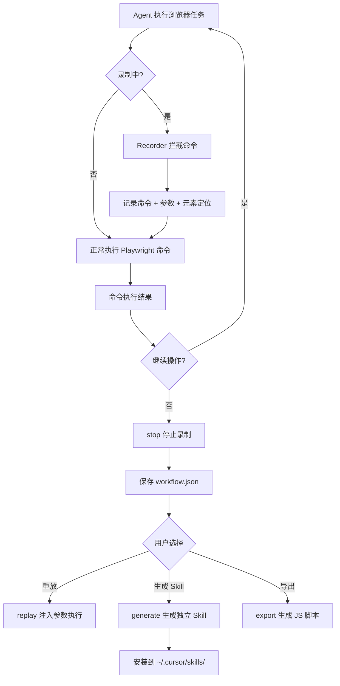

# Web Automation Builder — 设计文档

> 日期：2026-02-23
> 可行性分析：`2026-02-23-01-可行性分析.md`

## 1. 需求

### 1.1 背景

用户在浏览器中执行大量重复性操作（部署、配置、数据录入等）。希望 AI Agent 能录制这些操作，生成可重放的自动化工作流，并支持参数化——相同流程不同输入值。最终产物为独立 Skill，可安装到 Cursor 中供后续自然语言触发。

### 1.2 目标

1. 通过 Playwright CLI 包装层录制 Agent 的浏览器操作序列
2. 保存为结构化 JSON 工作流
3. 支持参数化重放（模板变量替换）
4. 支持生成独立 Skill 目录（SKILL.md + tool.js + workflow.json）
5. 支持导出为 Playwright 脚本

### 1.3 使用场景

| 场景 | 触发方式 | 说明 |
|------|----------|------|
| Agent 录制操作 | `record` 命令 | Agent 通过 Playwright 操作浏览器时，自动录制 |
| 重放工作流 | `replay` 命令 | 执行已录制的工作流，注入参数 |
| 生成独立 Skill | `generate` 命令 | 将工作流转为独立 Skill 安装到 ~/.cursor/skills/ |
| 导出脚本 | `export` 命令 | 导出为标准 Playwright JS 脚本 |
| 管理工作流 | `list`/`show`/`delete` | 查看、管理已录制的工作流 |

## 2. 整体流程



## 3. 技术方案

### 3.1 录制机制：Playwright CLI 包装层

录制器不修改 Playwright Skill 源码，而是作为一个**代理层**运行。Agent 在录制模式下，通过 web-automation-builder 的 `exec` 命令转发 Playwright 操作，录制器同时记录命令。

```
Agent → web-automation-builder exec → 记录 → Playwright Skill → 浏览器
```

**exec 命令格式**：

```bash
node skills/web-automation-builder/tool.js exec '{"command":"click","args":{"ref":"e5","element":"登录"}}'
```

等价于：

```bash
node skills/playwright/tool.js click '{"ref":"e5","element":"登录"}'
```

但 exec 会在转发前将命令记录到当前录制会话中。

**为什么不直接修改 Playwright Skill**：
- 保持 Playwright Skill 的独立性和通用性
- 避免录制逻辑污染浏览器操作逻辑
- web-automation-builder 可以独立升级

### 3.2 元素定位策略

录制每个操作时，除了记录 Playwright 的 ref，还通过 snapshot 数据提取多策略定位器：

```json
{
  "locators": {
    "ref": "e5",
    "text": "登录",
    "role": "button",
    "css": "button[type=submit]",
    "ariaLabel": "登录按钮",
    "placeholder": null
  }
}
```

重放时按优先级尝试：`text` > `role+name` > `css` > `ariaLabel`。ref 仅作为备选（因为 ref 不稳定）。

### 3.3 参数化引擎

工作流中的输入值通过 `{{param}}` 模板语法标记。参数化有两种方式：

1. **LLM 自动推断**：`analyze` 命令让 LLM 分析步骤序列，识别可变输入
2. **手动标记**：用户在 workflow.json 中直接编辑

模板渲染使用简单的字符串替换，不引入模板引擎依赖。

### 3.4 Skill 生成器

`generate` 命令生成的 Skill 结构：

```
<target>/
├── SKILL.md          # LLM 生成（需要 Agent 配合）
├── tool.js           # 工作流执行器（模板生成）
├── workflow.json     # 步骤数据（直接复制）
└── package.json      # 最小依赖声明
```

**tool.js 模板**：生成的 tool.js 是一个轻量执行器，读取同目录的 workflow.json，逐步调用 Playwright Skill 执行。

## 4. 推荐方案

### 4.1 架构

```
skills/web-automation-builder/
├── SKILL.md
├── tool.js              # CLI 入口
├── package.json
└── lib/
    ├── config.js         # 配置常量
    ├── response.js       # 统一响应格式
    ├── recorder.js       # 录制器（拦截 + 记录）
    ├── store.js           # 工作流存储（CRUD）
    ├── replayer.js        # 重放引擎（模板渲染 + 执行）
    ├── locator.js         # 多策略元素定位
    ├── generator.js       # Skill 生成器
    └── exporter.js        # Playwright 脚本导出
```

### 4.2 CLI 命令设计

```bash
# 录制控制
node skills/web-automation-builder/tool.js record '{"name":"登录后台"}'
node skills/web-automation-builder/tool.js stop '{}'
node skills/web-automation-builder/tool.js status '{}'

# 录制模式下执行 Playwright 命令（代理转发）
node skills/web-automation-builder/tool.js exec '{"command":"navigate","args":{"url":"https://example.com"}}'
node skills/web-automation-builder/tool.js exec '{"command":"click","args":{"ref":"e5","element":"登录"}}'
node skills/web-automation-builder/tool.js exec '{"command":"type","args":{"ref":"e10","text":"admin"}}'

# 工作流管理
node skills/web-automation-builder/tool.js list '{}'
node skills/web-automation-builder/tool.js show '{"id":"wf-xxx"}'
node skills/web-automation-builder/tool.js delete '{"id":"wf-xxx"}'

# 重放
node skills/web-automation-builder/tool.js replay '{"id":"wf-xxx","params":{"username":"admin","password":"123"}}'

# 参数化分析（输出建议，不自动修改）
node skills/web-automation-builder/tool.js analyze '{"id":"wf-xxx"}'

# 生成独立 Skill
node skills/web-automation-builder/tool.js generate '{"id":"wf-xxx","skillName":"deploy-staging","target":"~/.cursor/skills/deploy-staging"}'

# 导出 Playwright 脚本
node skills/web-automation-builder/tool.js export '{"id":"wf-xxx","output":"./deploy-staging.js"}'
```

### 4.3 数据格式

**工作流 JSON**：

```json
{
  "id": "wf-1708700000000",
  "name": "登录后台系统",
  "description": "",
  "params": [],
  "steps": [
    {
      "seq": 1,
      "command": "navigate",
      "args": { "url": "https://admin.example.com/login" },
      "locators": null,
      "timestamp": "2026-02-23T10:00:01Z"
    },
    {
      "seq": 2,
      "command": "type",
      "args": { "ref": "e10", "text": "admin" },
      "locators": {
        "ref": "e10",
        "text": null,
        "role": "textbox",
        "css": "#username",
        "ariaLabel": "用户名",
        "placeholder": "请输入用户名"
      },
      "timestamp": "2026-02-23T10:00:03Z"
    },
    {
      "seq": 3,
      "command": "click",
      "args": { "ref": "e15", "element": "登录" },
      "locators": {
        "ref": "e15",
        "text": "登录",
        "role": "button",
        "css": "button[type=submit]",
        "ariaLabel": null,
        "placeholder": null
      },
      "timestamp": "2026-02-23T10:00:05Z"
    }
  ],
  "metadata": {
    "startUrl": "https://admin.example.com/login",
    "endUrl": "https://admin.example.com/dashboard",
    "duration": 5000,
    "stepCount": 3
  },
  "createdAt": "2026-02-23T10:00:00Z",
  "updatedAt": "2026-02-23T10:00:05Z"
}
```

**参数化后**：

```json
{
  "params": [
    { "id": "username", "label": "用户名", "type": "text", "required": true, "default": "admin" },
    { "id": "password", "label": "密码", "type": "password", "required": true }
  ],
  "steps": [
    { "seq": 2, "command": "type", "args": { "ref": "e10", "text": "{{username}}" }, "..." : "..." },
    { "seq": 3, "command": "type", "args": { "ref": "e12", "text": "{{password}}" }, "..." : "..." }
  ]
}
```

### 4.4 录制状态管理

录制状态保存在 `lib/` 同级的 `.recording.json`：

```json
{
  "active": true,
  "id": "wf-1708700000000",
  "name": "登录后台",
  "startedAt": "2026-02-23T10:00:00Z",
  "steps": []
}
```

`exec` 命令检查此文件，如果 `active: true` 则记录步骤后转发。`stop` 命令将 steps 写入工作流存储并清除录制状态。

### 4.5 工作流存储

存储目录：`skills/web-automation-builder/workflows/`

每个工作流一个 JSON 文件：`workflows/<id>.json`

## 5. 实现计划

### Phase 1：核心功能（MVP）

- `record` / `stop` / `status` — 录制控制
- `exec` — 代理转发 Playwright 命令并记录
- `list` / `show` / `delete` — 工作流管理
- `replay` — 基础重放（直接执行，不带参数化）
- `lib/recorder.js` / `lib/store.js` / `lib/replayer.js` / `lib/config.js` / `lib/response.js`

### Phase 2：参数化 + Skill 生成

- `analyze` — 输出参数化建议（供 LLM 使用）
- `replay` 增强 — 支持 `params` 模板变量替换
- `generate` — 生成独立 Skill 目录
- `export` — 导出 Playwright JS 脚本
- `lib/generator.js` / `lib/exporter.js` / `lib/locator.js`

## 6. 风险与注意事项

| 风险 | 影响 | 缓解措施 |
|------|------|----------|
| Playwright Skill 路径依赖 | exec 需要知道 Playwright tool.js 的路径 | 配置化，支持环境变量覆盖 |
| ref 不稳定 | 重放时 ref 失效 | 多策略定位，ref 仅作备选 |
| 页面结构变化 | 工作流失效 | 重放失败时给出诊断信息 |
| 录制状态丢失 | 进程崩溃导致录制数据丢失 | 每步实时写入 .recording.json |
| 敏感数据 | 密码等存入 JSON | 参数化后敏感值不存储 |

## 7. 待讨论问题

1. ~~命名~~ → 已确认：`web-automation-builder`
2. ~~产物形态~~ → 已确认：分层产物（JSON → Skill → 脚本）
3. Playwright Skill 路径：硬编码相对路径 `../playwright/tool.js` 还是配置化？
4. generate 生成的 SKILL.md 由谁写？tool.js 生成模板 + Agent 补充，还是完全由 Agent 写？
