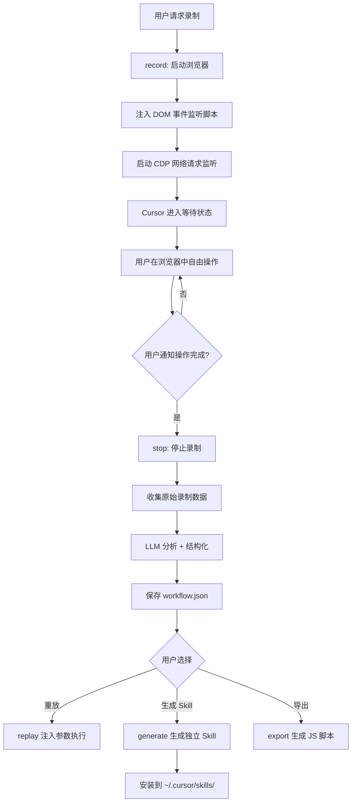

# Web Automation Builder — 设计文档 v2

> 日期：2026-02-23
> 版本：v2（修正录制模式）
> 前版：`2026-02-23-01-设计文档.md`
> 可行性分析：`2026-02-23-01-可行性分析.md`

## 变更说明

v1 采用方案 B（Playwright CLI 包装层录制），录制由 LLM 逐步驱动——Agent 通过 `exec` 命令操作浏览器，每次调用被记录为一个 step。这与实际使用场景不匹配：用户需要的是**打开浏览器后自由操作，系统被动录制**，而不是告诉 Agent 每一步做什么。

v2 将录制模式改为**用户自由操作 + 被动录制**（原可行性分析中的方案 A），同时增加 API 请求监听和 Cursor 等待机制。

### 核心变更

| 维度 | v1 | v2 |
|------|----|----|
| 录制模式 | LLM 驱动（Agent 调用 exec） | 用户自由操作 + 被动录制 |
| 操作来源 | 仅 Agent 的 Playwright CLI 调用 | 用户在浏览器中的真实操作 |
| 监听方式 | 无（命令层拦截） | CDP + DOM 事件注入 + 网络监听 |
| API 监听 | 无 | CDP Network 域监听请求/响应 |
| Cursor 交互 | Agent 主导对话 | Cursor 等待，用户操作完毕后通知 |
| exec 命令 | 核心录制手段 | 保留，作为 Agent 辅助操作的通道 |

## 1. 需求

### 1.1 背景

用户在浏览器中执行大量重复性操作（部署、配置、数据录入等）。希望 AI Agent 能录制这些操作，生成可重放的自动化工作流，并支持参数化——相同流程不同输入值。最终产物为独立 Skill，可安装到 Cursor 中供后续自然语言触发。

### 1.2 目标

1. 用户在浏览器中自由操作，系统被动录制操作序列和 API 调用
2. 保存为结构化 JSON 工作流
3. 支持参数化重放（模板变量替换）
4. 支持生成独立 Skill 目录（SKILL.md + tool.js + workflow.json）
5. 支持导出为 Playwright 脚本

### 1.3 使用场景

| 场景 | 触发方式 | 说明 |
|------|----------|------|
| 被动录制用户操作 | `record` 命令 | 打开浏览器，用户自由操作，系统被动录制 |
| 重放工作流 | `replay` 命令 | 执行已录制的工作流，注入参数 |
| 生成独立 Skill | `generate` 命令 | 将工作流转为独立 Skill 安装到 ~/.cursor/skills/ |
| 导出脚本 | `export` 命令 | 导出为标准 Playwright JS 脚本 |
| 管理工作流 | `list`/`show`/`delete` | 查看、管理已录制的工作流 |

### 1.4 核心交互流程（用户视角）

```
用户: "帮我录制部署后端代码的操作"

Cursor:
  1. 调用 record 命令，启动 Playwright 浏览器
  2. 注入 DOM 事件监听 + 启动网络请求监听
  3. 告知用户："浏览器已打开，请开始操作。操作完成后告诉我。"
  4. 进入等待状态（轮询录制状态文件）

用户: 在浏览器中自由操作（登录、点击、填表、提交...）

用户: "操作完成了"

Cursor:
  1. 调用 stop 命令，停止录制
  2. 读取录制数据（DOM 事件 + API 请求）
  3. LLM 分析录制数据，生成结构化工作流
  4. 保存工作流 JSON
  5. 向用户报告录制结果
```

## 2. 整体流程



## 3. 技术方案

### 3.1 录制机制：CDP + DOM 事件注入 + 网络监听

录制分为三个并行通道：

#### 通道 1：DOM 事件监听（用户操作）

通过 Playwright 的 `evaluate` 命令在页面中注入 JS 脚本，监听用户的 DOM 事件：

**监听的事件类型**：

| 事件 | 用途 | 记录内容 |
|------|------|----------|
| `click` | 点击操作 | target selector, text, coordinates |
| `input` / `change` | 输入操作 | target selector, value |
| `submit` | 表单提交 | form selector, form data |
| `keydown` | 键盘操作 | key, modifiers (ctrl/shift/alt) |
| `scroll` | 滚动 | scrollTop, scrollLeft |
| `popstate` / `hashchange` | SPA 路由变化 | new URL |

**注入脚本的职责**：

1. 监听上述 DOM 事件
2. 为每个事件生成多策略定位器（CSS selector, text content, aria-label, role, placeholder）
3. 将事件数据写入 `window.__WAB_EVENTS__` 数组
4. 通过 CDP `Runtime.evaluate` 定期轮询收集事件数据

**元素定位器生成策略**：

```javascript
// 注入脚本中的定位器生成逻辑（伪代码）
function generateLocators(element) {
  return {
    css: generateCssSelector(element),      // 最短唯一 CSS selector
    text: element.textContent?.trim(),       // 文本内容
    role: element.getAttribute('role') || element.tagName.toLowerCase(),
    ariaLabel: element.getAttribute('aria-label'),
    placeholder: element.getAttribute('placeholder'),
    testId: element.getAttribute('data-testid'),
    name: element.getAttribute('name'),
    id: element.id || null
  };
}
```

#### 通道 2：网络请求监听（API 调用）— 复用 api-tracer

**关键设计决策**：网络请求监听不重新实现，而是复用项目中已有的 **api-tracer** Skill 的 CDP 监听能力。api-tracer 已经实现了完整的 CDP Network 域监听，包括请求/响应捕获、响应体获取、过滤规则等。

**api-tracer 已有的能力**：

| 能力 | 实现方式 |
|------|----------|
| CDP 连接 | `playwright.chromium.connectOverCDP(wsEndpoint)` |
| 请求捕获 | `Network.requestWillBeSent` → URL、method、headers、postData |
| 响应捕获 | `Network.responseReceived` → status、headers、mimeType |
| 响应体获取 | `Network.loadingFinished` → `Network.getResponseBody`（文本类 MIME，≤512KB） |
| 新标签页监听 | `context.on('page', ...)` 自动 attach |
| 过滤 | `_shouldSkip()` 过滤静态资源 |

**复用方式**：

```
方案 C（复制并适配）：
将 api-tracer 的 Recorder._attachToPage() 逻辑复制到
web-automation-builder 的 network-monitor.js 中，并做以下适配：
1. 增加 onRequestCaptured 回调，将捕获的请求写入 rawEvents
2. 与 DOM 事件监听在同一进程内运行（避免多 daemon 竞争）
3. 数据格式对齐 rawEvents 的 network 类型
```

**不选择直接依赖 api-tracer 的原因**：
- api-tracer 使用 daemon 进程模型（spawn detached），web-automation-builder 需要同进程内监听
- api-tracer 的 Recorder 类面向独立 session 管理，web-automation-builder 需要与 DOM 事件合并到同一时间线

**复用的核心 CDP 监听模式**（来自 api-tracer `lib/recorder.js`）：

```javascript
cdp = await page.context().newCDPSession(page);
await cdp.send('Network.enable');

cdp.on('Network.requestWillBeSent', event => {
  // 捕获：url, method, headers, postData, resourceType
});

cdp.on('Network.responseReceived', event => {
  // 捕获：status, statusText, responseHeaders, mimeType
});

cdp.on('Network.loadingFinished', async event => {
  // 对文本类 MIME 且 < 512KB 的响应获取 body
  const { body, base64Encoded } = await cdp.send('Network.getResponseBody', { requestId });
});
```

**记录内容**（rawEvents 中的 network 类型）：

```json
{
  "type": "network",
  "timestamp": "2026-02-23T10:00:05Z",
  "request": {
    "url": "https://api.example.com/deploy",
    "method": "POST",
    "headers": { "Content-Type": "application/json" },
    "body": { "branch": "release/2.3", "env": "staging" },
    "resourceType": "Fetch"
  },
  "response": {
    "status": 200,
    "headers": { "Content-Type": "application/json" },
    "body": { "deployId": "d-123", "status": "started" },
    "mimeType": "application/json"
  },
  "duration": 1200
}
```

**过滤规则**（与 api-tracer 一致）：

- 忽略静态资源请求（.js, .css, .png, .woff 等）
- 忽略 analytics/tracking 请求（google-analytics, sentry 等）
- 仅记录 XHR/Fetch 类型的请求（resourceType 过滤）
- 响应体仅捕获文本类 MIME（json、text、xml、form-urlencoded 等）
- 响应体大小上限 512KB
- 可配置自定义过滤规则

#### 通道 3：页面状态快照

在关键时刻（页面导航、表单提交前后）自动获取页面状态：

- 当前 URL
- 页面标题
- Playwright accessibility snapshot（用于元素定位参考）

### 3.2 录制数据格式（原始数据）

录制期间的原始数据存储在 `.recording.json` 中：

```json
{
  "active": true,
  "id": "wf-1708700000000",
  "name": "部署后端代码",
  "startedAt": "2026-02-23T10:00:00Z",
  "browserWsEndpoint": "ws://127.0.0.1:9222/...",
  "rawEvents": [
    {
      "type": "navigation",
      "timestamp": "2026-02-23T10:00:01Z",
      "url": "https://jenkins.example.com/login",
      "title": "Jenkins Login"
    },
    {
      "type": "input",
      "timestamp": "2026-02-23T10:00:03Z",
      "locators": {
        "css": "#username",
        "role": "textbox",
        "placeholder": "Username",
        "name": "username"
      },
      "value": "admin"
    },
    {
      "type": "click",
      "timestamp": "2026-02-23T10:00:05Z",
      "locators": {
        "css": "button[type=submit]",
        "text": "Sign in",
        "role": "button"
      }
    },
    {
      "type": "network",
      "timestamp": "2026-02-23T10:00:05Z",
      "request": {
        "url": "https://jenkins.example.com/j_spring_security_check",
        "method": "POST",
        "body": "j_username=admin&j_password=***"
      },
      "response": {
        "status": 302,
        "headers": { "Location": "/dashboard" }
      }
    }
  ]
}
```

### 3.3 LLM 分析与结构化

`stop` 命令执行后，原始录制数据需要经过 LLM 分析，转换为结构化的工作流：

**LLM 的职责**：

1. **噪音过滤**：去除无关的点击（如点击空白区域）、无意义的滚动等
2. **操作合并**：将连续的 keydown 事件合并为一次输入操作
3. **意图识别**：识别每步操作的语义（"登录"、"选择分支"、"触发部署"）
4. **参数识别**：识别哪些输入值是可变参数（用户名、分支名等）
5. **API 关联**：将 DOM 操作与对应的 API 请求关联（如点击"部署"按钮触发了 POST /deploy）
6. **等待条件推断**：根据页面导航和 API 响应推断每步之间的等待条件

**LLM 输入**：原始录制数据（rawEvents）
**LLM 输出**：结构化工作流 JSON（见 3.5 节）

**分析提示词模板**：

```
你是一个浏览器操作分析专家。以下是用户在浏览器中操作的原始录制数据。
请分析这些数据，生成结构化的工作流 JSON。

要求：
1. 过滤噪音操作（无关点击、空白区域点击等）
2. 合并连续输入为单次操作
3. 为每步操作添加语义描述
4. 识别可参数化的输入值
5. 关联 DOM 操作与 API 请求
6. 推断步骤间的等待条件

原始数据：
{rawEvents}

输出格式：（见工作流 JSON 格式）
```

### 3.4 元素定位策略

重放时按优先级尝试定位元素：

1. `text` — 文本内容匹配（最稳定）
2. `role` + `name` — ARIA 角色 + 名称
3. `ariaLabel` — aria-label 属性
4. `placeholder` — placeholder 属性
5. `testId` — data-testid 属性
6. `css` — CSS 选择器（最不稳定）

### 3.5 工作流 JSON 格式（结构化后）

```json
{
  "id": "wf-1708700000000",
  "name": "部署后端代码",
  "description": "登录 Jenkins，选择分支，触发部署流水线",
  "params": [
    { "id": "username", "label": "用户名", "type": "text", "required": true, "default": "admin" },
    { "id": "password", "label": "密码", "type": "password", "required": true },
    { "id": "branch", "label": "部署分支", "type": "text", "required": true, "default": "main" }
  ],
  "steps": [
    {
      "seq": 1,
      "description": "打开 Jenkins 登录页",
      "command": "navigate",
      "args": { "url": "https://jenkins.example.com/login" },
      "waitAfter": { "type": "url", "value": "/login" }
    },
    {
      "seq": 2,
      "description": "输入用户名",
      "command": "fill",
      "args": { "text": "{{username}}" },
      "locators": {
        "css": "#username",
        "role": "textbox",
        "placeholder": "Username",
        "name": "username"
      }
    },
    {
      "seq": 3,
      "description": "输入密码",
      "command": "fill",
      "args": { "text": "{{password}}" },
      "locators": {
        "css": "#password",
        "role": "textbox",
        "placeholder": "Password",
        "name": "password"
      }
    },
    {
      "seq": 4,
      "description": "点击登录",
      "command": "click",
      "args": {},
      "locators": {
        "css": "button[type=submit]",
        "text": "Sign in",
        "role": "button"
      },
      "waitAfter": { "type": "navigation", "value": "/dashboard" },
      "apiCalls": [
        {
          "url": "https://jenkins.example.com/j_spring_security_check",
          "method": "POST",
          "description": "登录认证请求"
        }
      ]
    }
  ],
  "networkSummary": [
    {
      "url": "https://jenkins.example.com/j_spring_security_check",
      "method": "POST",
      "description": "登录认证",
      "triggeredByStep": 4
    },
    {
      "url": "https://jenkins.example.com/api/json",
      "method": "GET",
      "description": "获取 Jenkins 项目列表",
      "triggeredByStep": 4
    }
  ],
  "metadata": {
    "startUrl": "https://jenkins.example.com/login",
    "endUrl": "https://jenkins.example.com/job/backend/build",
    "duration": 45000,
    "stepCount": 8,
    "apiCallCount": 5,
    "recordedAt": "2026-02-23T10:00:00Z"
  },
  "createdAt": "2026-02-23T10:00:00Z",
  "updatedAt": "2026-02-23T10:00:45Z"
}
```

### 3.6 参数化引擎

#### 核心问题

录制的流程中，某些操作的输入值是动态的——比如用户名、密码、分支名、版本号、搜索关键词等。下次执行相同流程时，这些值需要变化。参数化引擎负责识别和管理这些可变输入。

#### 参数化时机

v2 中参数化在 `stop` 后的 LLM 分析阶段自动完成（而非 v1 的事后 `analyze`）：

```
stop → rawEvents → LLM 分析 → 同时完成：
  1. 噪音过滤
  2. 操作结构化
  3. 参数识别与标记（自动将可变值替换为 {{param}}）
```

#### 参数识别策略

LLM 在分析 rawEvents 时，根据以下规则识别可参数化的值：

| 规则 | 示例 |
|------|------|
| 输入到 password 类型字段的值 | `<input type="password">` 中的输入 → `{{password}}` |
| 输入到 username/email 类型字段的值 | `<input name="username">` 中的输入 → `{{username}}` |
| 下拉选择的值（select/option） | 选择了 "release/2.3" → `{{branch}}` |
| URL 中的可变路径段 | `/job/backend/build` 中的 `backend` → `{{project}}` |
| API 请求 body 中的可变字段 | `{"branch": "release/2.3"}` → `{"branch": "{{branch}}"}` |
| 搜索框输入 | 搜索 "order-123" → `{{searchTerm}}` |

#### 参数定义格式

```json
{
  "params": [
    {
      "id": "username",
      "label": "用户名",
      "type": "text",
      "required": true,
      "default": "admin",
      "source": "input#username"
    },
    {
      "id": "password",
      "label": "密码",
      "type": "password",
      "required": true,
      "default": null,
      "source": "input[type=password]"
    },
    {
      "id": "branch",
      "label": "部署分支",
      "type": "text",
      "required": true,
      "default": "main",
      "source": "select#branch-selector"
    }
  ]
}
```

`source` 字段记录参数值的来源元素，用于重放时定位填入位置。

#### 参数在各产物中的体现

| 产物 | 参数体现方式 |
|------|-------------|
| **JSON 工作流** | `{{param}}` 模板语法，`params` 数组定义参数元数据 |
| **replay 命令** | `--params '{"username":"admin","password":"123"}'` |
| **独立 Skill** | `tool.js run '{"username":"admin"}'`，SKILL.md 中列出参数表 |
| **Playwright 脚本** | 环境变量注入 `process.env.USERNAME`，或 CLI 参数 `--username admin` |

#### Playwright 脚本中的参数化示例

导出的脚本通过环境变量接收参数：

```javascript
const params = {
  username: process.env.USERNAME || 'admin',
  password: process.env.PASSWORD || '',
  branch: process.env.BRANCH || 'main',
};

(async () => {
  const browser = await chromium.launch({ headless: false });
  const page = await browser.newPage();

  await page.goto('https://jenkins.example.com/login');
  await page.getByPlaceholder('Username').fill(params.username);
  await page.getByPlaceholder('Password').fill(params.password);
  await page.getByRole('button', { name: 'Sign in' }).click();
  // ...
  await page.locator('select#branch').selectOption(params.branch);
  // ...
})();
```

运行方式：

```bash
USERNAME=admin PASSWORD=secret BRANCH=release/2.3 node deploy-staging.js
```

#### 参数的手动调整

LLM 自动参数化后，用户可以：
1. 通过对话告诉 Agent 调整（"把 URL 中的 backend 也参数化"）
2. 直接编辑 workflow.json 中的 `params` 和 `{{param}}` 标记

### 3.7 Skill 生成器

与 v1 相同，`generate` 命令生成独立 Skill 目录。生成的 Skill 中参数通过 CLI JSON 传入：

```bash
node ~/.cursor/skills/deploy-staging/tool.js run '{"branch":"release/2.3","username":"admin"}'
```

## 4. 架构

### 4.1 模块结构

```
skills/web-automation-builder/
├── SKILL.md
├── tool.js              # CLI 入口
├── package.json
└── lib/
    ├── config.js         # 配置常量
    ├── response.js       # 统一响应格式
    ├── recorder.js       # 录制器（启动浏览器、注入监听、收集数据）
    ├── injector.js        # DOM 事件注入脚本管理
    ├── network-monitor.js # CDP 网络请求监听
    ├── store.js           # 工作流存储（CRUD）
    ├── replayer.js        # 重放引擎（多策略定位 + 执行）
    ├── locator.js         # 多策略元素定位
    ├── generator.js       # Skill 生成器
    └── exporter.js        # Playwright 脚本导出
```

### 4.2 新增模块说明

| 模块 | 职责 |
|------|------|
| `injector.js` | 管理注入到页面的 DOM 事件监听脚本。负责注入、重新注入（页面导航后）、收集事件数据 |
| `network-monitor.js` | 通过 CDP Network 域监听 HTTP 请求/响应。核心逻辑复用自 api-tracer 的 `lib/recorder.js`，适配为同进程回调模式 |
| `locator.js` | 多策略元素定位。录制时生成定位器，重放时按优先级尝试定位 |

### 4.2.1 依赖关系

```
web-automation-builder
├── 依赖 Playwright Skill（浏览器启动、操作命令、evaluate 注入）
├── 复用 api-tracer 的 CDP 监听模式（network-monitor.js 中）
│   └── 来源：api-tracer/lib/recorder.js 的 _attachToPage() + CDP 事件处理
└── 共享 browser-state.json（获取 wsEndpoint）
```

### 4.3 CLI 命令设计

```bash
# 录制控制
node tool.js record '{"name":"部署后端代码"}'
# → 启动浏览器 + 注入监听 + 启动网络监听
# → 返回 { recording: true, id: "wf-xxx", browserReady: true }

node tool.js stop '{}'
# → 停止监听 + 收集原始数据 + 返回 rawEvents
# → Cursor/LLM 分析数据后调用 save 保存

node tool.js save '{"id":"wf-xxx","workflow":{...}}'
# → 保存 LLM 分析后的结构化工作流

node tool.js status '{}'
# → 返回当前录制状态 + 已收集的事件数量

# 录制模式下的辅助操作（Agent 可选使用）
node tool.js exec '{"command":"navigate","args":{"url":"https://..."}}'
# → 保留 v1 的 exec 命令，Agent 可辅助用户操作

# 工作流管理
node tool.js list '{}'
node tool.js show '{"id":"wf-xxx"}'
node tool.js delete '{"id":"wf-xxx"}'

# 重放
node tool.js replay '{"id":"wf-xxx","params":{"username":"admin","password":"123"}}'

# 生成独立 Skill
node tool.js generate '{"id":"wf-xxx","skillName":"deploy-staging","target":"~/.cursor/skills/deploy-staging"}'

# 导出 Playwright 脚本
node tool.js export '{"id":"wf-xxx","output":"./deploy-staging.js"}'
```

### 4.4 record 命令详细流程

```
record(name)
  │
  ├── 1. 检查是否已在录制 → 如果是，返回错误
  │
  ├── 2. 通过 Playwright Skill 启动浏览器（如果未启动）
  │      node playwright/tool.js launch '{"headless":false}'
  │
  ├── 3. 获取 CDP WebSocket 端点
  │      从 browser-state.json 读取 wsEndpoint
  │
  ├── 4. 通过 CDP 连接浏览器
  │      建立 WebSocket 连接
  │
  ├── 5. 启动网络请求监听
  │      CDP: Network.enable()
  │      监听: requestWillBeSent, responseReceived, loadingFinished
  │
  ├── 6. 注入 DOM 事件监听脚本
  │      通过 Playwright evaluate 注入 JS
  │      监听: click, input, change, submit, keydown, scroll
  │
  ├── 7. 监听页面导航事件
  │      CDP: Page.frameNavigated
  │      导航后重新注入 DOM 监听脚本
  │
  ├── 8. 创建 .recording.json
  │      { active: true, id, name, startedAt, wsEndpoint, rawEvents: [] }
  │
  └── 9. 启动事件收集轮询
         定期从页面收集 DOM 事件 → 追加到 .recording.json
```

### 4.5 stop 命令详细流程

```
stop()
  │
  ├── 1. 停止事件收集轮询
  │
  ├── 2. 最后一次收集页面中的 DOM 事件
  │
  ├── 3. 停止 CDP 网络监听
  │
  ├── 4. 移除注入的 DOM 监听脚本
  │
  ├── 5. 读取 .recording.json 中的 rawEvents
  │
  ├── 6. 返回原始录制数据给 Cursor
  │      { rawEvents: [...], eventCount: N, duration: M }
  │
  └── 7. 清除 .recording.json（或标记 active: false）
         注意：不关闭浏览器，用户可能还需要
```

### 4.6 Cursor 端交互协议（使用 agent-interact skill）

录制期间 Cursor 优先使用 **agent-interact skill** 进行交互，通过 Electron 置顶窗口与用户沟通，避免用户在浏览器和 Cursor 之间切换。

#### 完整交互流程

```
1. 调用 record → 获取录制 ID 和浏览器就绪状态

2. 弹出 wait 弹框（agent-interact）→ 置顶窗口，用户操作浏览器时可随时看到
   node agent-interact/tool.js dialog '{
     "type": "wait",
     "title": "正在录制：部署后端代码",
     "message": "浏览器已打开，请在浏览器中完成操作。\n录制中会自动记录你的点击、输入和 API 调用。\n操作完成后点击下方按钮。",
     "confirmText": "操作完成，停止录制"
   }'

3. 用户在浏览器中自由操作
   → agent-interact 的 wait 弹框持续显示，置顶不遮挡浏览器
   → 用户操作完毕后，点击弹框中的"操作完成，停止录制"按钮

4. wait 弹框返回 → Cursor 收到用户确认

5. 调用 stop → 获取原始录制数据

6. 弹出 progress 弹框 → 展示分析进度
   node agent-interact/tool.js dialog '{
     "type": "progress",
     "title": "分析录制数据",
     "steps": [
       {"id": "collect", "label": "收集录制数据", "status": "completed"},
       {"id": "analyze", "label": "LLM 分析操作序列", "status": "running"},
       {"id": "save", "label": "保存工作流", "status": "pending"}
     ],
     "percent": 40
   }'

7. LLM 分析 → 将 rawEvents 传给 LLM，生成结构化工作流

8. 调用 save → 保存结构化工作流

9. 弹出 notification → 通知录制完成
   node agent-interact/tool.js dialog '{
     "type": "notification",
     "level": "success",
     "title": "录制完成",
     "message": "已录制 12 个操作步骤，捕获 5 个 API 调用。工作流已保存。",
     "autoClose": 5
   }'

10. 向用户报告录制摘要（Cursor 对话中）
```

#### 为什么使用 agent-interact 而不是纯对话

| 方式 | 问题 |
|------|------|
| 纯对话等待 | 用户在浏览器中操作时，需要切回 Cursor 输入"操作完成了"，体验割裂 |
| agent-interact wait | Electron 置顶窗口始终可见，用户操作完直接点按钮，无需切换应用 |

#### 降级方案

如果 agent-interact 不可用（未安装或服务未启动），降级为纯对话模式：
- Cursor 输出"浏览器已打开，请开始操作。操作完成后告诉我。"
- 等待用户在对话中输入"操作完成了"

### 4.7 页面导航时的脚本重注入

SPA 内部路由变化不会丢失注入脚本，但完整页面导航（如跳转到新域名）会。解决方案：

1. 监听 CDP `Page.frameNavigated` 事件
2. 导航完成后，等待页面加载（`Page.loadEventFired`）
3. 重新注入 DOM 事件监听脚本
4. 记录一条 `navigation` 事件到 rawEvents

## 5. 实现计划

### Phase 1：被动录制 MVP

- `record` — 启动浏览器 + 注入 DOM 监听 + 启动网络监听
- `stop` — 停止录制 + 返回原始数据
- `save` — 保存 LLM 分析后的工作流
- `status` — 查询录制状态
- `lib/recorder.js` / `lib/injector.js` / `lib/network-monitor.js`
- `lib/store.js` / `lib/config.js` / `lib/response.js`

### Phase 2：重放 + 多策略定位

- `replay` — 基于结构化工作流重放
- `lib/replayer.js` / `lib/locator.js`
- 多策略元素定位（text > role > css）
- 智能等待（waitAfter 条件）

### Phase 3：参数化 + Skill 生成

- `generate` — 生成独立 Skill 目录
- `export` — 导出 Playwright JS 脚本
- `lib/generator.js` / `lib/exporter.js`
- LLM 自动参数化（在 stop 分析阶段完成）

### Phase 4：增强

- exec 辅助操作（Agent 可在录制期间辅助用户）
- 录制状态实时查询（已收集事件数）
- 自定义网络过滤规则
- 多标签页支持

## 6. 风险与注意事项

| 风险 | 影响 | 缓解措施 |
|------|------|----------|
| 页面导航后脚本丢失 | DOM 事件监听中断 | 监听 frameNavigated，自动重注入 |
| 跨域 iframe | 无法注入脚本 | Phase 1 不支持，后续迭代 |
| 大量网络请求 | 录制数据过大 | 过滤静态资源和 tracking 请求 |
| 敏感数据 | 密码等出现在录制数据中 | LLM 分析时自动识别并参数化 |
| CDP 连接断开 | 录制中断 | 自动重连 + 已收集数据不丢失 |
| LLM 分析质量 | 结构化工作流不准确 | 用户可手动编辑工作流 JSON |
| Playwright Skill 路径依赖 | 需要知道 Playwright tool.js 路径 | 配置化，支持环境变量覆盖 |

## 7. 待讨论问题

1. DOM 事件注入脚本的体积和性能影响——是否需要最小化注入脚本？
2. 网络请求 body 的大小限制——超大请求/响应 body 是否截断？
3. 录制数据的临时存储——rawEvents 过大时是否分片写入？
4. LLM 分析的 token 消耗——长录制会话的 rawEvents 可能超出 context window

暂时考不考虑，看实际的效果再判断
