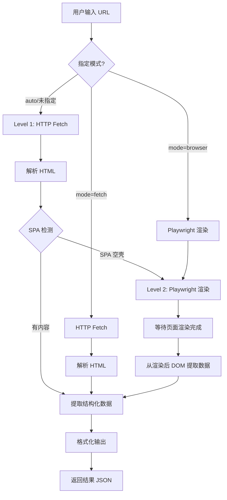
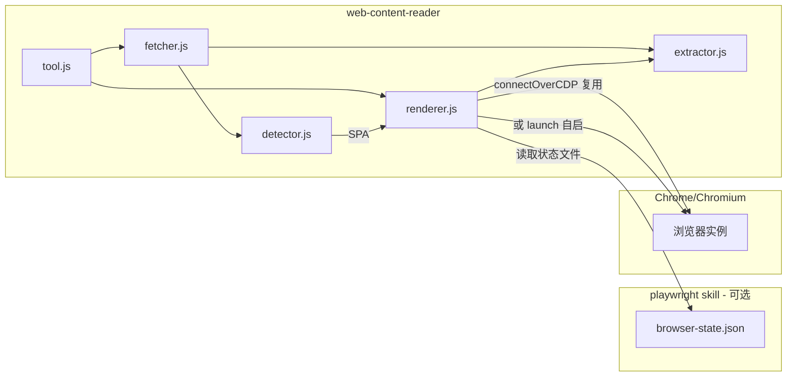

# Web Content Reader — 设计文档

## 1. 需求

### 1.1 背景

许多现代 Web 应用使用 Vue、React、Angular 等前端框架构建（SPA/CSR），页面内容通过 JavaScript 在客户端动态渲染。直接 HTTP fetch 获取到的 HTML 仅包含空壳（如 `<div id="app"></div>`），无法读取实际数据。

### 1.2 目标

提供一个统一的页面内容读取 Skill，支持：

- 输入 URL，自动获取页面渲染后的完整内容
- 先尝试轻量 HTTP fetch，失败时自动降级到浏览器渲染
- 支持 Agent 内部自动调用（WebFetch 工具获取不到数据时降级）
- 支持用户手动触发（指定 URL 读取内容）
- 输出纯文本、HTML、结构化数据（表格/列表/链接/元信息）

### 1.3 使用场景

| 场景 | 触发方式 | 说明 |
|------|----------|------|
| Agent 读取 SPA 页面 | 自动降级 | WebFetch 返回空内容时，Agent 调用此 Skill |
| 用户指定 URL 读取 | 手动触发 | 用户说"读取这个页面的数据" |
| 提取页面特定区域 | 手动触发 | 用户指定 CSS 选择器提取局部内容 |
| 批量读取多个页面 | 手动触发 | 用户提供多个 URL |

## 2. 整体流程



## 3. 技术方案

### 3.1 方案 A：Node.js + Cheerio + Playwright CLI

**原理**：Node.js 实现，fetch 层用内置 `fetch` API，HTML 解析用 `cheerio`，浏览器渲染通过 `child_process` 调用现有 Playwright Skill 的 CLI 命令。

**优点**：
- 与 Playwright Skill 技术栈一致（Node.js）
- 复用已有浏览器实例，无需额外安装
- 通过 CLI 调用解耦，Playwright Skill 升级不影响本 Skill

**缺点**：
- CLI 调用有进程开销（约 200-500ms）
- 强依赖 Playwright Skill，无法独立使用

### 3.2 方案 B：直接引用 Playwright Skill 的 browser-manager

**原理**：直接 `require` Playwright Skill 的 `lib/browser-manager.js`，共享浏览器连接。

**优点**：
- 无进程开销，调用更快
- 可以精细控制页面生命周期

**缺点**：
- 强耦合，Playwright Skill 内部变更会直接影响
- 需要处理模块路径依赖
- 无法独立使用

### 3.3 方案 C：独立 playwright-core + 可选复用（推荐）

**原理**：自带 `playwright-core` 依赖，独立管理浏览器。同时检测 Playwright Skill 的浏览器状态文件，如果已有运行中的浏览器实例则优先复用。

**优点**：
- 完全独立，不依赖任何其他 Skill
- 自带 playwright-core，安装即可用
- 智能复用：检测 Playwright Skill 的 `browser-state.json`，有则复用，无则自启
- 两个 Skill 互不影响，可独立升级

**缺点**：
- 自启浏览器时有额外资源消耗
- 需要系统安装 Chrome/Chromium

### 3.4 方案对比

| 维度 | A: CLI 调用 | B: 直接引用 | C: 独立 + 可选复用 |
|------|-------------|-------------|---------------------|
| 耦合度 | 中（CLI 接口） | 高（模块引用） | 无 |
| 调用延迟 | 中（进程开销） | 低 | 低（复用时）/ 中（自启时） |
| 维护成本 | 低 | 中 | 低 |
| 浏览器复用 | 是（强依赖） | 是（强依赖） | 是（可选复用） |
| 独立使用 | 否 | 否 | **是** |
| 实现复杂度 | 低 | 中 | 中 |
| 推荐度 | 备选 | 不推荐 | **推荐** |

## 4. 推荐方案：C（独立 + 可选复用）

### 4.1 架构



### 4.2 SPA 检测策略

`detector.js` 负责判断 fetch 获取的 HTML 是否为 SPA 空壳：

| 检测规则 | 说明 | 权重 |
|----------|------|------|
| body 文本长度 < 阈值 | body 内纯文本过少（去除 script/style 后） | 高 |
| 框架占位符 | 存在 `<div id="app">` / `<div id="root">` 等且内容为空 | 高 |
| script 标签占比 | script 标签数量多但文本内容少 | 中 |
| noscript 提示 | 存在 "enable JavaScript" 等提示文本 | 高 |
| meta 框架标识 | 存在 `data-server-rendered`、`__NEXT_DATA__` 等 SSR 标记则非 SPA | 反向 |

综合评分超过阈值时判定为 SPA，触发浏览器渲染。

### 4.3 渲染等待策略

浏览器打开页面后，需要等待 JS 渲染完成：

1. 导航到 URL（`navigate`）
2. 等待网络空闲（`waitFor` networkidle）
3. 可选：等待特定选择器出现（用户指定 `waitSelector`）
4. 超时兜底（默认 15s）

### 4.4 内容提取

`extractor.js` 从 HTML 中提取结构化数据：

- **title**：`<title>` 标签或 `og:title`
- **content**：body 纯文本（去除 script/style/nav/footer 等噪声标签）
- **html**：清洗后的 HTML（可选，按需返回）
- **tables**：`<table>` 解析为二维数组
- **links**：页面链接列表
- **meta**：Open Graph、description 等元信息

### 4.5 CLI 命令设计

```bash
node skills/web-content-reader/tool.js read '{"url":"https://example.com"}'
node skills/web-content-reader/tool.js read '{"url":"https://example.com","mode":"browser"}'
node skills/web-content-reader/tool.js read '{"url":"https://example.com","mode":"fetch"}'
node skills/web-content-reader/tool.js read '{"url":"https://example.com","selector":".content"}'
node skills/web-content-reader/tool.js read '{"url":"https://example.com","output":"text"}'
```

参数说明：

| 参数 | 类型 | 默认值 | 说明 |
|------|------|--------|------|
| `url` | string | 必填 | 目标页面 URL |
| `mode` | string | `auto` | `auto`/`fetch`/`browser` |
| `selector` | string | - | CSS 选择器，提取特定区域 |
| `output` | string | `text` | 输出格式：`text`/`html`/`json` |
| `waitSelector` | string | - | 浏览器模式下等待此选择器出现 |
| `timeout` | number | `15000` | 浏览器渲染超时（ms） |

### 4.6 输出格式

```json
{
  "result": {
    "title": "页面标题",
    "content": "提取的纯文本内容...",
    "html": "<div>清洗后的 HTML</div>",
    "tables": [
      { "headers": ["列1", "列2"], "rows": [["值1", "值2"]] }
    ],
    "links": [
      { "text": "链接文本", "href": "https://..." }
    ],
    "meta": {
      "description": "页面描述",
      "ogTitle": "OG 标题",
      "ogImage": "https://..."
    }
  },
  "method": "fetch",
  "url": "https://example.com",
  "elapsed": 1234,
  "error": null
}
```

`output` 参数控制返回字段：
- `text`：仅返回 `title` + `content`
- `html`：返回 `title` + `content` + `html`
- `json`：返回全部字段

### 4.7 技术栈与目录结构

**技术栈**：Node.js 18+、cheerio、playwright-core

**目录结构**：

```
skills/web-content-reader/
├── SKILL.md
├── tool.js
├── package.json
└── lib/
    ├── config.js
    ├── fetcher.js
    ├── detector.js
    ├── renderer.js
    ├── extractor.js
    └── response.js
```

## 5. 实现计划

### Phase 1：核心功能（MVP）

- `config.js`：配置管理
- `fetcher.js`：HTTP fetch + 基础 HTML 解析
- `detector.js`：SPA 检测
- `renderer.js`：调用 Playwright CLI 渲染
- `extractor.js`：内容提取
- `response.js`：统一输出格式
- `tool.js`：CLI 入口，支持 `read` 命令

### Phase 2：增强功能

- 支持 `selector` 参数提取局部内容
- 支持 `waitSelector` 自定义等待条件
- 支持多 URL 批量读取
- 缓存机制（相同 URL 短时间内不重复请求）

### Phase 3：Agent 集成

- 编写 SKILL.md 文档
- 提供自然语言交互指南
- 与 WebFetch 工具的降级策略文档

## 6. 风险与注意事项

| 风险 | 影响 | 缓解措施 |
|------|------|----------|
| Playwright Skill 未安装 | 浏览器模式不可用 | fetch 模式仍可用，提示安装 Playwright |
| 页面需要登录 | 无法获取内容 | 提示用户先通过 Playwright 登录 |
| 大页面内容过多 | 输出过长影响 Agent 上下文 | 截断策略 + selector 精确提取 |
| 动态加载内容 | 等待时间不确定 | networkidle + 超时兜底 + waitSelector |
| 反爬机制 | 请求被拦截 | 浏览器模式天然绕过基础反爬 |
